# META scope

## Purpose

Own the DSET constitution: project identity, accepted behavioral truth,
artifact semantics, universal invariants, canonical layer definitions, and
inter-layer relations.

## Boundaries

META owns rules that remain valid across downstream technologies and either
govern multiple layers or define a layer boundary. It owns the invariant, not
the downstream mechanism. GOV, TOOL, SKILL, IMPL, and OPS retain their
canonical realization responsibilities.

## Layer map

```mermaid
flowchart LR
    META["META<br/>meaning and invariants"]
    GOV["GOV<br/>governed carriers"]
    TOOL["TOOL<br/>executable enforcement"]
    SKILL["SKILL<br/>agent orchestration"]
    IMPL["IMPL<br/>development realization"]
    OPS["OPS<br/>delivery and operation"]
    EXPLORE["Exploration Mode<br/>candidate feedback"]

    META --> GOV
    GOV --> TOOL
    TOOL --> SKILL
    SKILL --> IMPL
    IMPL --> OPS
    OPS -. "observations; no backward authority" .-> EXPLORE
```

The solid arrows show authority and refinement flow. A later layer consumes
earlier authority in the reverse dependency direction. Accepted feedback
re-enters the solid flow at its proper owning layer.

## Start here

- `dset_settings.toml`
- `specification-domain.md`
- `specification-methodology.md`
- `navigation-methodology.md`
- `procedure-domain-spec-authoring.md`
- Schemas
- Templates
- Applied META artifacts
- `changes`
