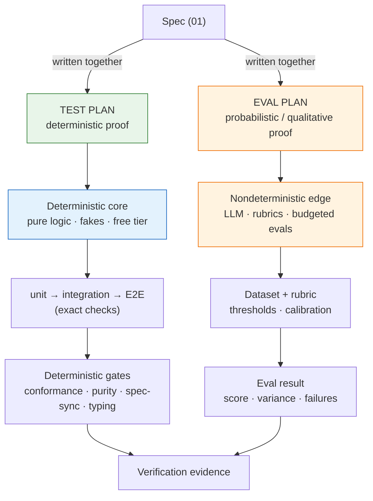

# 02_Test and Eval Plan Patterns — Proof Artifact Conventions

**Thesis:** Stage 2 produces two authored artifacts, not one blended plan: `test-plan.md` defines deterministic proof, while `eval-plan.md` defines probabilistic or qualitative proof. They are written **with the spec, before code** (`00_Tool Development Playbook.md`), so proof pins the *intent* rather than whatever the first implementation happened to do. A project with no probabilistic behavior may mark the eval plan not applicable with a reason; it must not rename deterministic tests as evals. The catalog is §1; the load-bearing five §2; the artifact contract and checklist are §3. The day-to-day enforcement practice is `05_Layered Build Standard — DDD, TDD, Small Functions, Typed Gates.md` §3.

---

## §1 | The pattern catalog

¶1 One row per decision: the convention and its canonical name + originator. Reuse the **name**, not a synonym.

Catalog (convention → established pattern)

| Convention | Established pattern (term · originator) |
|---|---|
| **Write both plans with the spec, before code** — tests define exact correctness and evals define accepted quality; proof criteria drive the work | **design-first / spec-first**; tests-as-spec ≈ **Specification by Example** (Adzic) / **executable specification** |
| **Separate exact correctness from measured quality** — pure logic and external API contracts get deterministic tests; variable LLM behavior gets dataset-and-rubric evals | **Humble Object / test doubles** (Meszaros, *xUnit Test Patterns*); **contract tests** at external seams; calibrated **evaluation** at probabilistic seams |
| **Layer unit → integration → end-to-end; most tests at the bottom** — E2E = the full trigger → … → output run in a dry/sandbox mode | **test pyramid** (Cohn); E2E in **dry-run / sandbox** (no external writes) |
| **Plan the fake inventory up front** — a double for every side-effecting collaborator: LLM, clock, network, disk | **test doubles** (Meszaros); **Dependency Injection** makes them pluggable |
| **Source a case corpus from resolved real work** — use exact expected outputs as regression tests and variable-output cases as an eval dataset with criteria and thresholds | **characterization tests** (Feathers, *Working Effectively with Legacy Code*, 2004); **golden master** (folklore; popularized by Rainsberger); evaluation datasets |
| **No-model tests vs model evals** — deterministic behavior with the model replaced by a fake runs on every change; recorded-output and live-model eval tiers are explicit and budgeted | **offline evaluation** before live evaluation; cost-tiered proof |
| **Task-specific LLM assertions** — encode the behavior the model usually misses as explicit pass/fail checks, not vibes | **LLM eval assertions / guardrails**; see `06_External Grounding — LLM Power-User Practice.md` |
| **Calibrate LLM-as-judge with humans** — judge prompts and rubrics are tested against human decisions before they become gates | **evaluator validation**; prevents the validator from silently becoming the bug |
| **Agent-runnable verification** — each plan section names the exact command, fixture diff, screenshot check, or smoke test an agent can run after editing | **executable checks**; tight feedback loop for AI-assisted development |
| **One pinning test per fixed bug, in the same change** — fails on the old code, passes on the fix | **regression pinning**; regression-test-driven |
| **Differential proof for refactors** — run old and new on the same inputs, assert byte-identical output BEFORE deleting the old | **golden-master diff / differential testing** |
| **Real-store smokes for anything that serializes** — one test against a REAL throwaway store (tmp-dir ClickHouse, SQLite file); mock-only suites pass while production crashes | **integration smoke against a real backing service**; the anti-pattern it kills is mock-only false confidence |
| **A property layer over the pure core** — totality (parsers never raise), idempotence (f(f(x)) == f(x)), round-trips (serialize→parse == id), content preservation; derandomize in CI | **property-based testing** (QuickCheck, Claessen & Hughes, 2000; Hypothesis); **derandomized CI** so a counterexample is a failure, not a flake |
| **An injection canary for LLM-facing tools** — a hostile input must stay inside its untrusted fence; deterministic, CI-safe | **canary test** for prompt-injection containment |
| **Declare the six deterministic gate categories in the test plan** — conformance, purity, spec-sync, typing/contracts, lint/static analysis, and secret hygiene run through the selected language profile | **rules as executable tests** — see `05_Layered Build Standard — DDD, TDD, Small Functions, Typed Gates.md` §§5–6 |
| **Capture red/green evidence for test-driven changes** — the plan says where the failing output and passing output will be recorded, so tests prove intent rather than merely passing after the fact | **red-green-refactor** / strict TDD evidence (superpowers) |
| **Verification-before-completion — evidence before claims** — before claiming a task is done, run a fresh full verification command, read its output and exit code, verify the claim, then state it with the evidence | **verification-before-completion** (superpowers) |
| **Subagent review after each implementation task** — a fresh implementer per bounded task; after each task, a reviewer checks spec compliance and quality before the next task starts | **subagent-driven development** (superpowers) |
| **Prove supportability in both artifacts without blending them** — deterministic tests validate telemetry contracts, propagation, safety, and bounds; qualitative evals measure whether an independent operator can diagnose, contain, escalate, and locate the governing change from realistic evidence | **observability contract testing** + **operability/incident-response evaluation** |

## §2 | The five load-bearing ones

¶1 If you take only five ideas to the next test plan and eval plan, take these — least cost, most leverage.

The five

1. **Plan with the spec, before code.** A plan written after the build tests the implementation; a plan written with the spec tests the intent. The spec's invariants and lifecycle transitions are the test list — derive it, don't brainstorm it.
2. **Exact correctness vs measured quality is the master split.** Pure logic and external contracts get exhaustive, free, fast tests with fakes; variable model behavior gets budgeted evals against datasets, rubrics, and thresholds. Automation does not change the category: an automated eval is still an eval.
3. **Resolved real cases feed both artifacts without blending them.** Exact expected outputs become regression tests; cases with multiple acceptable outputs become the eval dataset. Deterministic replay runs on every change; live-model evaluation is a deliberate spend.
4. **Real-store smokes + pinning tests are non-negotiable.** Anything that serializes gets one real-throwaway-store test; a fake-backed suite can pass while the real store still fails. Every fixed bug ships its pinning test in the same change.
5. **Agent-runnable checks + calibrated judges.** An agent should never have to infer whether it is done: give it a command or artifact diff. If an LLM judge is part of the gate, validate that judge against human decisions and keep adversarial examples in the suite.

## §3 | What the separate proof artifacts must contain

¶1 `test-plan.md` owns deterministic unit, integration, end-to-end, fake, serialization, property, regression, and machine-gate proof. `eval-plan.md` owns probabilistic/qualitative criteria, datasets, rubrics, evaluator calibration, drift/adversarial cases, and live-eval budgets. Shared IDs link both artifacts to requirements, implementation batches, and later verification evidence; neither artifact duplicates the other.

Checklist (artifact sections)

- [ ] **Shared scope map** — every component assigned to deterministic test proof or probabilistic/qualitative eval proof; boundary contracts and IDs named.
- [ ] **Test levels** (`test-plan.md`) — unit / integration / E2E coverage; the E2E path and dry/sandbox mode spelled out.
- [ ] **Fake inventory** (`test-plan.md`) — the double for each side-effecting collaborator and where it is injected.
- [ ] **Serialization smokes and properties** (`test-plan.md`) — real-store round-trips plus totality, idempotence, round-trip, and content-preservation properties.
- [ ] **Regression policy** (`test-plan.md`) — every fixed bug ships a pinning test; refactors ship a differential proof.
- [ ] **Machine gates** (`test-plan.md`) — name the selected language profile and its conformance, purity, spec-sync, typing/contracts, lint/static-analysis, and secret-hygiene commands per `05_Layered Build Standard — DDD, TDD, Small Functions, Typed Gates.md`; add an injection canary when untrusted text reaches an LLM.
- [ ] **Supportability contract tests** (`test-plan.md`, when production-bound) — validate required fields and schemas, correlation propagation, deploy/change identity, read-only diagnostic permissions, redaction/access/retention/deletion behavior, cardinality/volume/sampling bounds, and runbook/incident-link resolution.
- [ ] **Eval dataset and criteria** (`eval-plan.md`) — representative and adversarial cases, task-specific assertions, rubrics, thresholds, and refresh policy.
- [ ] **Evaluator calibration** (`eval-plan.md`) — human-labeled examples, disagreement policy, and refresh cadence for any LLM judge.
- [ ] **Eval tiers and budget** (`eval-plan.md`) — offline/replay tier, live-model tier, cost budget, drift cadence, and accepted variance.
- [ ] **Diagnostic-usefulness evaluation** (`eval-plan.md`, when production-bound) — give an independent operator a synthetic, redacted incident and evaluate whether the evidence supports diagnosis, containment, escalation or rollback, and traceability to the governing requirement, change, PR, and fix.
- [ ] **Agent-runnable verification** (shared) — canonical command/check sequence with a readable pass/fail signal.
- [ ] **Red/green evidence capture** (shared) — failing and passing evidence for each test-driven change.
- [ ] **Verification-before-completion gate** (shared) — fresh full verification output and exit status before completion.
- [ ] **Review checkpoint** (shared) — risk-scaled spec-compliance and quality review before the next task.
- [ ] **Done criteria** (shared) — which deterministic test tiers and eval thresholds must pass before the tool climbs a rollout rung (`03_Implementation Plan Patterns — Service Build Conventions.md`).

