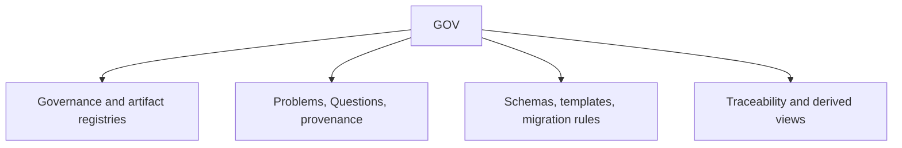

# GOV scope

## Purpose

Own repository governance, artifact architecture, intake, provenance,
migration rules, and derived relationship views.

## Boundaries

GOV owns the single intake and governance registries. Generated views are navigational evidence, not parallel truth, and other scopes retain their own semantic artifacts.

## Layer map

## Start here

- `dset_settings.toml`
- `navigation-governance.md`
- Applied GOV artifacts
- `navigation-methodology.md`
- Schemas
- Templates
- `changes`
- `generated`
