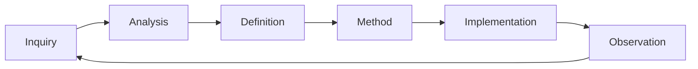

# Governance operating methodology

This maintained view describes how the current GOV sources operate together.
Atomic sources remain authoritative when this view becomes stale.

## Governed development loop



Observation preserves what occurred, was measured, or was reported. Analysis
interprets those facts and may provide rationale for Definition or Method.
Each node is an artifact role, not a lifecycle state through which one artifact
mutates. Sources: `DSET-REQUIREMENT-META-047` and
`DSET-REQUIREMENT-META-048`.

## Project resolution

1. Walk upward from the working location to one unambiguous enclosing Git
   repository and selected DSET project root.
2. Read `.dset/dset_settings.toml`, then the enabled type/subtype whitelist.
3. Read `.dset/artifact_catalog.toml` for route, identity, carrier, and
   persistence mappings.
4. Resolve installed rules, artifacts, views, tools, and skill instructions
   only inside the selected `.dset`.
5. Resolve every durable reference by stable artifact ID, native identity, or
   globally unique carrier name; physical paths are transient resolver output.
6. Fail closed on missing, duplicate, disabled, ambiguous, outside-root, or
   incompatible authority.

The installed methodology is materialized project-local data, not a symlink or
pointer to framework source. Repository-root framework methodology is refreshed
into `.dset/000_dset_methodology/` only by an explicit one-way synchronization
operation. Sources: `DSET-IMPL-GOV-007`,
`DSET-IMPL-GOV-008`,
`DSET-IMPL-GOV-002`, and `DSET-REQUIREMENT-GOV-052`.

## Interaction and Exploration Mode

Question-shaped input and input framed as an idea enter Exploration Mode.
Exploration may inspect, compare, model, or critique, but it creates no
governed artifact until the operator accepts a durable conclusion. An explicit
implementation, artifact-creation, or promotion request ends exploration for
the accepted scope.

`interaction.reporting_mode` controls presentation only:

- `silent` reports durable changes, blockers, approvals, failures, and material
  deviations; and
- `verbose` additionally reports mode selection, skill chains, gates, and
  transitions.

Both modes preserve the same authorization, routing, validation, and safety.
Sources: `DSET-REQUIREMENT-META-058` and
`DSET-REQUIREMENT-GOV-098`.

## Atomic emission

After exploration ends, classify the smallest independently reviewable primary
claim using one enabled direct type and optional direct subtype. Split
multi-head claims. Derive route and identity kind from the catalog; do not
repeat them in the carrier. Assign the narrowest structural scope and add only
non-derived properties.

The default creation gate is `medium`. `high` strictness asks focused questions
until authority, claim, scope, provenance, lineage, conflicts, and proof
obligations are sufficiently precise for immutable emission. Before writing,
assess whether the unchanged claim is eligible for promotion one structural
level upward; propose but never promote without operator acceptance. Sources:
`DSET-REQUIREMENT-GOV-102` and `DSET-REQUIREMENT-GOV-112`.

## Maintained semantic views

DSET can begin atomic-first with optional maintained surfaces disabled.
Activation is independent per surface and adds only its registered currentness
and entry-gate obligations. Deactivation preserves carrier and Git history.

An enabled maintained semantic view is a thin reasoned model, not a
concatenation of atoms. It contains:

- a Mermaid domain flow;
- domain entities defined only from earlier entities;
- per-entity lifecycle/status models with entry, exit, prohibited-transition,
  ownership, and failure criteria where applicable; and
- precise links to atomic sources at the relevant flow, definition, or table
  location.

Refresh is on demand or when a downstream entry gate requires a current view.
If applicable active atoms and a view disagree, atomic authority wins and the
view is stale until refreshed. Sources: `DSET-REQUIREMENT-META-054` and
`DSET-REQUIREMENT-GOV-115`.

## Development and release-readiness modes

Development mode is the default:

```text
active atomic authority
→ Test Plans and Evaluation Plans
→ implementation
→ executable tests and evaluations
→ Evidence Records
→ development Verification
```

It consumes current maintained views when enabled plus active atomic authority
not yet reflected in them. It does not refresh every view after every atom.

Release-readiness mode is mandatory before a Version can be ready:

```text
all active atomic authority
→ refresh enabled maintained semantic views
→ detect authority/view conflicts
→ resolve through new atomic artifacts
→ repeat to a stable authority/view set
→ reconcile implementation
→ run tests and evaluations at the exact candidate head
→ Evidence Records
→ release Verification
→ Readiness Record
```

Any applicable view, implementation, check implementation, evaluation
implementation, or configuration change after assurance makes the affected
release evidence stale. Source: `DSET-REQUIREMENT-GOV-109`.

## Git and commit coverage

Git is mandatory. Initialization uses an enclosing repository for a monorepo
work area or, when authorized, creates one where none exists. Each governed
transaction stages only intended changes and commits before reporting
completion.

Every implemented authority has an `Implements:` trailer, every resolved
Problem has a `Resolves:` trailer, and every governed commit has one `Session:`
trailer. Archive transitions additionally use `Archives:`, `Archive-Reason:`,
and `Archive-Reference:` when applicable. Generated-only paths do not create
semantic implementation coverage for the graph that generated them. Sources:
`DSET-IMPL-GOV-006`, `DSET-REQUIREMENT-GOV-065`, and
`DSET-REQUIREMENT-GOV-096`.

## Atomic lifecycle

Atomic meaning never changes. Active and archived are the only storage states.
Complete replacement, resolution, scoped override, and recurrence use typed
relations. Reopening is forbidden. Withdrawal archives the atom and, when work
is deferred to a future version, records intent in that Version's Roadmap.
Archive relocation preserves bytes and stable lookup. Source:
`DSET-DECISION-GOV-035`.

## Mechanical migrations

Use a bounded deterministic Python script for a multi-carrier mechanical
migration. The script names exact carriers or patterns, validates every
expected source shape before writing, prepares all outputs before cutover, and
leaves a reviewable diff. Unexpected structure stops without partial mutation.
It may recode an atom's identity or carrier only when a separately accepted
one-to-one migration preserves governed meaning and rewrites the complete
reference graph. Sources: `DSET-IMPL-GOV-001`,
`DSET-DECISION-GOV-027`, and `DSET-REQUIREMENT-GOV-108`.

## Carrier and preview policy

Every Markdown artifact starts with valid YAML frontmatter and uses GitHub
Flavored Markdown, repository-relative navigation, GitHub alerts,
`<details><summary>` for collapsible sections, and fenced Mermaid diagrams.
TOML is reserved for executed human-edited configuration, JSON for schemas and
machine boundaries, NDJSON for append-only records, and native formats for
code, CI, lockfiles, and host manifests. Sources:
`DSET-CONSTRAINT-GOV-002` and `DSET-REQUIREMENT-GOV-116`.

## Storage and discovery boundaries

- `.dset/` contains current governed state, installed methodology, settings,
  catalogs, tools, and skill instructions;
- `.dset_journal/` contains durable append-only NDJSON running records; and
- `.dset_runtime/` contains reconstructible or resumable runtime state; and
- the host temporary root contains disposable process scratch.

Completed migrations, superseded aggregate registries, compatibility archives,
and inactive legacy documentation stay outside `.dset` and are never a
fallback governance source. Repository legal files stay at root `LICENSE` and
`LICENSES`, outside all three DSET roots. Sources:
`DSET-IMPL-GOV-008`, `DSET-DECISION-GOV-029`, and
`DSET-REQUIREMENT-GOV-111`.

## Priority and conflict selection

Stored priority is `high`, `medium`, or `low`; `highest` is a capped virtual
comparison result. Scope and earlier-layer bonuses apply only during eligible
comparison and never alter stored values. The default conflict policy is
`ask_always`. `auto_by_effective_priority` may select only one unique eligible
winner; ties, uncertainty, same-level ambiguity, incomparability, or
unsatisfiable external obligations return to the operator. Source:
`DSET-REQUIREMENT-GOV-107`.

## Independent review

An external review packet binds exact inputs, rules, revision, criteria, scope,
and permitted effects. Its report is evidence, not authority. Each finding is
rejected with rationale, deferred to Version planning, or routed to a canonical
type/subtype selected by the active route catalog or to a proof obligation.
Accepted conclusions refresh only their affected closure.

## Release-lifecycle artifacts

Roadmap, Version Scope, Change, Release Plan, Readiness Record, and Release
Record remain release-lifecycle roles. Milestones are Roadmap entries. Release
Notes and changelogs derive from Release Records. A Release Plan is a
maintained Definition. Pull requests are maintained relational Methods;
internal and external commits remain distinct atomic Implementations.

The final top-level route type names remain unresolved by
`DSET-QUESTION-GOV-014`, and `DSET-PROBLEM-GOV-008` blocks any claim that the
current catalog is total and one-to-one. Current role semantics come from
`DSET-REQUIREMENT-GOV-078`, `DSET-REQUIREMENT-GOV-080`, and
`DSET-REQUIREMENT-GOV-103`.
