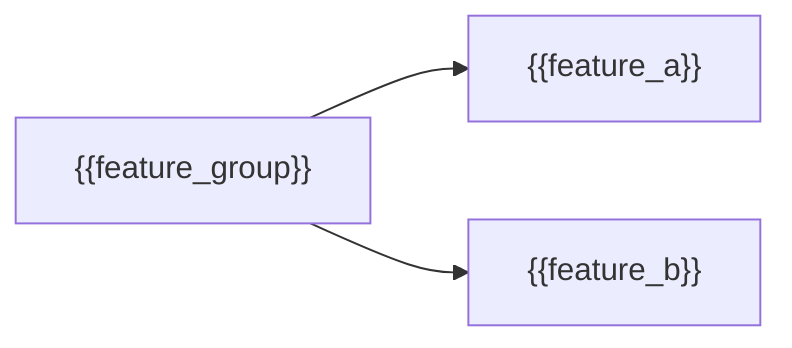

+++
artifact_type = "specification"
artifact_subtype = "architecture"
artifact_id = "{{project_key}}-SPECIFICATION-{{sequence}}"
llm_session_ids = []
+++

# Feature-group architecture — {{feature_group}}

Show the features immediately owned by this group and their responsibility
boundaries. Do not expand into feature internals here.

Link each feature to its owning hub below the diagram.
