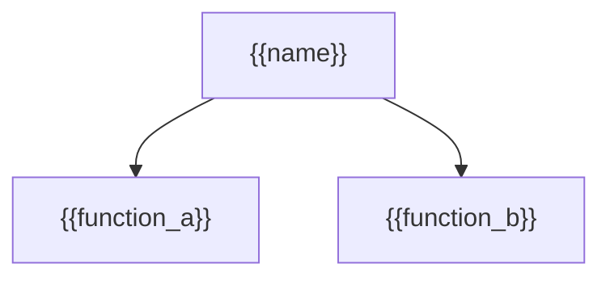

+++
artifact_type = "specification"
artifact_subtype = "architecture"
artifact_id = "{{project_key}}-SPECIFICATION-{{sequence}}"
llm_session_ids = []
+++

# {{structure_kind}} architecture — {{name}}

Show the main functions, capabilities, or components immediately owned by this
feature or layer. Link behavior and implementation owners instead of copying
their rules.

Record cross-boundary connections after every node is defined.
