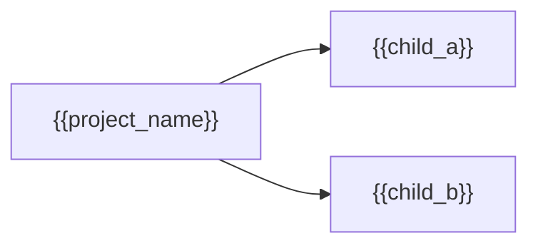

# Project architecture — {{project_name}}

Show only the immediate enabled structural children. Prefer feature groups when
present; otherwise show features and/or layers. Do not invent empty levels.

Link each node to its owning hub below the diagram.
