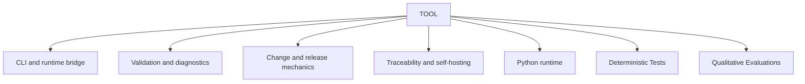

# TOOL scope

## Purpose

Own executable CLI, validation, fixture, traceability, and self-hosting contracts.

## Boundaries

TOOL governs executable behavior, deterministic diagnostics, and reusable
proof execution. Python/Test development sources remain in conventional
repository package roots and materialize into installed methodology without
symlinks. Applied QA definitions, evidence, and Verification remain with their
project or layer owners.

## Layer map

## Start here

- `specification-build-rules.md`
- `navigation-methodology.md`
- Fixtures
- Schemas
- Templates
- Applied TOOL artifacts
- `000_dset-tool-python-hub.md`
- `000_dset-tool-tests-hub.md`
- `000_dset-tool-evaluations-hub.md`
- `changes`
