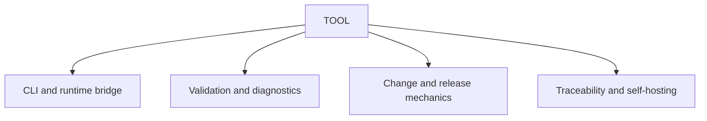

# TOOL scope

## Purpose

Own executable CLI, validation, repository configuration, fixture,
traceability, and self-hosting contracts.

## Boundaries

TOOL governs executable behavior, deterministic diagnostics, repository
configuration, and reusable execution contracts. Concrete development
environments, production code, Test code, Evaluation implementations, and
code-focused gates belong to IMPL. Applied QA definitions, evidence, and
Verification remain with their project or layer owners.

## Layer map

## Start here

- `specification-build-rules.md`
- `navigation-methodology.md`
- Fixtures
- Schemas
- Templates
- Applied TOOL artifacts
- `changes`
