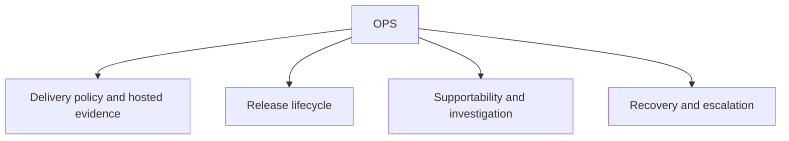

# OPS scope

## Purpose

Own post-implementation delivery, release, runtime supportability, hosted
evidence, and production investigation contracts.

## Boundaries

OPS records operational authority and proof without replacing GitHub as owner
of hosted PR, check, run, merge, tag, or release state. It consumes the
implemented supportability surface and routes deficiencies upstream; it does
not govern implementation technique.

## Layer map

## Start here

- `procedure-release.md`
- Applied Version artifacts
- `specification-supportability.md`
- `delivery-runbook.md`
- `navigation-methodology.md`
- Schemas
- Templates
- Applied OPS artifacts
- `changes`
