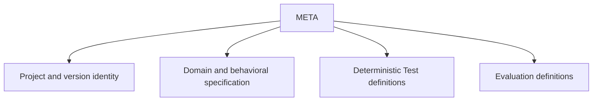

# META scope

## Purpose

Own project identity, accepted behavioral truth, specification semantics, and proof-plan definitions.

## Boundaries

META owns the project manifest and version identity plus the META fragment of each accepted package. It does not own repository governance, tooling, skill orchestration, or operations.

## Layer map

## Start here

- [Project settings and manifest](../dset_settings.toml)
- [Methodology package fragment](navigation-methodology.md)
- [Governing rules](procedure-domain-spec-authoring.md)
- [Schemas](schemas/README.md)
- [Templates](templates/README.md)
- [Project-wide Changes](../versions/changes/)
