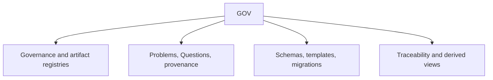

# GOV scope

## Purpose

Own repository governance, artifact architecture, intake, provenance, migrations, and derived relationship views.

## Boundaries

GOV owns the single intake and governance registries. Generated views are navigational evidence, not parallel truth, and other scopes retain their own semantic artifacts.

## Layer map

## Start here

- [Governance registry](../project/governance.toml)
- [Artifact-type registry](../project/artifact-types.toml)
- [Governing rules](navigation-governance.md)
- [Intake](../project/intake.toml)
- [Methodology package fragment](navigation-methodology.md)
- [Schemas](schemas/README.md)
- [Templates](templates/README.md)
- [Project-wide Changes](../versions/changes/)
- [Generated project health](../project/generated/DSET-DERIVED-VIEW-001-project-health.md)
- [Generated authority compilation](../project/generated/compilation.toml)
- [Generated traceability](../project/generated/traceability.toml)
