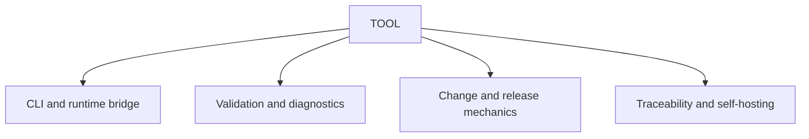

# TOOL scope

## Purpose

Own executable CLI, validation, fixture, traceability, and self-hosting contracts.

## Boundaries

TOOL governs executable behavior and deterministic diagnostics. Source code remains in conventional repository folders and links back to these accepted contracts.

## Layer map

## Start here

- [Build rules](specification-build-rules.md)
- [Methodology package fragment](navigation-methodology.md)
- [Fixtures](fixtures/README.md)
- [Schemas](schemas/README.md)
- [Templates](templates/README.md)
- [Project-wide Changes](../versions/changes/)
