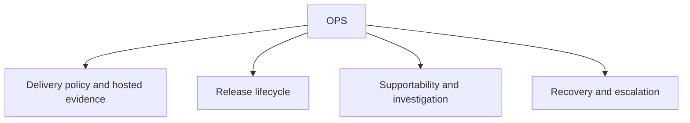

# OPS scope

## Purpose

Own delivery, release, supportability, hosted evidence, and production investigation contracts.

## Boundaries

OPS records operational authority and proof without replacing GitHub as owner of hosted PR, check, run, merge, tag, or release state.

## Layer map

## Start here

- [Release rules](procedure-release.md)
- [DSET Version Scopes and active Roadmap](../versions/README.md)
- [Supportability rules](specification-supportability.md)
- [Delivery runbook](supportability/delivery-runbook.md)
- [Methodology package fragment](navigation-methodology.md)
- [Schemas](schemas/README.md)
- [Templates](templates/README.md)
- [Project-wide Changes](../versions/changes/)
