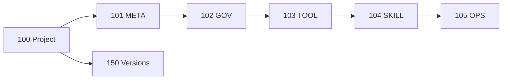

# Applied project-wide DSET artifacts

## Purpose

This directory owns project-wide atomic artifacts, evergreen specifications
and plans, analysis, promoted evidence, migrations, and retained history for
the repository that develops DSET.

## Boundaries

Layer-specific truth belongs to the corresponding applied layer. Installed
methodology is referenced by unique identity and never duplicated here.

## Start here

- `DSET-META-HUB.md`
- `DSET-GOV-HUB.md`
- `DSET-TOOL-HUB.md`
- `DSET-SKILL-HUB.md`
- `DSET-OPS-HUB.md`
- `DSET-VERSIONS-HUB.md`
- `000_dset-methodology-hub.md`
