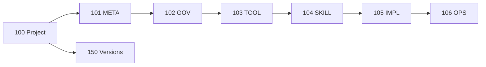

# Applied project-wide DSET artifacts

## Purpose

This directory owns current project-wide atomic artifacts, evergreen
specifications and plans, analysis, promoted evidence, and verification for
the repository that develops DSET.

## Boundaries

Layer-specific truth belongs to the corresponding applied layer. Installed
methodology is referenced by unique identity and never duplicated here.
Historical aggregates and completed migration records are inert repository
history outside `.dset` and are not project-control inputs.

## Start here

- `DSET-META-HUB.md`
- `DSET-GOV-HUB.md`
- `DSET-TOOL-HUB.md`
- `DSET-SKILL-HUB.md`
- `DSET-IMPL-HUB.md`
- `DSET-OPS-HUB.md`
- `DSET-VERSIONS-HUB.md`
- `000_dset-methodology-hub.md`
