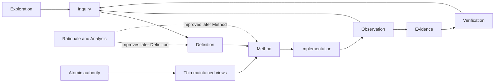

# Analysis Report — META and GOV overview through FPF

## Conclusion

The root META and GOV methodology now forms a coherent, bounded governance
system. Its classifications are sparse, its relations are explicit, its
authority and assurance roles are separated, and its maintained views remain
distinct from the atomic claims they explain.

This is an FPF-informed review, not a claim that DSET implements or conforms to
FPF. FPF is used as a precision lens.

The root source has reached a stable fixed point for this scope:

- all 35 active META atoms are represented in maintained META documents;
- all 47 active GOV atoms are represented in maintained GOV documents;
- the superseded four-family hierarchy is absent from current META/GOV source;
- the removed currentness class is absent from current META/GOV source;
- JSON and TOML carriers parse;
- all META/GOV Markdown files have YAML frontmatter;
- every META/GOV Markdown type/subtype used by the source is registered by the
  current catalog template; and
- the canonical relation vocabulary is now owned by
  `DSET-IMPL-GOV-004`.

## Reviewed boundary

The review covers the current root META and GOV methodology after commits
`24c4fa2`, `951ca51`, `6eff216`, and `f6650c1`, plus their active applied META
and GOV atoms. It excludes TOOL implementation, skill behavior, installed
methodology synchronization, test/evaluation execution, and release
publication.

## Current development-governance flow

Exploration prevents provisional vocabulary from becoming durable governance.
Rationale and Analysis surround the loop without becoming a mandatory
lifecycle stage or hidden authority.

## FPF review

| FPF lens | DSET result | Disposition |
|---|---|---|
| **F.14 anti-explosion control** | One registered direct type/subtype derives one route; route coordinates, scope, priority, provenance, and lifecycle do not mint parallel type families | Aligned adaptation |
| **A.06.P relational precision** | Twelve forward relations have distinct meanings; inverses are derived; relational artifacts require explicit kinds and role-bearing endpoints | Aligned in methodology; executable endpoint enforcement remains downstream |
| **A.10 evidence graph** | Authority, checking method, execution, Evidence Record, provenance, and Verification are separate; evidence is claim-bound and bounded by use | Aligned in methodology; executable graph closure remains downstream |
| **A.02.01 contextual role assignment** | Artifact meaning, authority, creator provenance, structural scope, and execution role are not inferred from one another | Aligned adaptation |
| **E.18 transformation-flow structure** | Layer authority is forward-only, views refresh the smallest affected closure, and release readiness iterates to a stable authority/view set | Aligned adaptation |
| **C.22.02 problem-side discipline** | Question and Problem remain distinct from prescribed work; each records one bounded matter and routes to an honest next use | Aligned adaptation |

## Why the model is now coherent

### Classification

The catalog and settings have non-overlapping jobs. The catalog owns route,
identity, carrier, and persistence mappings. Settings own only the enabled
whitelist and operator-selectable behavior. The carrier stores one type/subtype
and does not repeat derived coordinates.

This avoids a shadow ontology: Revision mode answers how a carrier changes;
Content role answers what it contributes; Governance locus answers where
governance originates; and `scope_path` answers where the artifact is owned
structurally.

### Atomic and maintained boundaries

Atomic meaning is immutable. Append-only records preserve accepted order.
Maintained artifacts may change through their registered procedures. A
maintained semantic view is a thin current model with a flow, dependency-ordered
definitions, lifecycle criteria, and precise source links; it is not a second
authority or a concatenated ledger.

### Relations and lifecycle

`child_of`, `override_of`, `replacement_of`, and `recurrence_of` are distinct.
`solution_for` is Conflict-specific; other closure uses `resolution_of`.
`relates_to` is a fallback with no coverage force. Active and archived are the
only Atomic-artifact storage states, and Git trailers bind archive movement to
its semantic reason.

### Layer topology

META governs cross-layer invariants. GOV realizes them as storage, routing,
authority, lifecycle, and carrier rules. GOV does not redefine META. Later
layers consume this authority without sending normative dependencies backward.

## Remaining downstream gaps

These findings do not invalidate the root META/GOV model, but they prevent a
claim that the whole project already executes it end to end:

1. The installed methodology and applied project settings/catalog have not yet
   been explicitly synchronized from the root source. This is intentional
   under the one-way synchronization rule.
2. TOOL validators still need to enforce catalog whitelist resolution,
   relation-specific endpoint signatures, and the direct type-derived identity
   model.
3. Evidence-graph closure, projection-frontier validation, and release
   fixed-point checks remain executable TOOL/IMPL responsibilities.
4. Historical atomic prose retains older terminology where its meaning is
   immutable. Current maintained views translate that meaning; new writers must
   not revive the retired vocabulary.

## Fixed-point verdict

No additional META or GOV taxonomy is needed for the current scope.

Further changes should be accepted only when they expose a real missing
distinction, relation signature, authority boundary, or operational failure.
New names alone are insufficient. The next justified work is downstream
implementation and an explicit installed-methodology synchronization, not
another restructuring of META or GOV.
