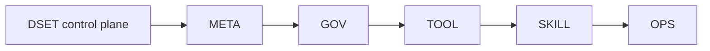

# DSET project root

## Purpose

This is the control-plane hub for the repository as both the DSET framework source and its recursive adopter. Project truth is divided among five stable semantic owners without duplicating one logical package.

## Boundaries

`.dset/` owns project control artifacts. Public framework prose remains under `methodology/` and `documentation/`; executable source remains under `dset_toolchain/`, `skills/`, and `.github/`. Those implementation surfaces trace back to accepted layer-owned contracts.

## Project-control map

## Start here

- [Project behavior settings](../dset_settings.toml) — documented artifact,
  workflow, Change-workspace, delegation-budget, and priority choices.
- [META](../layer_1_meta/README.md) — identity, accepted behavior, specification semantics, and proof plans.
- [GOV](../layer_2_gov/README.md) — governance, intake, provenance, migrations, and generated views.
- [TOOL](../layer_3_tool/README.md) — executable CLI, validation, fixtures, traceability, and self-hosting.
- [SKILL](../layer_4_skill/README.md) — agent workflows, delegation, and local run evidence.
- [OPS](../layer_5_ops/README.md) — delivery, release, supportability, and hosted evidence.

Each layer has a hub and may own governing rules, schemas, templates, a fragment of the logical `methodology` package, and layer-scoped artifacts. Project identity and behavior share one [settings and manifest](../dset_settings.toml). Project-wide governance and intake live in [governance.toml](governance.toml) and [intake.toml](intake.toml). Generated [traceability](generated/traceability.toml) is a non-authoritative relationship view. Changes and releases are project-wide under [versions](../versions/README.md).

## Ownership

| Scope | Owns |
|---|---|
| META | Project/version identity; accepted domain, behavior, Contracts, and proof-plan semantics |
| GOV | Artifact and repository governance; Problems, Opportunities, Questions; provenance and derived indexes |
| TOOL | CLI behavior, diagnostics, fixtures, trace generation, validation, and self-hosting |
| SKILL | Thin wrappers, lifecycle recommendation, delegation budgets, and local run records |
| OPS | Release, hosted delivery, supportability, incident investigation, and recovery evidence |

The accepted methodology remains one logical package with five writable fragments. A Change lives only under its `primary_layer`; `affected_layers` and stable IDs connect cross-layer work.

Features, when enabled, are peers joined by horizontal Contracts. These layers
are ordered: authority moves only `META → GOV → TOOL → SKILL → OPS`, preferably
through the immediately following layer. A downstream layer may consume,
implement, check, or evidence upstream authority, but cannot govern or override
it.

The project manifest also declares neutral repository-relative Work Areas. A
Work Area may contain a deployable service, local tool, library, documentation,
methodology, data, tests, hosted automation, or mixed content. It is a scope
boundary, not a feature/module/service classification. Every schema 1.3 Change
targets either the whole repository or one or more declared Work Areas.

## Repository commands

| Command | Behavior |
|---|---|
| `python -m dset_toolchain check .` | Read-only validation with stable diagnostics |
| `python -m dset_toolchain verify .` | Project-configured gates plus trace freshness |
| `python -m dset_toolchain rules check .` | Validate repository-local rule ownership and identity |
| `python -m dset_toolchain rules resolve <workflow-id> . --format json` | Print the ordered local rules used by a thin wrapper |
| `python -m dset_toolchain self-host .` | Run the bounded released-to-candidate fixed point |
| `uv run dset new <slug> --package <package-id> --profile <profile> --layer <layer> [--work-area <id> ...] [--workspace branch-worktree]` | Allocate a stable layer-qualified Change ID; use the integration branch by default or opt into an isolated worktree |
| `uv run dset compile . --write` | Compile active atomic authority into a digest-bound projection index; use `--check` in gates |
| `uv run dset trace . --write` | Regenerate deterministic relationship evidence |
| `uv run dset health . --write` | Regenerate the portable project-health dashboard; use `--check` in gates |
| `uv run dset dependencies .` | Enforce exact allow/deny, registry, version, license, provenance, lockfile, and exception policy |
| `uv run dset conflict . --candidate <path> --emit <atom.md>` | Classify an incompatibility, apply the artifact gate, and emit a sealed Conflict atom only when required |
| `uv run dset conflict . --candidate <path> --check-result <result.json>` | Reject a recorded disposition after party, context, precedence, or effective-priority drift |
| `uv run dset atom archive . --id <semantic-id>` | Move an explicitly retired atom byte-for-byte while retaining canonical lookup |
| `uv run dset review packet . --output <path> --packet-id <id> --artifact <path> --criterion <text> --scope <text>` | Bind an external review to exact inputs, commit, local rules, and read-only effects |
| `uv run dset review validate . --packet <path> --report <path>` | Validate an independent report envelope while allowing a free-form findings body |
| `uv run dset review reconcile . --packet <path> --report <path> --candidate <json>` | Require one explicit disposition per stable finding without authorizing repair |
| `uv run dset archive <stable-change-id>` | Preview guarded archival; add `--execute` only after readiness passes |

## Lifecycle

1. Create one Change with one stable `DSET-CHANGE-<LAYER>-NNN` ID, readable slug, repository-or-Work-Area target, and explicit workspace mode.
2. Record affected layers, dependencies, exact consumed commits, Contracts, proof plans, and reopen triggers.
3. Implement against accepted truth; keep deterministic tests and qualitative/probabilistic evals separate.
4. Reconcile only the affected package fragments, refresh the smallest invalidated proof closure, and regenerate traceability.
5. Archive the Change under its primary layer through its implementing PR.
6. By default, work on local `dev`, push remote `dev`, and open the release PR from `dev` to protected `main`.
7. Select `branch-worktree` only when the Change needs isolation; review that branch into `dev` before the release PR.

Permanent layer branches are forbidden. One cross-layer Change stays atomic when splitting would create an invalid intermediate state; split only independently reviewable, verifiable, and mergeable work.
