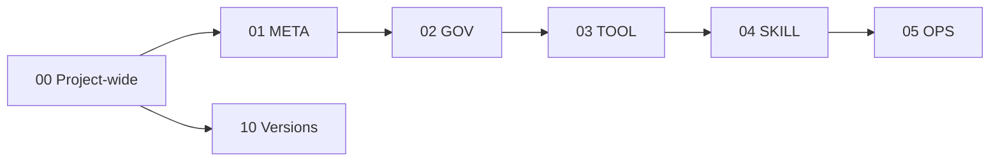

# DSET recursive project

This directory owns project-wide truth for the repository that develops DSET.
The portable framework used by the project lives separately under
[`.dset/`](../.dset/README.md).

## Project map

## Ownership

- Project-wide evergreen specifications and plans live directly here.
- Project-wide atomic artifacts use the same type directories as layer-owned
  atoms when needed.
- [`analysis/`](analysis/) contains interpreted reports, not authority.
- [`migrations/`](migrations/) and [`legacy/`](legacy/) are project history;
  neither is active framework input.
- [`../10_versions/`](../10_versions/README.md) owns Version artifacts and
  Changes for the whole project.

Layer-specific artifacts live under the narrowest owner:

- [META](../01_layer_meta/README.md)
- [GOV](../02_layer_gov/README.md)
- [TOOL](../03_layer_tool/README.md)
- [SKILL](../04_layer_skill/README.md)
- [OPS](../05_layer_ops/README.md)

Exact shared truth may be represented by one portable TOML reference to the
matching `.dset` framework document. When project truth diverges, semantic
compilation replaces that reference with a project-owned evergreen document.
Compilation is requested explicitly or by a downstream entry gate; it is not
triggered after every new atom.
