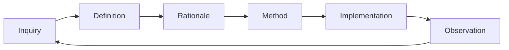
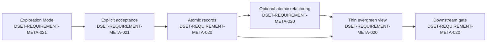
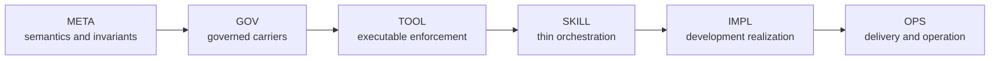

# Methodology META specification

## DSET-REQUIREMENT-META-001 — One governed feedback cycle

Atomic source: `DSET-REQUIREMENT-META-001`.

The methodology must define one six-role feedback cycle: Inquiry; Definition;
Rationale; Method; Implementation; and Observation. Test plans, evaluation
plans, and implementation plans are Methods. Code and generated operative
outputs are Implementations. Test and evaluation results are Observations.

**Scenario DSET-SCENARIO-META-001:** Given a contributor deciding what an
artifact contributes, its primary content maps to exactly one role while links
connect it to the other roles without duplicating ownership.

## DSET-REQUIREMENT-META-002 — Tests and evals remain distinct

Atomic source: `DSET-REQUIREMENT-META-002`.

The methodology must keep deterministic tests in `test-plan.md` and
probabilistic or qualitative evaluation in `eval-plan.md`. Both are Methods;
their execution results remain distinct Observations.

**Scenario DSET-SCENARIO-META-002:** Given behavior with one exact expected output, it is routed to the test plan even when the check is automated. Given multiple acceptable outputs judged by criteria or a rubric, it is routed to the eval plan.

## DSET-REQUIREMENT-META-003 — Runtime rules are selected by independent concerns

Atomic source: `DSET-REQUIREMENT-META-003`.

The methodology must select recovery semantics by runtime risk and durable backing by topology, write volume, and concurrency. Event sourcing, reconciliation, durable execution, and observed-progress liveness apply only when their specific semantics are required.

**Scenario DSET-SCENARIO-META-003:** A stateless CRUD service keeps durable state in its database without adding an application file WAL or event store unless audit/replay requirements independently demand one.

**Scenario DSET-SCENARIO-META-004:** A modest-write local resumable tool keeps accepted state in declared files with one writer and atomic/durable writes; a higher-volume or concurrent local tool selects a database instead of two writable authorities.

## DSET-REQUIREMENT-META-004 — Delivery semantics are bounded

Atomic source: `DSET-REQUIREMENT-META-004`.

The methodology must describe retries as at-least-once delivery plus receiving-side deduplication or idempotency. It may claim effectively-once effects only inside the declared key, retention, and atomicity boundary.

**Scenario DSET-SCENARIO-META-005:** A retryable receiver documents its deduplication key, retention window, owner, and atomic check/write operation without claiming universal exactly-once execution.

## DSET-REQUIREMENT-META-005 — Public identity is stable

Atomic source: `DSET-REQUIREMENT-META-005`.

The public framework identity must use the display name **DSET Spec Loops**, the title **DSET Spec Loops: A Production Vibecoding Framework**, the expansion **Domain–Supportability–Evals–Tests**, and the repository slug `dset-specs-loops-framework`.

**Scenario DSET-SCENARIO-META-006:** README, project metadata, repository slug, and active methodology truth use the same identity; historical archive evidence may retain prior URLs when redirects preserve the recorded provenance.

## DSET-REQUIREMENT-META-006 — Profile axes remain orthogonal

Atomic source: `DSET-REQUIREMENT-META-006`.

DSET must select implementation-language enforcement and artifact-governance enforcement independently. Runtime risk selects recovery/supportability semantics; durability topology selects durable authority; a language profile selects code tools and thresholds; an artifact profile selects document architecture, ownership, navigation, and authoring gates.

**Scenario DSET-SCENARIO-META-007:** A Python repository selects `python-v1` and `documentation-v1` together; a documentation-only repository selects `documentation-v1` without inheriting Python tools; a future TypeScript repository combines its own language profile with the same artifact profile.

## DSET-REQUIREMENT-META-007 — Proof categories remain separate

Atomic source: `DSET-REQUIREMENT-META-007`.

Exact resolver, ownership, path, identity, wrapper, and recursion behavior must be proven by deterministic tests. Agent interpretation, rule-following, navigation, and diagnostic usefulness must be proven by separate qualitative or probabilistic evals. Automation does not change the proof category.

**Scenario DSET-SCENARIO-META-008:** A scripted assertion that a cycle emits one stable code remains a test; an automated agent run measuring whether the diagnostic enables a safe correction remains an eval.

## DSET-REQUIREMENT-META-008 — Contracts preserve boundaries

Atomic source: `DSET-REQUIREMENT-META-008`.

When the operator supplies or accepts a DDL, CSV/XLSX schema,
OpenAPI/message/protocol, host-native package format, supported-platform
interface, hosted-CI interface, dependency boundary, or comparable obligation,
DSET must represent it as an atomic relational Definition named Contract. A
Contract uses a stable `CONTRACT` ID. Each immutable record names the accepted
source, relation kind, role-bearing endpoints, direction, conformance rule,
compatibility rule, priority, creation state, and any older Contract records it
replaces. Each endpoint independently declares internal or external origin.
External formats are pinned by version or digest in applicable evidence.

Implementation conforms to every applicable active Contract and cannot rewrite
the boundary. Ambiguity routes to an Inquiry; incompatible active authority
becomes a Conflict; observed nonconformance becomes a Problem. An unrelated
artifact does not silently override a Contract; change requires explicit
precedence or an operator-accepted replacement Contract. A mandated dependency
is a Constraint when an external authority imposes it and a Contract when a
boundary participant relies on it. A project-selected dependency rule is a
Requirement; selecting a material implementation approach is an Implementation
Decision.

**Scenario DSET-SCENARIO-META-009:** The operator accepts host, platform,
dependency, and GitHub Actions boundaries as Contracts. Descriptive Markdown or
local scripts alone cannot satisfy them. An unclear host format is an Inquiry,
incompatible active formats form a Conflict, and a failing platform or
disallowed dependency is a Problem.

## DSET-REQUIREMENT-META-009 — User Stories remain Requirement forms

Atomic source: `DSET-REQUIREMENT-META-009`.

When actor, capability, and value framing is useful, it belongs inside or links
to a Requirement. User Story is not a routing axis or required registered name.
Split independently enforceable acceptance criteria into sibling atomic
Definitions.

**Scenario DSET-SCENARIO-META-010:** A contributor story explains why a host
integration matters, while separate Requirement, Test Plan, and Evaluation Plan
artifacts own the behavior and proof.

## DSET-REQUIREMENT-META-010 — Outcomes remain definition, method, or observation content

Atomic source: `DSET-REQUIREMENT-META-010`.

An intended measurable state change belongs in a Definition when it is required
or in a Method when it defines assessment. An observed result is an
Observation. Outcome is not a routing axis or mandatory registered name, and
shipping an output alone does not prove an intended state change.

**Scenario DSET-SCENARIO-META-011:** A Requirement defines the release behavior;
a linked Evaluation defines how time-to-diagnose improvement is assessed; the
observed timestamps remain evidence.

## DSET-REQUIREMENT-META-011 — Work Areas bound repository scope without assuming implementation type

Atomic source: `DSET-REQUIREMENT-META-011`.

DSET must support either one repository-level scope or one or more declared Work
Areas. A Work Area is a repository-relative folder declaration used to scope
accepted truth, Changes, proof, runs, and operational handoffs. Its content may
be a local tool, deployable service, library, documentation, methodology, data,
or any mixture of these. Declaring a Work Area must not classify it as code,
deployable, a service, a feature, or a module, and DSET must not require those
properties to use the boundary.

The repository's accepted Work Area declaration is authoritative. A session or
session checkpoint may reference the repository-level scope or declared Work
Areas so chained work can resume in the intended scope, but session continuity
does not own, create, rename, or supersede a Work Area. Every resume must
re-resolve the current authoritative declaration.

**Scenario DSET-SCENARIO-META-012:** A monorepo declares a deployable API folder,
a shared library folder, a documentation-and-methodology folder, and a mixed
data/tooling folder as separate Work Areas. Another repository declares only
its root. DSET scopes both projects without inventing services, modules,
features, or deployment semantics, and a resumed session follows the current
declaration rather than a stale checkpoint hint.

## DSET-REQUIREMENT-META-012 — Three independent axes route every artifact

Atomic sources: `DSET-REQUIREMENT-META-012` and its routing foundation
`DSET-REQUIREMENT-META-018`.

Every governed artifact must declare exactly one `revision_mode`, one
`content_role`, and one `governance_locus`.

| Axis | Values | Question answered |
|---|---|---|
| Revision mode | `atomic`, `evergreen`, `maintained` | How may it change? |
| Content role | `inquiry`, `definition`, `rationale`, `method`, `implementation`, `observation` | What does it contribute? |
| Governance locus | `internal`, `external`, `relation` | What does it primarily govern? |

The route is explicit metadata. Names, folders, suffixes, workflow steps, and
scope paths must not infer or override it. Authority, provenance, priority,
lifecycle state, and applicability remain explicit metadata outside the route.

**Scenario DSET-SCENARIO-META-013:** Requirement routes to
atomic/definition/internal, Constraint to atomic/definition/external, Contract
to atomic/definition/relation, and Implementation Decision to
atomic/method/internal without placing any of them under a Decision-centered
name hierarchy.

## DSET-REQUIREMENT-META-013 — The routing matrix remains sparse

Atomic source: `DSET-REQUIREMENT-META-013`.

The routing space is the matrix below. Every cell may contain zero or one
registered name at each enabled governance locus. An empty cell is valid.

| Revision mode \ Content role | Inquiry | Definition | Rationale | Method | Implementation | Observation |
|---|---|---|---|---|---|---|
| Atomic | I / E / R | I / E / R | I / E / R | I / E / R | I / E / R | I / E / R |
| Evergreen | I / E / R | I / E / R | I / E / R | I / E / R | I / E / R | I / E / R |
| Maintained | I / E / R | I / E / R | I / E / R | I / E / R | I / E / R | I / E / R |

`I`, `E`, and `R` mean internal, external, and relation. They mark available
coordinates, not required artifacts. Internal governance is always enabled;
external and relation governance are enabled independently by project settings.

**Scenario DSET-SCENARIO-META-014:** A small internal-only project creates no
external or relational placeholders. A project with an OpenAPI boundary enables
relations and registers only the names it actually needs.

## DSET-REQUIREMENT-META-014 — Relations remain first-class and endpoint-explicit

Atomic source: `DSET-REQUIREMENT-META-014`.

An artifact routed to `governance_locus = "relation"` must declare a stable
relation kind and at least two role-bearing endpoints. Each endpoint declares
its own internal or external origin. Endpoint origin does not add another
routing axis, and a relational name or suffix cannot replace the endpoint
record.

**Scenario DSET-SCENARIO-META-015:** A Contract identifies provider and consumer;
a Pull Request identifies source and target; a Merge Commit records the merged
parents. Each remains one relational artifact with explicit participants.

## DSET-REQUIREMENT-META-015 — Scope path remains structural

Atomic source: `DSET-REQUIREMENT-META-015`.

Layer, feature, feature group, Work Area, and configured compositions of them
form the artifact's project-relative `scope_path`. The current project is
ambient and never repeated inside the path. A project-level artifact therefore
uses an empty scope path, while a layer artifact begins with a coordinate such
as `layer:meta`. Scope path may affect inheritance, applicability, and identity,
but it does not alter the three-axis semantic route.

**Scenario DSET-SCENARIO-META-016:** A feature-layer Requirement and a
project-level Requirement share atomic/definition/internal while retaining
different scope paths.

## DSET-REQUIREMENT-META-016 — Content roles form a feedback cycle

Atomic source: `DSET-REQUIREMENT-META-016`.

DSET uses this development cycle:

The flow helps navigation and entry-gate selection. It does not determine
artifact identity, revision mode, governance locus, or authority.

**Scenario DSET-SCENARIO-META-017:** A production observation raises a new
Question; its route is selected from its own semantics, not copied from the
preceding implementation.

## DSET-REQUIREMENT-META-017 — Generated and maintained implementations remain distinct

Atomic source: `DSET-REQUIREMENT-META-017`.

Generated Code is an internal evergreen Implementation when it is a reproducible
current projection with generator and source provenance. Hand-maintained
executable truth is an internal maintained Implementation. A Commit is an
atomic Implementation; a Merge Commit is an atomic relational Implementation.

**Scenario DSET-SCENARIO-META-018:** Regenerating a dashboard updates one
evergreen Implementation, while editing a source module updates one maintained
Implementation and committing that edit creates a separate atomic
Implementation record.

## FPF alignment

This routing model adapts three FPF constraints:

- E.24: names and local use frames must not create a shadow ontology;
- A.6.P: a relation must expose its kind, participants, and qualifiers;
- A.02.01: contextual roles require holders and context, and optional slots do
  not justify dummy entities.

Therefore the axes classify one artifact's current governance role, registered
names remain sparse interface vocabulary, and relational participants remain
explicit rather than encoded in names.

## DSET-REQUIREMENT-META-021 — Exploration Mode defers artifact creation

Atomic source: `DSET-REQUIREMENT-META-021`.

Exploration Mode sits outside the artifact-routing matrix. It permits
brainstorming, discussion, research, analysis, comparison, terminology work,
scope and axis design, structural modeling, and read-only inspection, but
creates no governed artifacts or governance commits. Explicit operator
acceptance is the only exit that authorizes durable emission.

| Status | Entry criteria | Exit criteria | Allowed next status | Required evidence | Atomic sources |
|---|---|---|---|---|---|
| Inactive | No active exploration request | Clear exploratory intent or explicit Exploration Mode request | Active | Operator/session instruction | `DSET-REQUIREMENT-META-021` |
| Active | Exploratory intent is established | Explicit accept, finalize, apply, or end-exploration instruction | Inactive | Operator acceptance instruction | `DSET-REQUIREMENT-META-021` |

## DSET-REQUIREMENT-META-020 — Evergreen documents are thin semantic views

Atomic source: `DSET-REQUIREMENT-META-020`.

An evergreen domain specification contains:

1. a domain-flow Mermaid diagram;
2. topologically ordered entity definitions;
3. per-entity lifecycle models;
4. cross-entity relations outside definitions; and
5. direct atomic-source IDs at each summarized semantic location.

Entity definitions use only previously defined entities. A forward reference is
a connection, not part of the definition.

| Evergreen status | Entry criteria | Exit criteria | Allowed next status | Required evidence | Atomic sources |
|---|---|---|---|---|---|
| Current | Reasoned refresh reflects all applicable active atoms and every semantic source resolves | An applicable atomic record is added, replaced, archived, or found unrepresented | Stale | Resolved atomic links and reviewed refresh | `DSET-REQUIREMENT-META-020` |
| Stale | The current view no longer represents its applicable atomic frontier | A reasoned refresh restores complete atomic coverage | Current | Staleness reason and affected atomic IDs | `DSET-REQUIREMENT-META-020` |

Each stateful entity lifecycle records identity, uniqueness, invariants,
transition authority, status meaning, entry criteria, exit criteria, allowed
and forbidden transitions, required evidence, and applicable failure/recovery
behavior.

Semantic links target atomic records only. Links to hubs or other evergreen
documents are navigation and carry no semantic authority.

## DSET-REQUIREMENT-META-022 — META eligibility rule

Atomic source: `DSET-REQUIREMENT-META-022`.

A rule belongs in META only when it remains technology-independent, governs
multiple layers or a layer boundary, and can be stated without downstream
implementation vocabulary. Otherwise, its invariant and mechanism are split
and the mechanism moves to the earliest complete downstream owner.

## DSET-REQUIREMENT-META-023 — Canonical layer definitions

Atomic source: `DSET-REQUIREMENT-META-023`.

| Layer | Canonical responsibility |
|---|---|
| META | Meanings, routing axes, universal invariants, layer topology, and inter-layer semantics |
| GOV | Identity, settings, provenance, lifecycle, applicability, scope, carriers, and conflict governance |
| TOOL | Executable capability, validation, resolution, diagnostics, generation, and repository mechanics |
| SKILL | Provider-neutral orchestration, entry gates, workflow chaining, and session continuity |
| IMPL | Development environment, profiles, code, Test and Evaluation implementations, and code-quality gates |
| OPS | Post-implementation delivery, release, publication, runtime supportability, investigation, recovery, and hosted evidence |

## DSET-REQUIREMENT-META-024 — Layer handoffs

Atomic source: `DSET-REQUIREMENT-META-024`.

| Boundary | Input | Output |
|---|---|---|
| META → GOV | Semantic invariants | Governable carriers and policies |
| GOV → TOOL | Executable obligations | Callable enforcement and diagnostics |
| TOOL → SKILL | Capabilities and diagnostics | Thin orchestration and entry gates |
| SKILL → IMPL | Accepted context and satisfied gates | Governed implementation work |
| IMPL → OPS | Verified supportable implementation | Deliverable and operable output |

Every boundary declares entry criteria, exit criteria, and blocker behavior.
Adjacent handoffs are preferred; a skip is valid only when intermediate layers
have no meaningful transformation or ownership.

## DSET-REQUIREMENT-META-025 — Acyclic layer dependencies

Atomic source: `DSET-REQUIREMENT-META-025`.

Authority and refinement flow forward. Dependency consumption points from a
later layer to its own or an earlier layer. Feedback may return to Exploration
Mode, but accepted feedback re-enters at its proper owner and creates no
backward-governance edge. Dependency, scope specialization, and horizontal
feature Contracts remain distinct relations.

## DSET-REQUIREMENT-META-026 — Single-owner placement

Atomic source: `DSET-REQUIREMENT-META-026`.

Each claim has one authority at the earliest layer that can define it
completely. A downstream layer may reference, refine, realize, check, or
observe upstream authority. It cannot duplicate it. If an upstream statement
needs downstream entities to be defined, split the stable invariant from its
mechanism or move the statement downstream.

## DSET-REQUIREMENT-META-027 — Forward change propagation

Atomic source: `DSET-REQUIREMENT-META-027`.

Propagation preserves historical atoms, identifies affected views, Methods,
Implementations, Observations, and assurance, then restores currentness through
their owning gates. Refreshing an evergreen view does not by itself complete
the forward pass.

## DSET-REQUIREMENT-META-028 — Authority and assurance

Atomic source: `DSET-REQUIREMENT-META-028`.

Definitions and accepted Methods may own semantic authority. Implementations
realize it. Tests and Evaluations check it. Observations and Evidence report
what happened. Verification judges sufficiency and currentness. Assurance may
support or challenge reliance but cannot establish or override authority.

## DSET-REQUIREMENT-META-029 — Profiles and applicability

Atomic source: `DSET-REQUIREMENT-META-029`.

Profiles specialize downstream realization for an explicit scope. They cannot
weaken META invariants, redefine routing or layer meanings, or require
placeholders for non-applicable concerns. Non-applicability is explicit and
reasoned.

## DSET-REQUIREMENT-META-030 — Layer extension gate

Atomic source: `DSET-REQUIREMENT-META-030`.

A candidate layer must add one non-overlapping responsibility, declare its
predecessor and successor handoffs, and preserve the dependency DAG. If a
feature, profile, Work Area, or ordinary scope can own the concern, DSET does
not add a layer.

## DSET-REQUIREMENT-META-031 — Bounded recursive self-hosting

Atomic source: `DSET-REQUIREMENT-META-031`.

DSET applies the same constitution to itself while keeping reusable
methodology, installed methodology, applied authority, implementations,
runtime state, and generated views distinct. Self-hosting terminates at a
declared fixed point; skills and tools resolve current project-local governance
instead of treating embedded wrapper knowledge as authority.

## DSET-REQUIREMENT-META-032 — Durable control-plane safety

Atomic source: `DSET-REQUIREMENT-META-032`.

The durable control plane contains accepted current project truth only. It
stores no secrets, remains LLM-provider agnostic, keeps future intentions in
Version Roadmaps, and excludes unaccepted Exploration. Downstream layers own
concrete storage, adapter, lookup, redaction, and enforcement mechanisms.

## DSET-REQUIREMENT-META-033 — Progressive governance surfaces

Atomic source: `DSET-REQUIREMENT-META-033`.

DSET begins with atomic authority and requires no evergreen or maintained
governance surface merely because the project is initialized. Requirements
carry clear accepted obligations; Questions and Problems remain available when
uncertainty or discrepancy exists.

A named surface may be activated when its coordination value becomes useful.
Activation adds that surface's currentness and gate obligations. Deactivation
removes those obligations while preserving its carrier and Git history. A
later reactivation reconciles the retained surface against current atoms before
calling it current.

Activation applies to named governance surfaces, not globally to the
`evergreen` or `maintained` revision modes.
