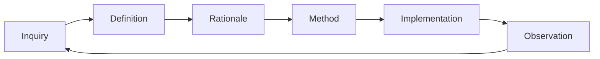

# Methodology META specification

## DSET-REQUIREMENT-META-001 — One governed feedback cycle

The methodology must define one six-role feedback cycle: Inquiry; Definition;
Rationale; Method; Implementation; and Observation. Test plans, evaluation
plans, and implementation plans are Methods. Code and generated operative
outputs are Implementations. Test and evaluation results are Observations.

**Scenario DSET-SCENARIO-META-001:** Given a contributor deciding what an
artifact contributes, its primary content maps to exactly one role while links
connect it to the other roles without duplicating ownership.

## DSET-REQUIREMENT-META-002 — Tests and evals remain distinct

The methodology must keep deterministic tests in `test-plan.md` and
probabilistic or qualitative evaluation in `eval-plan.md`. Both are Methods;
their execution results remain distinct Observations.

**Scenario DSET-SCENARIO-META-002:** Given behavior with one exact expected output, it is routed to the test plan even when the check is automated. Given multiple acceptable outputs judged by criteria or a rubric, it is routed to the eval plan.

## DSET-REQUIREMENT-META-003 — Runtime rules are selected by independent concerns

The methodology must select recovery semantics by runtime risk and durable backing by topology, write volume, and concurrency. Event sourcing, reconciliation, durable execution, and observed-progress liveness apply only when their specific semantics are required.

**Scenario DSET-SCENARIO-META-003:** A stateless CRUD service keeps durable state in its database without adding an application file WAL or event store unless audit/replay requirements independently demand one.

**Scenario DSET-SCENARIO-META-004:** A modest-write local resumable tool keeps accepted state in declared files with one writer and atomic/durable writes; a higher-volume or concurrent local tool selects a database instead of two writable authorities.

## DSET-REQUIREMENT-META-004 — Delivery semantics are bounded

The methodology must describe retries as at-least-once delivery plus receiving-side deduplication or idempotency. It may claim effectively-once effects only inside the declared key, retention, and atomicity boundary.

**Scenario DSET-SCENARIO-META-005:** A retryable receiver documents its deduplication key, retention window, owner, and atomic check/write operation without claiming universal exactly-once execution.

## DSET-REQUIREMENT-META-005 — Public identity is stable

The public framework identity must use the display name **DSET Spec Loops**, the title **DSET Spec Loops: A Production Vibecoding Framework**, the expansion **Domain–Supportability–Evals–Tests**, and the repository slug `dset-specs-loops-framework`.

**Scenario DSET-SCENARIO-META-006:** README, project metadata, repository slug, and active methodology truth use the same identity; historical archive evidence may retain prior URLs when redirects preserve the recorded provenance.

## DSET-REQUIREMENT-META-006 — Profile axes remain orthogonal

DSET must select implementation-language enforcement and artifact-governance enforcement independently. Runtime risk selects recovery/supportability semantics; durability topology selects durable authority; a language profile selects code tools and thresholds; an artifact profile selects document architecture, ownership, navigation, and authoring gates.

**Scenario DSET-SCENARIO-META-007:** A Python repository selects `python-v1` and `documentation-v1` together; a documentation-only repository selects `documentation-v1` without inheriting Python tools; a future TypeScript repository combines its own language profile with the same artifact profile.

## DSET-REQUIREMENT-META-007 — Proof categories remain separate

Exact resolver, ownership, path, identity, wrapper, and recursion behavior must be proven by deterministic tests. Agent interpretation, rule-following, navigation, and diagnostic usefulness must be proven by separate qualitative or probabilistic evals. Automation does not change the proof category.

**Scenario DSET-SCENARIO-META-008:** A scripted assertion that a cycle emits one stable code remains a test; an automated agent run measuring whether the diagnostic enables a safe correction remains an eval.

## DSET-REQUIREMENT-META-008 — Contracts preserve boundaries

When the operator supplies or accepts a DDL, CSV/XLSX schema,
OpenAPI/message/protocol, host-native package format, supported-platform
interface, hosted-CI interface, dependency boundary, or comparable obligation,
DSET must represent it as an atomic relational Definition named Contract. A
Contract uses a stable `CONTRACT` ID. Each immutable record names the accepted
source, relation kind, role-bearing endpoints, direction, conformance rule,
compatibility rule, priority, creation state, and any older Contract records it
replaces. Each endpoint independently declares internal or external origin.
External formats are pinned by version or digest in applicable evidence.

Implementation conforms to every applicable active Contract and cannot rewrite
the boundary. Ambiguity routes to an Inquiry; incompatible active authority
becomes a Conflict; observed nonconformance becomes a Problem. An unrelated
artifact does not silently override a Contract; change requires explicit
precedence or an operator-accepted replacement Contract. A mandated dependency
is a Constraint when an external authority imposes it and a Contract when a
boundary participant relies on it. A project-selected dependency rule is a
Requirement; selecting a material implementation approach is an Implementation
Decision.

**Scenario DSET-SCENARIO-META-009:** The operator accepts host, platform,
dependency, and GitHub Actions boundaries as Contracts. Descriptive Markdown or
local scripts alone cannot satisfy them. An unclear host format is an Inquiry,
incompatible active formats form a Conflict, and a failing platform or
disallowed dependency is a Problem.

## DSET-REQUIREMENT-META-009 — User Stories remain Requirement forms

When actor, capability, and value framing is useful, it belongs inside or links
to a Requirement. User Story is not a routing axis or required registered name.
Split independently enforceable acceptance criteria into sibling atomic
Definitions.

**Scenario DSET-SCENARIO-META-010:** A contributor story explains why a host
integration matters, while separate Requirement, Test Plan, and Evaluation Plan
artifacts own the behavior and proof.

## DSET-REQUIREMENT-META-010 — Outcomes remain definition, method, or observation content

An intended measurable state change belongs in a Definition when it is required
or in a Method when it defines assessment. An observed result is an
Observation. Outcome is not a routing axis or mandatory registered name, and
shipping an output alone does not prove an intended state change.

**Scenario DSET-SCENARIO-META-011:** A Requirement defines the release behavior;
a linked Evaluation defines how time-to-diagnose improvement is assessed; the
observed timestamps remain evidence.

## DSET-REQUIREMENT-META-011 — Work Areas bound repository scope without assuming implementation type

DSET must support either one repository-level scope or one or more declared Work
Areas. A Work Area is a repository-relative folder declaration used to scope
accepted truth, Changes, proof, runs, and operational handoffs. Its content may
be a local tool, deployable service, library, documentation, methodology, data,
or any mixture of these. Declaring a Work Area must not classify it as code,
deployable, a service, a feature, or a module, and DSET must not require those
properties to use the boundary.

The repository's accepted Work Area declaration is authoritative. A session or
session checkpoint may reference the repository-level scope or declared Work
Areas so chained work can resume in the intended scope, but session continuity
does not own, create, rename, or supersede a Work Area. Every resume must
re-resolve the current authoritative declaration.

**Scenario DSET-SCENARIO-META-012:** A monorepo declares a deployable API folder,
a shared library folder, a documentation-and-methodology folder, and a mixed
data/tooling folder as separate Work Areas. Another repository declares only
its root. DSET scopes both projects without inventing services, modules,
features, or deployment semantics, and a resumed session follows the current
declaration rather than a stale checkpoint hint.

## DSET-REQUIREMENT-META-012 — Three independent axes route every artifact

Every governed artifact must declare exactly one `revision_mode`, one
`content_role`, and one `governance_locus`.

| Axis | Values | Question answered |
|---|---|---|
| Revision mode | `atomic`, `evergreen`, `maintained` | How may it change? |
| Content role | `inquiry`, `definition`, `rationale`, `method`, `implementation`, `observation` | What does it contribute? |
| Governance locus | `internal`, `external`, `relation` | What does it primarily govern? |

The route is explicit metadata. Names, folders, suffixes, workflow steps, and
scope paths must not infer or override it. Authority, provenance, priority,
lifecycle state, and applicability remain explicit metadata outside the route.

**Scenario DSET-SCENARIO-META-013:** Requirement routes to
atomic/definition/internal, Constraint to atomic/definition/external, Contract
to atomic/definition/relation, and Implementation Decision to
atomic/method/internal without placing any of them under a Decision-centered
name hierarchy.

## DSET-REQUIREMENT-META-013 — The routing matrix remains sparse

The routing space is the matrix below. Every cell may contain zero or one
registered name at each enabled governance locus. An empty cell is valid.

| Revision mode \ Content role | Inquiry | Definition | Rationale | Method | Implementation | Observation |
|---|---|---|---|---|---|---|
| Atomic | I / E / R | I / E / R | I / E / R | I / E / R | I / E / R | I / E / R |
| Evergreen | I / E / R | I / E / R | I / E / R | I / E / R | I / E / R | I / E / R |
| Maintained | I / E / R | I / E / R | I / E / R | I / E / R | I / E / R | I / E / R |

`I`, `E`, and `R` mean internal, external, and relation. They mark available
coordinates, not required artifacts. Internal governance is always enabled;
external and relation governance are enabled independently by project settings.

**Scenario DSET-SCENARIO-META-014:** A small internal-only project creates no
external or relational placeholders. A project with an OpenAPI boundary enables
relations and registers only the names it actually needs.

## DSET-REQUIREMENT-META-014 — Relations remain first-class and endpoint-explicit

An artifact routed to `governance_locus = "relation"` must declare a stable
relation kind and at least two role-bearing endpoints. Each endpoint declares
its own internal or external origin. Endpoint origin does not add another
routing axis, and a relational name or suffix cannot replace the endpoint
record.

**Scenario DSET-SCENARIO-META-015:** A Contract identifies provider and consumer;
a Pull Request identifies source and target; a Merge Commit records the merged
parents. Each remains one relational artifact with explicit participants.

## DSET-REQUIREMENT-META-015 — Scope path remains structural

Project, layer, feature, feature group, and configured compositions of them form
the artifact's `scope_path`. Scope path may affect inheritance, applicability,
and identity, but it does not alter the three-axis semantic route.

**Scenario DSET-SCENARIO-META-016:** A feature-layer Requirement and a
project-level Requirement share atomic/definition/internal while retaining
different scope paths.

## DSET-REQUIREMENT-META-016 — Content roles form a feedback cycle

DSET uses this development cycle:

The flow helps navigation and entry-gate selection. It does not determine
artifact identity, revision mode, governance locus, or authority.

**Scenario DSET-SCENARIO-META-017:** A production observation raises a new
Question; its route is selected from its own semantics, not copied from the
preceding implementation.

## DSET-REQUIREMENT-META-017 — Generated and maintained implementations remain distinct

Generated Code is an internal evergreen Implementation when it is a reproducible
current projection with generator and source provenance. Hand-maintained
executable truth is an internal maintained Implementation. A Commit is an
atomic Implementation; a Merge Commit is an atomic relational Implementation.

**Scenario DSET-SCENARIO-META-018:** Regenerating a dashboard updates one
evergreen Implementation, while editing a source module updates one maintained
Implementation and committing that edit creates a separate atomic
Implementation record.

## FPF alignment

This routing model adapts three FPF constraints:

- E.24: names and local use frames must not create a shadow ontology;
- A.6.P: a relation must expose its kind, participants, and qualifiers;
- A.02.01: contextual roles require holders and context, and optional slots do
  not justify dummy entities.

Therefore the axes classify one artifact's current governance role, registered
names remain sparse interface vocabulary, and relational participants remain
explicit rather than encoded in names.
