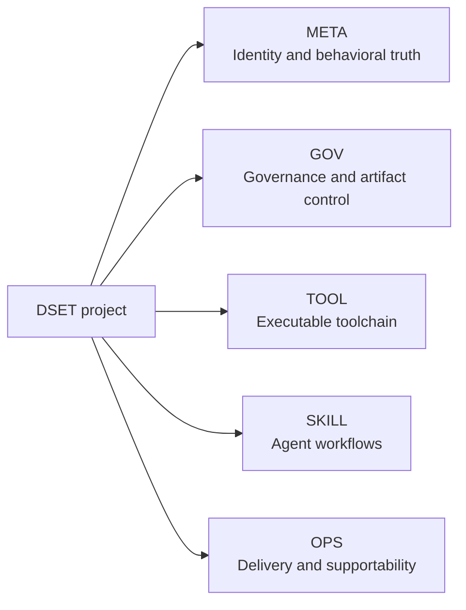
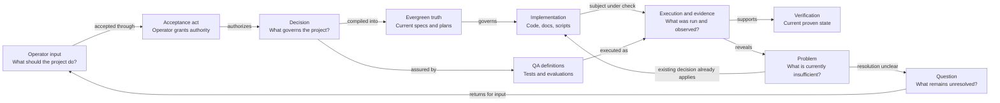

# DSET Spec Loops: A Production Vibecoding Framework

**A framework for production vibecoding.**

DSET expands to **Domain–Supportability–Evals–Tests**.

“Spec” remains in the name because every iteration is a governed spec loop; it is not the `S` in DSET.

The framework treats natural language as a high-leverage programming interface while keeping durable software grounded in explicit domain models, accepted behavioral specifications, production supportability, deterministic tests, qualitative or probabilistic evals, implementation plans, and machine-verifiable gates.

## Purpose

This repository is the public source for the DSET framework, executable toolchain, reusable artifact contracts, and focused agent workflows. It also dogfoods DSET as an adopting project.

## Boundaries

Framework rules and release assets live here. Each adopting repository owns
its own behavioral truth and changes under its local `.dset/` root. Ignored
resumable DSET runtime state lives separately under `.dset_runtime/`, while
disposable process scratch uses `/tmp` on POSIX or the native temporary root on
Windows. Installed skills, cached tooling, private working notes, and external
project artifacts are not independent framework authorities.

Repository behavior is selected in the self-documenting
[`.dset/dset_settings.toml`](.dset/dset_settings.toml). The same file owns project
identity, topology, contracts, release targets, verification commands, and
provenance boundaries, so configuration has one canonical owner.

## Project architecture map

This repository enables layers rather than feature groups. The project view
therefore shows the five immediate semantic owners; each linked layer hub shows
its own main functions one level below.



Project-level truth owns only concerns that cross these immediate owners or
apply to the whole project: shared outcomes and requirements, inter-layer
Contracts and semantics, end-to-end Tests and Evaluations, cross-cutting
Invariants and Constraints, integration architecture, release/readiness, and
cross-owner Questions or Problems. Every claim otherwise stays with the
narrowest common structural owner; the root links child detail without copying
it.

Artifacts trace through ten forward relation types: structure, analysis,
projection, implementation, QA checks, evidence, resolution, scoped override,
complete replacement, and a non-semantic fallback. Reverse edges are derived,
never authored. Evergreen projections store one Type/scope frontier instead of
listing every compiled atom; sealed legacy `child_of` remains compatible.

## Core loop

The core workflow separates unresolved context, atomic authority, compiled
current truth, implementation, and proof. It is an ownership model rather than
a rigid execution order.



- **Operator input** is the source of project intent. An explicit operator
  acceptance act grants project authority to a Decision directive; the act,
  directive, and record carrying it remain distinct.
- **Question** records unresolved knowledge, interpretation, or choice.
- **Problem** records something that is currently wrong, missing, or
  insufficient. It returns directly to implementation when current authority
  already defines the correction; otherwise it raises a Question.
- **Decision** records immutable directive content accepted as project
  authority. Requirements, Constraints, Contracts, User Stories, Outcomes,
  Scenarios, and Invariants are direct Decision subtypes; a general Decision
  has no subtype, and subtypes never contain subtypes.
- **Evergreen truth** is the mutable current projection of active Decisions
  into specifications and implementation, Test, and Evaluation plans.
- **Implementation** contains the actual code, documentation, scripts, Tests,
  Evaluation prompts, and other executable project material.
- **QA** defines checks and keeps deterministic Tests separate from
  qualitative, probabilistic, statistical, or model-judged Evaluations. A
  check's execution and result are work and evidence, not QA atoms.
- **Verification** is a derived statement of the currently proven state, not a
  competing source of authority.

Supportability applies across evergreen truth, implementation, QA, and
verification. It is the risk-scaled ability to investigate, reproduce, and fix
real failures using suitable logs, traces, provenance, state, and runbooks.

## Repository areas

| Area | Start here | Owns |
|---|---|---|
| Methodology | [Methodology hub](methodology/README.md) | Delivery stages, runtime/build rules, proof conventions, and external grounding |
| Artifact governance | [Documentation architecture hub](documentation/README.md) | Artifact types, authoring rules, hubs, maintenance, and `documentation-v1` |
| Project control plane | [DSET project hub](.dset/project/README.md) | Accepted project truth, active/archive changes, schemas, templates, fixtures, [project health](.dset/project/generated/DSET-DERIVED-VIEW-001-project-health.md), traceability, migrations, and supportability |
| Executable CLI | [`dset_toolchain/`](dset_toolchain/) | Dependency-light lifecycle, governance resolution/materialization, immutable-atom sealing, conflict disposition, health rendering, validation, traceability, archive, and bounded self-hosting |
| Agent workflows | [Skills hub](skills/README.md) | Sixteen thin lifecycle, planning, implementation, review, support, and release wrappers backed by one shared runtime |
| Delivery and provenance | [Delivery policy](.github/DELIVERY.md) and [third-party notices](THIRD_PARTY_NOTICES.md) | Protected publication path and external-source/license boundaries |

## What is already here

DSET is now a public, self-hosted framework repository rather than only a
methodology document set. The published `0.3.1` baseline and active `0.4`
self-hosting work include:

- published methodology and documentation governance for Domain,
  Supportability, Evals, Tests, specs, Decisions, contracts, stories, outcomes,
  and risk-scaled proof;
- a repository-local DSET control plane split into the META, GOV, TOOL, SKILL,
  and OPS scopes under [`dset/`](dset/);
- schema `1.2` layered project metadata, Work Areas for monorepos and mixed
  repositories, scoped Changes, and stable project-prefixed artifact IDs;
- a dependency-light Python toolchain with packaged `init`, repository checks,
  Change scaffolding/archive, traceability, governance resolution, bounded
  self-hosting, persistent runtime checkpoints, host skill distribution, and
  coordinated release preparation, plus portable external-review packet,
  report-validation, and finding-reconciliation commands;
- schemas, templates, fixtures, migration guidance, generated traceability, and
  provenance records, plus a deterministic Markdown project-health view with
  explicit coverage denominators and stale/unknown dispositions;
- 16 repository-native skills: one catch-all lifecycle orchestrator, one thin
  direct wrapper per stable lifecycle mode, and two bounded pre-resolution
  entrypoints, plus governing contracts for skill-run logs, session
  checkpoints, and delegation budgets;
- dry-run-first copy distribution for the exact public skill catalog into Codex and Claude
  layouts, with digest verification, collision stops, and invocation receipts;
- GitHub delivery policy, Linux/macOS/native-Windows CI, an explicit WSL proof
  hook, a guarded exact-merge-SHA release publisher, supportability runbooks,
  third-party notices, and PR-linked proof history.

## Run DSET

Read-only validation requires only Python 3.10 or newer:

```bash
python -m dset_toolchain check .
```

For this repository's complete locked Python profile:

```bash
uv sync --locked --dev
uv run dset verify .
```

Initialize an empty or existing repository with a read-only preview first:

```bash
dset init /path/to/project \
  --project-key APP \
  --project-id example-app \
  --name "Example App" \
  --license MIT

# Repeat the reviewed command with --execute to materialize and validate it.
```

Install the complete 16-skill portable catalog and shared runtime after
reviewing the plan:

```bash
dset skills install --host codex
dset skills install --host codex --apply

dset skills install --host claude
dset skills install --host claude --apply
```

The CLI also provides `runtime start|resume|checkpoint|finish`,
`release plan|check|prepare`, `rules check|resolve|materialize|refresh|diff`,
`self-host`, `version`, `new`, `trace`, and guarded `archive` workflows. See
the [project-root guide](.dset/project/README.md) and
[host distribution guide](skills/host-distribution.md) for lifecycle,
authorization, and proof details.

## Source-of-truth model

This public repository is the canonical source for DSET Spec Loops and every released framework-owned methodology document, schema, template, validator, utility, skill, fixture, and migration guide. Installed or workspace-local copies are distributions of this repository, not independent editable sources.

Each project that adopts DSET owns its project truth separately under its own
`.dset/` root. In the current schema 1.3 layout, one
[`.dset/dset_settings.toml`](.dset/dset_settings.toml) owns settings and manifest
facts, `.dset/project/` owns project-wide truth and records, `.dset/versions/`
owns Version lifecycle artifacts, and direct `.dset/<layer>/` roots own
layer-specific truth. Ignored `.dset_runtime/` owns resumable local runs,
sessions, readiness, and recovery state without becoming project truth. Older
central and `dset/` paths remain read-only
compatibility and migration surfaces. Framework truth never replaces project
truth, and project artifacts do not become framework rules unless they are
deliberately contributed here.

Schema 1.3 supports simple repositories and monorepos through neutral Work
Areas: declared repository-relative folders containing any code, deployable,
local, documentation, methodology, data, test, automation, or mixed content.
Every Change and workflow may target the whole repository or one or more Work
Areas without treating those folders as features, modules, or services.

## Status

The methodology is published, the repository dogfoods its own project contract,
and the executable schema/toolchain v1 contract was implemented through PR
[#7](https://github.com/anatoly-m-maslennikov/dset-specs-loops-framework/pull/7).
The coordinated DSET `0.3.1` product/Python-package release was merged through
PR [#10](https://github.com/anatoly-m-maslennikov/dset-specs-loops-framework/pull/10).
It is a framework-foundation release: it validates this repository, publishes
the scoped schema/control-plane shape, and records remaining gaps explicitly.
It is not yet an end-user adoption-readiness claim.

## What is next

The local wheel/toolchain boundary is implemented. The next work should close
the remaining native and hosted evidence gaps without overstating them:

- publish a schema `1.2` compatible validator release so self-hosting no longer
  relies on the migration-baseline bootstrap;
- run authenticated clean-host Codex and Claude discovery/load/invocation,
  local-rule, handoff, and stop proofs and promote only verified receipts;
- run the configured Linux/macOS/native-Windows CI matrix and a labeled WSL
  runner against the same commit;
- exercise the guarded publisher through a real version-changing `dev` to
  `main` delivery, including retry, partial-recovery, and collision evidence;
- finish the next-action heuristic and RC/final readiness integration; refresh
  the generated project-health view when its sources change, and complete
  authenticated independent-review and reconciliation usefulness evidence;
- add the JavaScript/TypeScript applied profile while keeping documentation and
  methodology as first-class Work Areas and implementation roles;
- harden release automation, pinned distribution, hosted exact-head proofs, and
  recovery diagnostics before claiming `1.0` adoption readiness.

External adopter pilots are separate project-owned work and are not part of
the current DSET repository release scope.
