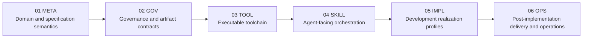
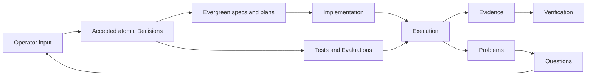

# DSET Spec Loops: A Production Vibecoding Framework

**A framework for production vibecoding.**

DSET expands to **Domain–Supportability–Evals–Tests**. “Spec” remains in the
name because every iteration is a governed specification loop; it is not the
`S` in DSET.

DSET treats natural language as a high-leverage development interface while
keeping production work grounded in explicit domain truth, accepted atomic
decisions, supportability, deterministic tests, qualitative or probabilistic
evaluations, implementation plans, provenance, and verifiable evidence.

## What this repository contains

This repository is both:

- the public source of the portable DSET framework, Python toolchain, schemas,
  templates, governing documents, and 18 agent-facing skills; and
- a recursive DSET adopter whose own development artifacts exercise that
  framework.

The two roles are deliberately separated:

| Surface | Role |
|---|---|
| `10_project` and `11_layer_meta` through `16_layer_ops` | Reusable framework source organized by project and ordered layers |
| `50_versions` | Public framework edition and release projections |
| `000_dset-methodology-hub.md` | Installed project-local methodology resolved by thin skills |
| `DSET-PROJECT-HUB.md` and `DSET-META-HUB.md` through `DSET-OPS-HUB.md` | This repository's applied project and six layer artifacts, including Implementation Profiles |
| `DSET-VERSIONS-HUB.md` | This repository's applied Version artifacts and Changes |
| `.dset_runtime/` | Local resumable sessions and generated views; never project authority |

An adopter gets the same project-local separation under `.dset/`. The root
`10`–`50` source tree exists in this repository because DSET itself is the
product being developed; it is not copied into ordinary adopter repositories.

## Architecture

DSET uses ordered layers in this repository. Authority flows forward and a
layer should affect only the next layer where practical. A downstream layer
may consume, implement, check, or evidence upstream authority, but it cannot
govern an earlier layer.



Features are different: features are peers joined by horizontal contracts.
When an intended layer structure develops unavoidable backward dependencies,
DSET should propose remodelling those owners as features instead of pretending
the dependency direction is still layered.

## Authority and carrier model

DSET keeps three active carrier roles separate:

1. **Atomic artifacts** are immutable accepted claims or transactional events,
   such as Decisions, Questions, Problems, QA definitions, and lifecycle
   records. A newer atom may replace or override an older atom through an
   explicit relation; the older carrier is never edited.
2. **Evergreen artifacts** are mutable current specifications and plans. They
   are semantic syntheses of applicable atoms, not mechanically concatenated
   ledgers.
3. **Implementation artifacts** are code, documentation, configuration,
   migrations, test implementations, evaluation implementations, and other
   material that realizes accepted truth.

Settings and registries share the unique `dset_settings.toml` carrier inside
the selected project control plane. Aggregate artifact, intake, atom,
lifecycle, provenance, and version registries are not parallel active
authorities. Historical aggregates, completed migrations, and compatibility
snapshots live only in the inert root `90_legacy` archive, outside `.dset` and
outside skill discovery or current compilation.

Semantic compilation is **on demand**. A new atom does not force every
evergreen document to be rewritten. `dset-compile` updates only affected owners
when the operator requests compilation or a downstream entry gate requires
current evergreen truth.

## Core development loop



- A **Decision** is accepted project authority. Requirement, Constraint,
  Contract, User Story, Outcome, Scenario, and Invariant are direct Decision
  subtypes; a general Decision has no subtype.
- A **Question** records unresolved knowledge or choice. Conflict, Risk, and
  Opportunity are direct Question subtypes.
- A **Problem** records something currently wrong, missing, or insufficient.
  Defect, Gap, and Debt are direct Problem subtypes.
- **QA** keeps deterministic Tests separate from qualitative, probabilistic,
  statistical, or model-judged Evaluations.
- **Evidence** records an observation. **Verification** states what applicable
  evidence supports at one exact revision; neither overrides accepted atoms.

Supportability crosses all stages: production work must leave enough logs,
traces, provenance, state, and runbook context to investigate, reproduce, and
fix real failures. Durability mechanisms remain risk- and topology-specific.

## Relations

Authored relations are forward and single-purpose:

- `child_of` narrows or specializes a parent claim;
- `analysis_of` interprets a subject without authorizing it;
- `projection_of` binds an evergreen frontier to the latest applicable atom in
  its declared type/scope range;
- `implementation_of`, `check_of`, and `evidence_for` connect realization and
  assurance;
- `resolution_of` closes a Question or Problem;
- `override_of` replaces inherited authority only within a narrower scope;
- `replacement_of` completely succeeds an older immutable atom; and
- `relates_to` is the non-semantic fallback.

Reverse indexes are derived. Every child stores its own relation; parents are
never mutated to list children.

## Start here

| Area | Hub |
|---|---|
| Reusable framework overview | `000_dset-project-hub.md` |
| Reusable META method | `000_dset-meta-hub.md` |
| Reusable artifact governance | `000_dset-gov-hub.md` |
| Installed project-local methodology | `000_dset-methodology-hub.md` |
| Self-hosting project artifacts | `DSET-PROJECT-HUB.md` |
| Toolchain implementation | [`dset_toolchain/`](dset_toolchain/) |
| Agent workflows | [Skills](skills/README.md) |
| Applied Version lifecycle | `DSET-VERSIONS-HUB.md` |
| Delivery boundary | [GitHub delivery policy](.github/DELIVERY.md) |

## Commands

Read-only repository validation requires Python 3.10 or newer:

```bash
python -m dset_toolchain check .
```

Initialize an empty or existing repository with a preview first:

```bash
dset init /path/to/project \
  --project-key APP \
  --project-id example-app \
  --name "Example App" \
  --license MIT

# Repeat with --execute only after reviewing the preview.
```

Install the portable skill catalog with a dry run before applying it:

```bash
dset skills install --host codex
dset skills install --host codex --apply

dset skills install --host claude
dset skills install --host claude --apply
```

Framework maintainers can preview and then synchronize the reusable source into
the installed project-local methodology:

```bash
python -m dset_toolchain methodology check .
python -m dset_toolchain methodology sync .
python -m dset_toolchain methodology sync . --execute
```

Synchronization is explicit and one-way: ordinary root-source edits never
rewrite `.dset/000_dset_methodology/`, and installed files are never copied
back into the root source. Run the execute form only when the operator requests
the refresh.

The main operator surface is `dset`. Direct entries
include decisions, semantic compilation, proof planning, implementation
planning, implementation, verification, overview, diagnosis, clarification,
landscape analysis, prototyping, triage, release, and completion.

## Current status

The coordinated public baseline is `0.3.1`. This working repository now uses
schema `1.5` and the separated-methodology layout intended for the next
version. Historical migrations remain in the inert root archive and are not
current framework inputs. Release-readiness claims continue to require the
separate configured verification and hosted-delivery gates.
