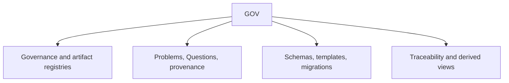

# GOV scope

## Purpose

Own repository governance, artifact architecture, intake, provenance, migrations, and derived relationship views.

## Boundaries

GOV owns the single intake and governance registries. Generated views are navigational evidence, not parallel truth, and other scopes retain their own semantic artifacts.

## Layer map

## Start here

- [Governance registry](governance.yaml)
- [Artifact-type registry](artifact-types.yaml)
- [Governing rules](governance/README.md)
- [Intake](intake.yaml)
- [Methodology package fragment](specs/packages/methodology/README.md)
- [Schemas](schemas/README.md)
- [Templates](templates/README.md)
- [Changes](changes/README.md)
- [Generated traceability](generated/traceability.yaml)
