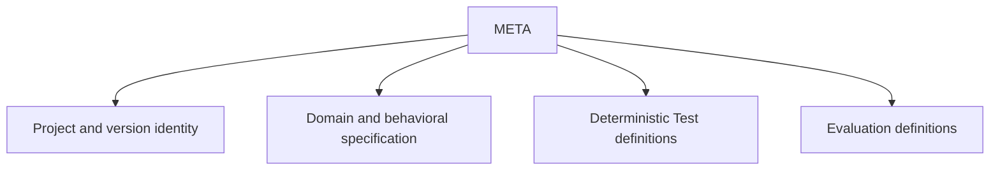

# META scope

## Purpose

Own project identity, accepted behavioral truth, specification semantics, and proof-plan definitions.

## Boundaries

META owns the project manifest and version identity plus the META fragment of each accepted package. It does not own repository governance, tooling, skill orchestration, or operations.

## Layer map

## Start here

- [Project manifest](dset.toml)
- [Methodology package fragment](specs/packages/methodology/README.md)
- [Governing rules](governance/domain-spec-authoring.md)
- [Schemas](schemas/README.md)
- [Templates](templates/README.md)
- [Changes](changes/README.md)
