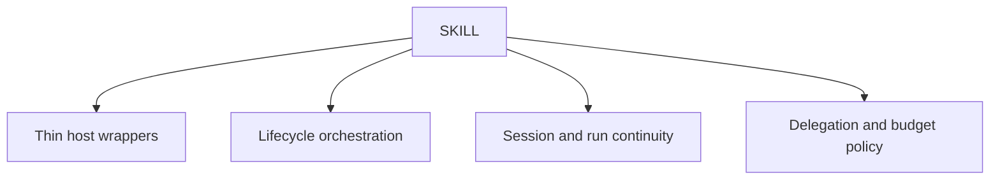

# SKILL scope

## Purpose

Own agent-facing workflow orchestration, delegation, local run evidence,
session continuity, and thin-wrapper contracts.

## Boundaries

SKILL owns workflow rules and accepted skill behavior. Host-native source packages remain under `skills/` and cannot become a second rule store.

## Layer map

## Start here

- [Lifecycle orchestration](governance/lifecycle-orchestration.md)
- [Run and session continuity](governance/skill-runs.md)
- [Delegation budget](budget.yaml)
- [Methodology package fragment](specs/packages/methodology/README.md)
- [Schemas](schemas/README.md)
- [Templates](templates/README.md)
- [Active Changes](changes/README.md)
