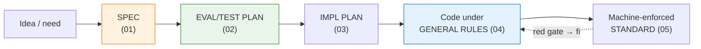

# 00_Tool Development Playbook

**Thesis:** Every internal tool is built through the same pipeline of **authored artifacts**: first the **SPEC** (what the tool is), then the **EVAL/TEST PLAN** (how we will know it works — written before code), then the **IMPL PLAN** (how we will build and roll it out safely), then **code under the general build rules**, with the shared standard **machine-enforced by gates**, not prose. Each stage has exactly one governing doc, numbered in pipeline order (01–05); [[06_External Grounding — LLM Power-User Practice]] is the provenance/source map behind the standard. This playbook is the map, not a restatement — use it to choose the right doc, then open that doc when you reach the stage.

---

## §0 | Document map — what each doc owns

¶1 Use this as the table of contents and boundary map for the methodology folder: each doc owns one layer of the pipeline, and cross-links are pointers, not permission to duplicate the same rule in multiple places.

> [!example]- Folder map
> | Doc | What it is about | Open it when | It does not own |
> |---|---|---|---|
> | [[00_Tool Development Playbook]] | The whole pipeline map: which artifact comes next, how the stages scale from one-shot scripts to deployed services, and where the external grounding lives | You need to decide which methodology doc applies now | The detailed rules for any individual stage |
> | [[01_Spec Authoring Patterns — Service Spec Conventions]] | How to write the service spec: entities, lifecycle/state machines, control plane, schema/source-of-truth, and rationale split | You are defining what the tool is before designing tests or code | Eval design, implementation sequencing, generic code rules, or executable gates |
> | [[02_Eval and Test Plan Patterns — Test Plan Authoring Conventions]] | How to design proof before code: deterministic checks, probabilistic/LLM assertions, golden cases, fakes, calibration, drift/adversarial cases, and runnable gates | You need to answer “how will we know this works?” before implementation | The business/domain spec itself, rollout sequencing, or code architecture rules |
> | [[03_Implementation Plan Patterns — Service Build Conventions]] | How to turn an accepted spec into a service build plan: read-only exploration, build order, schema/store binding, event log/idempotency, safe-rung rollout, chokepoints, shadow, and milestone checks | You are planning the actual build and rollout of a deployed/resumable service | Generic tool-code pattern catalog or enforcement mechanics |
> | [[04_General Build Rules — Tool Code Conventions]] | The generic code/runtime rule catalog for any tool: pure core/injected shell, WAL/crash-only restart, reconciliation, rate limits, observability, least privilege, secret handling, failure classification, and named pattern provenance | You need the rule/pattern name and the general coding convention that should apply | A service-specific milestone plan or the exact tests/gates that enforce the rule |
> | [[05_Layered Build Standard — DDD, TDD, Small Functions, Typed Gates]] | The executable standard: layering gates, small-function ratchets, TDD/pinning tests, strict typed seams, lint/conformance/spec-sync checks, injection canaries, and agent-facing health commands | You need to make 04’s rules mechanically enforceable in a codebase | Re-cataloging the pattern origins already owned by 04, except where a gate needs exact structure |
> | [[06_External Grounding — LLM Power-User Practice]] | The external source map behind the standard: Karpathy-style Software 3.0 framing, Willison/Anthropic AI-assisted coding practice, eval research, agent safety, agent-config findings, OpenSpec delta-spec/change-folder/archive model, and superpowers strict executable agent skills (TDD, verification, subagent review) | You need provenance, justification, or candidate improvements grounded in external practice | Local pipeline ownership; it informs 00–05 rather than replacing them |

---

## §1 | The pipeline — stage, artifact, governing doc

¶1 One row per stage: the artifact you produce and the doc that governs it.

> [!example]- The five stages
> | # | Stage | Artifact you produce | Governing doc |
> |---|---|---|---|
> | 1 | **Spec** | The *what*: domain entities + per-entity lifecycle FSMs, control plane, schema-as-source-of-truth; the *why* split into a separate ADR-style rationale doc | [[01_Spec Authoring Patterns — Service Spec Conventions]] |
> | 2 | **Eval/test plan** | The *proof design*: deterministic core vs nondeterministic edge, unit→integration→E2E levels, fakes/golden corpus/gates — authored WITH the spec, before code | [[02_Eval and Test Plan Patterns — Test Plan Authoring Conventions]] |
> | 3 | **Impl plan** | The *how*: build sequence in the spec's dependency order, store/DDL binding, engine-vs-authoring split, safe-rung rollout ladder, shadow | [[03_Implementation Plan Patterns — Service Build Conventions]] |
> | 4 | **Code** | The tool itself, under the always-on general rules: small functions, nothing-important-in-memory (all state on disk), WAL durability + crash-only restart, workers doing atomic operations, start/complete/fail event logs, hot-reloaded TOML tuning, adapter-only secret loading from local `.env` / secret stores, polite rate-limiting | [[04_General Build Rules — Tool Code Conventions]] |
> | 5 | **Enforcement** | Rules as executable gates in the tool's own suite: conformance (≤25-line functions), purity (layer matrix), spec-sync, mypy typed seams, lint | [[05_Layered Build Standard — DDD, TDD, Small Functions, Typed Gates]] |

## §2 | Scale it to the tool

¶1 The pipeline scales down by tool class — what may be skipped and what never is.

> [!example]- Scaling rules
> - **Deployed service** (long-running, triggered, resumable, progressively autonomous): full pipeline, all five stages, each artifact a separate doc.
> - **One-shot / utility script**: spec may be a §-block instead of a doc set, the impl plan may collapse into the spec — but the **eval/test plan thinking** (02: what proves it works, which parts are deterministic or probabilistic) and the **general rules** (04) apply in full, and any script that survives past a week gets the gates (05) via the adoption checklist. The "no vault doc set needed" default still holds for a tool's *first* deployment — promote it to a doc set once it proves reusable across multiple deployments.
> - **Never skipped, any size**: 04's four load-bearing rules (functional core + injected shell, WAL + crash-only restart, idempotent reconcile against the source of truth, observed-progress liveness) and a pinning test per fixed bug.
> - **Ordering is load-bearing**: the eval/test plan is written *with* the spec, before code — writing it after the fact produces tests that pin the implementation, not the intent.
> - **Prototype vs durable tool**: vibe-coding is fine for low-stakes exploration; a tool graduates to this pipeline once it must persist, touch private data, perform external writes, or be maintained by another human or agent. The pipeline is the answer to the “fast first 70%, hard final 30%” problem from [[06_External Grounding — LLM Power-User Practice]].

---

## §3 | External grounding

¶1 The external source map for Karpathy-style Software 3.0, Simon Willison-style production AI-assisted coding, Anthropic Claude Code practices, eval research, agent-config research, OpenSpec delta-spec/change-folder/archive model, and superpowers strict executable agent skills (TDD, verification, subagent review) lives in [[06_External Grounding — LLM Power-User Practice]]. These are borrowed operating patterns integrated into the methodology, not replacements for it. Use 06 as provenance for the 00–05 standard without bloating the stage docs.

---
