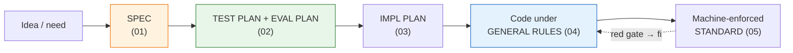

# 00_Tool Development Playbook

**Thesis:** Every durable internal tool is built through the same pipeline of **authored artifacts**: first the **SPEC** (what the tool is, including its risk-scaled production supportability contract), then a separate **TEST PLAN** (deterministic proof) and **EVAL PLAN** (probabilistic or qualitative proof), then the **IMPL PLAN** (how we will build and roll it out safely), then **code under the general build rules**, with the shared standard **machine-enforced by gates**, not prose. The test and eval plans are written with the spec, before code, but remain independently reviewable artifacts. Each stage has exactly one governing doc, numbered in pipeline order (01–05); [06_External Grounding — LLM Power-User Practice](<06_External Grounding — LLM Power-User Practice.md>) is the provenance/source map behind the standard. This playbook is the map, not a restatement — use it to choose the right doc, then open that doc when you reach the stage.

---

## §0 | Document map — what each doc owns

¶1 Use this as the table of contents and boundary map for the methodology folder: each doc owns one layer of the pipeline, and cross-links are pointers, not permission to duplicate the same rule in multiple places.

Folder map

| Doc | What it is about | Open it when | It does not own |
|---|---|---|---|
| [00_Tool Development Playbook](<00_Tool Development Playbook.md>) | The whole pipeline map: which artifact comes next, how the stages scale from one-shot scripts to deployed services, and where the external grounding lives | You need to decide which methodology doc applies now | The detailed rules for any individual stage |
| [01_Spec Authoring Patterns — Service Spec Conventions](<01_Spec Authoring Patterns — Service Spec Conventions.md>) | How to write the service spec: entities, lifecycle/state machines, control plane, schema/source-of-truth, production supportability contract, and rationale split | You are defining what the tool is before designing tests or code | Eval design, implementation sequencing, generic code rules, or executable gates |
| [02_Test and Eval Plan Patterns — Proof Artifact Conventions](<02_Test and Eval Plan Patterns — Proof Artifact Conventions.md>) | How to design proof before code in two linked artifacts: a deterministic test plan, including supportability-contract tests, and a probabilistic/qualitative eval plan, including operator-usefulness evals | You need to answer “how will we know this works?” before implementation | The business/domain spec itself, rollout sequencing, or code architecture rules |
| [03_Implementation Plan Patterns — Service Build Conventions](<03_Implementation Plan Patterns — Service Build Conventions.md>) | How to turn an accepted spec into a service build plan: read-only exploration, profile/topology propagation, durability binding, supportability milestones, conditional event/reconcile/workflow patterns, safe-rung rollout, chokepoints, shadow, and milestone checks | You are planning the actual build and rollout of a deployed service | Generic tool-code pattern catalog or enforcement mechanics |
| [04_General Build Rules — Tool Code Conventions](<04_General Build Rules — Tool Code Conventions.md>) | The generic code/runtime rule catalog for any tool: runtime risk profiles, file/database/backing-service durability topologies, concern-scoped authority, conditional recovery/reconciliation, rate limits, supportability, least privilege, secret handling, and failure classification | You need the rule/pattern name and the general coding convention that should apply | A service-specific milestone plan or the exact tests/gates that enforce the rule |
| [05_Layered Build Standard — DDD, TDD, Small Functions, Typed Gates](<05_Layered Build Standard — DDD, TDD, Small Functions, Typed Gates.md>) | The executable standard: six language-neutral gate categories instantiated through applied language profiles, plus risk-triggered supplemental supportability and safety gates, TDD/pinning proof, injection canaries, and agent-facing health commands | You need to make 04’s rules mechanically enforceable with tools and thresholds appropriate to the implementation language | Re-cataloging 04’s patterns or imposing one language’s tools and thresholds on every project |
| [06_External Grounding — LLM Power-User Practice](<06_External Grounding — LLM Power-User Practice.md>) | The external source map behind the standard: Karpathy-style Software 3.0 framing, Willison/Anthropic AI-assisted coding practice, eval research, agent safety, agent-config findings, OpenSpec delta-spec/change-folder/archive model, and superpowers strict executable agent skills (TDD, verification, subagent review) | You need provenance, justification, or candidate improvements grounded in external practice | Local pipeline ownership; it informs 00–05 rather than replacing them |

---

## §1 | The pipeline — stage, artifact, governing doc

¶1 One row per stage: the artifact you produce and the doc that governs it.

The five stages

| # | Stage | Artifact you produce | Governing doc |
|---|---|---|---|
| 1 | **Spec** | The *what*: domain entities + per-entity lifecycle FSMs, control plane, schema-as-source-of-truth, and a risk-scaled production supportability contract; the *why* split into a separate ADR-style rationale doc | [01_Spec Authoring Patterns — Service Spec Conventions](<01_Spec Authoring Patterns — Service Spec Conventions.md>) |
| 2 | **Test plan + eval plan** | The *proof design*: deterministic unit→integration→E2E and supportability-contract checks in `test-plan.md`; probabilistic, qualitative, LLM, or operator-usefulness proof in `eval-plan.md`; both authored WITH the spec, before code | [02_Test and Eval Plan Patterns — Proof Artifact Conventions](<02_Test and Eval Plan Patterns — Proof Artifact Conventions.md>) |
| 3 | **Impl plan** | The *how*: build sequence in the spec's dependency order, propagation of runtime risk, durability ownership, and supportability requirements, authoritative contract binding, conditional event/reconcile/workflow milestones, engine-vs-authoring split, safe-rung rollout, and shadow | [03_Implementation Plan Patterns — Service Build Conventions](<03_Implementation Plan Patterns — Service Build Conventions.md>) |
| 4 | **Code** | The tool itself under 04's two-axis routing: runtime risk selects required recovery, safety, and supportability semantics; topology and write volume/concurrency select authoritative files, a local database, or external backing services. Event logs, reconciliation, durable execution, and observed-progress liveness remain conditional | [04_General Build Rules — Tool Code Conventions](<04_General Build Rules — Tool Code Conventions.md>) |
| 5 | **Enforcement** | Six executable gate categories in the tool's own suite—conformance, purity, spec-sync, typing/contracts, lint/static analysis, and secret hygiene—implemented by the project's selected language profile; risk-triggered supportability proof remains a supplemental gate | [05_Layered Build Standard — DDD, TDD, Small Functions, Typed Gates](<05_Layered Build Standard — DDD, TDD, Small Functions, Typed Gates.md>) |

## §2 | Scale it to the tool

¶1 The pipeline scales down by tool class — what may be skipped and what never is.

Scaling rules

- **Deployed service** (long-running, triggered, resumable, progressively autonomous): full pipeline, all five stages, each artifact a separate doc.
- **Production supportability**: every production-bound tool declares the minimum evidence, correlation and deploy identity, safe diagnostic path, data-governance controls, and runbook appropriate to its profile and topology. A non-production local tool may mark the contract not applicable with a reason; a production system may scale it down, but may not silently omit it.
- **One-shot / utility script**: the spec may be a §-block instead of a doc set, and the impl plan may collapse into it. Deterministic test thinking still applies; an eval plan is required only when behavior is probabilistic or qualitative. Apply 04 through its risk profiles rather than forcing durable-runtime machinery onto a transient script. Any script that survives past a week or gains persistence, private data, external writes, retries, or shared maintenance gets the corresponding gates (05).
- **Never skipped, any size**: explicit scope, a deterministic verification command, recoverability-aware error handling, secret hygiene when credentials exist, and a pinning test per fixed bug. Stateful/retryable tools must declare authority and recovery per concern; event logs, reconciliation, durable workflow execution, and observed-progress liveness become mandatory only when their narrower semantics are triggered.
- **Ordering is load-bearing**: the test plan and applicable eval plan are written *with* the spec, before code — writing either after the fact produces proof that follows the implementation instead of pinning the intent.
- **Prototype vs durable tool**: vibe-coding is fine for low-stakes exploration; a tool graduates to this pipeline once it must persist, touch private data, perform external writes, or be maintained by another human or agent. The pipeline is the answer to the “fast first 70%, hard final 30%” problem from [06_External Grounding — LLM Power-User Practice](<06_External Grounding — LLM Power-User Practice.md>).

---

## §3 | External grounding

¶1 The external source map for Karpathy-style Software 3.0, Simon Willison-style production AI-assisted coding, Anthropic Claude Code practices, eval research, agent-config research, OpenSpec delta-spec/change-folder/archive model, and superpowers strict executable agent skills (TDD, verification, subagent review) lives in [06_External Grounding — LLM Power-User Practice](<06_External Grounding — LLM Power-User Practice.md>). These are borrowed operating patterns integrated into the methodology, not replacements for it. Use 06 as provenance for the 00–05 standard without bloating the stage docs.

---
