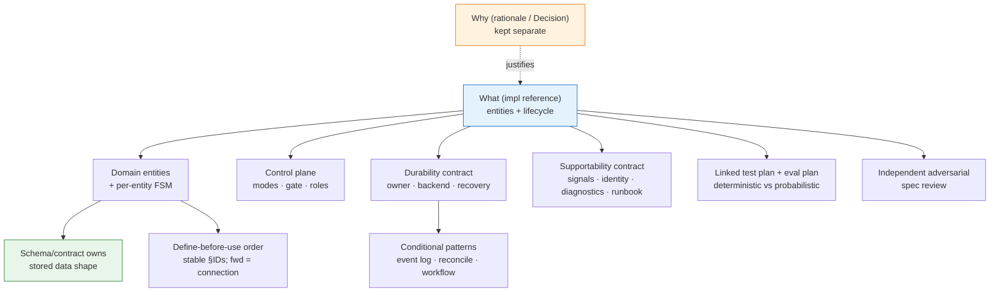

# 01_Spec Authoring Patterns — Service Spec Conventions

**Thesis:** When you write the spec for a **deployed service**—including a stateless service whose durable state lives in backing systems—don't invent ad-hoc structure; reuse the named patterns below. The spec must declare its runtime risk profile, durability ownership per concern, and risk-scaled production supportability contract before it selects event sourcing, reconciliation, or durable execution. This is **stage 1** of [00_Tool Development Playbook](<00_Tool Development Playbook.md>): the spec comes first; its separate deterministic **test plan** and probabilistic/qualitative **eval plan** are authored with it per [02_Test and Eval Plan Patterns — Proof Artifact Conventions](<02_Test and Eval Plan Patterns — Proof Artifact Conventions.md>); and the code-side conventions live in [04_General Build Rules — Tool Code Conventions](<04_General Build Rules — Tool Code Conventions.md>). The catalog is §1, ordered by importance; the apply-it checklist is §2.

---

## §1 | The pattern catalog

¶1 One row per decision: the convention and its canonical name + originator. Rows are ordered by importance; the `Priority` column replaces a separate duplicate “load-bearing” section. Reuse the **name**, not a synonym.

Catalog (ordered by importance)

| # | Priority | Convention | Established pattern (term · originator) |
|---|---|---|---|
| 1 | Core spine | Model the service as **domain entities + per-entity lifecycle state machines** before any code | **Domain-Driven Design** (Evans, 2003) — entities / aggregates; **finite-state machine**; current status = a **projection** |
| 2 | Core spine | The stored-data **schema or contract owns data shape**—DDL for a database, a versioned file/schema contract for file-backed tools, or the backing service's contract; link it instead of copying fields into prose | **single source of truth per concern / DRY** (Hunt & Thomas); **schema-first / contract-first** |
| 3 | Core spine | Split the spec into the **what** (a clean implementation reference) and the **why** (rationale), in separate docs | **Architecture Decision Record** (Nygard, 2011) for the *why*; **separation of concerns** (Dijkstra) keeps the *what* uncluttered |
| 4 | Core spine | Order sections so each entity is **defined using only entities above it**; a forward `(§N)` is a *connection*, not a definition | **declaration-before-use** (compiler / topological order) + the **Principle of Least Astonishment / Rule of Least Surprise** (popularized by Raymond, *The Art of Unix Programming*, 2003; predates him — PL/I community, 1960s) for reading order; the discipline = separate **definition** from **connection** |
| 5 | Core spine | Give sections **stable IDs** so the physical order can change without breaking cross-references | **stable identifiers / permalinks** + a level of **indirection** (“any problem solvable by another layer of indirection”, Wheeler) |
| 6 | Runtime spine | Declare the **authoritative owner per state concern** and select the backing topology from risk, write volume, and concurrency: files for modest local workloads, an embedded/local database or database server for heavier local workloads, and external databases/brokers/object stores/workflow stores for stateless services. Use an append-only event log only when audit/history/replay is a requirement | **single source of truth per concern** + Twelve-Factor **backing services**; optional **Event Sourcing** (Fowler, 2005) and CQRS projection (Young) |
| 7 | Runtime spine | Define the **receiving-side idempotency boundary** and deduplication key for retry and resume; delivery remains at-least-once, while accepted effects are effectively-once only inside that named boundary | **idempotency key** (Stripe / HTTP); **at-least-once delivery** + receiving-side deduplication/idempotency ⇒ **effectively-once effects within the boundary** |
| 8 | Runtime spine | When desired state must converge with independently changing observed state, define a **reconcile / catch-up loop** plus a repeat-safe watermark; ordinary transactional CRUD without that split does not need a controller | **control loop** (Kubernetes controllers, *level-triggered*) + **watermark / dedup**; conditional on a desired/observed or external-effect boundary |
| 9 | Safety | **Graduate autonomy by blast radius** (a ladder from no-op → irreversible), default to the safe rung, with a hard **kill-switch** above it | **fail-safe defaults** (Saltzer & Schroeder, 1975); **graduated autonomy / capability ladder**; **circuit-breaker / kill-switch** (Nygard, *Release It!*) |
| 10 | Safety | A **composed gate** (confidence/policy from many inputs) with **human-in-the-loop escalation** that hands off instead of dead-stopping | **human-in-the-loop**; **graceful degradation** (established fault-tolerance principle, not coined by Nygard); gate = a **policy** composed at decision time |
| 11 | Safety | A **shadow vs live role** so a change can be evaluated on real input with zero external effect | **shadow deployment / dark launch** (sibling of canary); **shadow testing** |
| 12 | Architecture | An **engine-vs-authoring contract** — a stable code engine owns the I/O contract; editable domain content (runbooks / prompts) is injected | **separation of mechanism and policy** (Brinch Hansen, RC 4000, 1970; popularized as Unix’s *mechanism, not policy*) + **policy-as-configuration**; the wrapper owns the structured I/O a runbook doesn’t specify |
| 13 | Proof | Link two proof artifacts from the spec: a **test plan** for deterministic unit → integration → end-to-end checks and an **eval plan** for probabilistic, qualitative, or LLM behavior | owned by [02_Test and Eval Plan Patterns — Proof Artifact Conventions](<02_Test and Eval Plan Patterns — Proof Artifact Conventions.md>) (test pyramid, Humble Object / test doubles, contract tests, calibrated evals) |
| 14 | Proof | **Make the spec agent-verifiable** — every invariant names the command, fixture diff, screenshot comparison, smoke check, or eval that will prove it | **executable specification**; acceptance tests; reinforced by [06_External Grounding — LLM Power-User Practice](<06_External Grounding — LLM Power-User Practice.md>) |
| 15 | Change control | **Package spec changes as delta specs inside a change folder** — each change is one bounded work unit; delta specs declare ADDED/MODIFIED/REMOVED requirements against the current-truth spec; archiving the change merges resolved deltas back into truth | **delta-spec / change-folder / archive** model (OpenSpec, Fission-AI) |
| 16 | Scope control | **Spec-ahead-of-code is fine** — define the target; mark every not-yet item **deferred / out-of-scope** explicitly | **design-first / spec-first**; explicit **out-of-scope** to fence **scope creep** |
| 17 | Context control | **Treat context as a budget** — keep the implementation reference concise; include examples and non-goals, but link out to bulky rationale/source material | **context engineering** + **progressive disclosure**; less irrelevant context means better agent behavior |
| 18 | Review hygiene | **Validate the finished spec with an independent, adversarial reviewer** before calling it done | **independent / adversarial review**; spec **walkthrough** (Fagan inspection) |
| 19 | Reading hygiene | **Progressive-disclosure formatting** — thesis + headings + one ordering ¶ visible; detail in GitHub-native collapsed details sections | **progressive disclosure** (popularized by Nielsen / NN/g, not coined by him); the KG **skim rule** |
| 20 | Provenance | **Cite provenance** — link the schema, the prior-art SOPs, the source data the model was distilled from | **source attribution**; reuse over reinvention |
| 21 | Runtime spine | Define the **production supportability contract** at the selected risk/profile level: incident triggers and service objectives; structured logs, traces, or local diagnostic records; correlation and deploy/change identity; safe read-only diagnostic commands and permissions; retention, redaction, access, deletion, volume, cardinality, and sampling bounds; runbook, escalation, rollback/kill-switch, and incident-to-requirement/PR/fix traceability. Telemetry is evidence, not a second business-state authority | **observability** + **operability** + incident-response **traceability**; profile-scaled and vendor-neutral |

## §2 | Apply it to the next deployed-service spec

¶1 A profile-routed checklist: every service declares the ownership and recovery contract; event logs, controllers, and durable workflow engines appear only when their semantics are required.

Checklist

- [ ] **Two docs: what vs why** — an implementation-reference spec (entities/lifecycle/control) + a separate rationale or Decision doc; keep the *what* free of justification prose.
- [ ] **Entities + lifecycle first** — name the domain entities, their properties, and each entity's state machine before any code.
- [ ] **Stored-data contract** — identify the DDL, file/schema contract, or backing-service contract that owns each stored shape; link it and never maintain a second field list in prose.
- [ ] **Define-before-use order + stable IDs** — each section defines using only entities above; forward links are connections; section IDs are stable so the order is free to change.
- [ ] **Inputs / outputs as first-class entity lists** — what the service reads and what it produces, each its own catalog (balance the two).
- [ ] **Graduated autonomy** — a mode ladder by blast radius, safe default, hard kill-switch; tie every external write to a rung.
- [ ] **Runtime profile + durability ownership table** — for every concern name the authority, backing system, write rate/volume, concurrency/writer model, reload semantics, and recovery proof. Process memory is never the sole durable authority.
- [ ] **Production supportability contract** — name the incident triggers/objectives, required signals, correlation and deploy/change identity, safe diagnostic commands and permissions, retention/redaction/access/deletion and volume/cardinality/sampling bounds, runbook/escalation/rollback path, and incident-to-requirement/PR/fix links. Mark it not applicable only for a non-production tool and record why.
- [ ] **Event log only when required** — if audit/history/replay is a requirement, define its authority, ordering/version semantics, retention, projection rules, and recovery proof; otherwise use the selected store's ordinary transactional model.
- [ ] **Receiving-side idempotency boundary** — specify the key's exact components, retention window, owner, and atomic check/write operation. Delivery remains at-least-once; deduplication or an idempotent receiver produces effectively-once effects only within that declared boundary.
- [ ] **Conditional scheduler / control loop** — when work discovery, desired/observed convergence, or external recovery requires it, specify what finds, runs, and recovers work, plus the repeat-safe watermark and concurrency boundary. Mark it not applicable for ordinary request/transaction flows.
- [ ] **Composed gate + escalation** — the gate's inputs named; escalation hands off to a human (note + alert) and the run still completes — no dead-stop, no indefinite pause.
- [ ] **Shadow vs live role** — a non-acting role to evaluate a change on real input with zero external effect.
- [ ] **Engine vs authoring contract** — the stable engine owns the I/O contract; editable domain content (runbooks/prompts) is injected, not hard-coded.
- [ ] **Separate proof artifacts linked from the spec** — `test-plan.md` owns deterministic unit, integration, and end-to-end checks; `eval-plan.md` owns probabilistic, qualitative, and real-LLM evaluation. Author both with the spec, before code, per [02_Test and Eval Plan Patterns — Proof Artifact Conventions](<02_Test and Eval Plan Patterns — Proof Artifact Conventions.md>).
- [ ] **Agent-verifiable acceptance** — every important claim points to a runnable check/eval, not only a paragraph a reviewer must believe.
- [ ] **Context budget** — include only the facts an agent needs to implement and verify the service; move bulky rationale, prior art, and raw source material behind links.
- [ ] **Spec-ahead-of-code** — define the target; mark deferred items explicitly (don't silently drop scope, don't smuggle in code-state asides).
- [ ] **Progressive disclosure** — thesis + headings + one ¶ visible; detail in GitHub-native collapsed details sections.
- [ ] **Independent adversarial review** of the finished spec (a separate reviewer / subagent) before declaring it done; fix cross-ref, terminology, and definition-order findings.
- [ ] **Cite provenance** — link the schema, prior-art SOPs, and the source data/examples the model was distilled from.
- [ ] **Change-folder packaging** — each spec change lives in a bounded change folder with delta specs; archive merges resolved deltas back into the spec truth.

