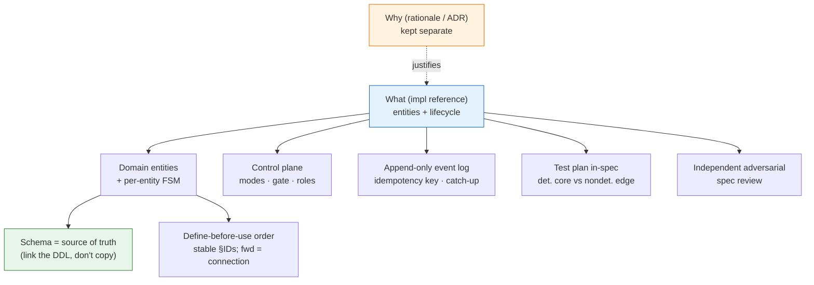

# 01_Spec Authoring Patterns — Service Spec Conventions

**Thesis:** When you write the spec for a **deployed service** — a long-running, externally-triggered, resumable, (progressively) autonomous runtime, not a one-shot script — don't invent ad-hoc structure; each decision below is an instance of a **named, established pattern**; reuse the term so the next author finds the canon. This is **stage 1** of [[00_Tool Development Playbook]]: the spec comes first, its **eval/test plan** is authored with it per [[02_Eval and Test Plan Patterns — Test Plan Authoring Conventions]], and the code-side conventions live in [[04_General Build Rules — Tool Code Conventions]]. The catalog is §1, ordered by importance; the apply-it checklist is §2.

---

## §1 | The pattern catalog

¶1 One row per decision: the convention and its canonical name + originator. Rows are ordered by importance; the `Priority` column replaces a separate duplicate “load-bearing” section. Reuse the **name**, not a synonym.

> [!example]- Catalog (ordered by importance)
> | # | Priority | Convention | Established pattern (term · originator) |
> |---|---|---|---|
> | 1 | Core spine | Model the service as **domain entities + per-entity lifecycle state machines** before any code | **Domain-Driven Design** (Evans, 2003) — entities / aggregates; **finite-state machine**; current status = a **projection** |
> | 2 | Core spine | The **schema (DDL) is the source of truth** for entity properties — link it, never copy columns into prose | **single source of truth / DRY** (Hunt & Thomas); **schema-first** |
> | 3 | Core spine | Split the spec into the **what** (a clean implementation reference) and the **why** (rationale), in separate docs | **Architecture Decision Record** (Nygard, 2011) for the *why*; **separation of concerns** (Dijkstra) keeps the *what* uncluttered |
> | 4 | Core spine | Order sections so each entity is **defined using only entities above it**; a forward `(§N)` is a *connection*, not a definition | **declaration-before-use** (compiler / topological order) + the **Principle of Least Astonishment / Rule of Least Surprise** (popularized by Raymond, *The Art of Unix Programming*, 2003; predates him — PL/I community, 1960s) for reading order; the discipline = separate **definition** from **connection** |
> | 5 | Core spine | Give sections **stable IDs** so the physical order can change without breaking cross-references | **stable identifiers / permalinks** + a level of **indirection** (“any problem solvable by another layer of indirection”, Wheeler) |
> | 6 | Runtime spine | **Append-only event log** as the system of record; derive status by replay | **Event Sourcing** (Fowler, 2005) + **CQRS** projection (Young); **last-writer-wins** for current status |
> | 7 | Runtime spine | An **idempotency key** giving exactly-once side effects across retry & resume | **idempotency key** (Stripe / HTTP); **exactly-once** = at-least-once delivery + dedup |
> | 8 | Runtime spine | A **reconcile / catch-up loop** that resumes stuck work, plus a trigger **watermark** so detection is safe to repeat | **control loop** (Kubernetes controllers, *level-triggered*); **watermark / dedup**; at-least-once + idempotent ⇒ **effectively-once** |
> | 9 | Safety | **Graduate autonomy by blast radius** (a ladder from no-op → irreversible), default to the safe rung, with a hard **kill-switch** above it | **fail-safe defaults** (Saltzer & Schroeder, 1975); **graduated autonomy / capability ladder**; **circuit-breaker / kill-switch** (Nygard, *Release It!*) |
> | 10 | Safety | A **composed gate** (confidence/policy from many inputs) with **human-in-the-loop escalation** that hands off instead of dead-stopping | **human-in-the-loop**; **graceful degradation** (established fault-tolerance principle, not coined by Nygard); gate = a **policy** composed at decision time |
> | 11 | Safety | A **shadow vs live role** so a change can be evaluated on real input with zero external effect | **shadow deployment / dark launch** (sibling of canary); **shadow testing** |
> | 12 | Architecture | An **engine-vs-authoring contract** — a stable code engine owns the I/O contract; editable domain content (runbooks / prompts) is injected | **separation of mechanism and policy** (Brinch Hansen, RC 4000, 1970; popularized as Unix’s *mechanism, not policy*) + **policy-as-configuration**; the wrapper owns the structured I/O a runbook doesn’t specify |
> | 13 | Proof | Put the **test plan in the spec**: a **deterministic core** (no LLM / no nondeterministic dep) vs the **nondeterministic edge** (LLM), at unit → integration → **end-to-end** levels | owned by [[02_Eval and Test Plan Patterns — Test Plan Authoring Conventions]] (test pyramid, Humble Object / test doubles, contract tests) |
> | 14 | Proof | **Make the spec agent-verifiable** — every invariant names the command, fixture diff, screenshot comparison, smoke check, or eval that will prove it | **executable specification**; acceptance tests; reinforced by [[06_External Grounding — LLM Power-User Practice]] |
> | 15 | Change control | **Package spec changes as delta specs inside a change folder** — each change is one bounded work unit; delta specs declare ADDED/MODIFIED/REMOVED requirements against the current-truth spec; archiving the change merges resolved deltas back into truth | **delta-spec / change-folder / archive** model (OpenSpec, Fission-AI) |
> | 16 | Scope control | **Spec-ahead-of-code is fine** — define the target; mark every not-yet item **deferred / out-of-scope** explicitly | **design-first / spec-first**; explicit **out-of-scope** to fence **scope creep** |
> | 17 | Context control | **Treat context as a budget** — keep the implementation reference concise; include examples and non-goals, but link out to bulky rationale/source material | **context engineering** + **progressive disclosure**; less irrelevant context means better agent behavior |
> | 18 | Review hygiene | **Validate the finished spec with an independent, adversarial reviewer** before calling it done | **independent / adversarial review**; spec **walkthrough** (Fagan inspection) |
> | 19 | Reading hygiene | **Progressive-disclosure formatting** — thesis + headings + one ordering ¶ visible; detail in default-collapsed callouts | **progressive disclosure** (popularized by Nielsen / NN/g, not coined by him); the KG **skim rule** |
> | 20 | Provenance | **Cite provenance** — link the schema, the prior-art SOPs, the source data the model was distilled from | **source attribution**; reuse over reinvention |

## §2 | Apply it to the next deployed-service spec

¶1 A checklist — most triggered, resumable, (progressively) autonomous services want all of it.

> [!example]- Checklist
> - [ ] **Two docs: what vs why** — an implementation-reference spec (entities/lifecycle/control) + a separate rationale (ADR) doc; keep the *what* free of justification prose.
> - [ ] **Entities + lifecycle first** — name the domain entities, their properties, and each entity's state machine before any code.
> - [ ] **Schema = source of truth** — properties live in the DDL; link it, never copy the columns into the spec.
> - [ ] **Define-before-use order + stable IDs** — each section defines using only entities above; forward links are connections; section IDs are stable so the order is free to change.
> - [ ] **Inputs / outputs as first-class entity lists** — what the service reads and what it produces, each its own catalog (balance the two).
> - [ ] **Graduated autonomy** — a mode ladder by blast radius, safe default, hard kill-switch; tie every external write to a rung.
> - [ ] **Append-only event log** as system of record; status is a derived projection (distinct value sets for run-level vs step-level, so they can't be confused).
> - [ ] **Idempotency key** specified explicitly (its exact components) → exactly-once across retry & catch-up.
> - [ ] **Schedulers / control loop** — what finds work, what runs it, what recovers it; a trigger **watermark** so detection is repeat-safe; per-key serialization where concurrency would race.
> - [ ] **Composed gate + escalation** — the gate's inputs named; escalation hands off to a human (note + alert) and the run still completes — no dead-stop, no indefinite pause.
> - [ ] **Shadow vs live role** — a non-acting role to evaluate a change on real input with zero external effect.
> - [ ] **Engine vs authoring contract** — the stable engine owns the I/O contract; editable domain content (runbooks/prompts) is injected, not hard-coded.
> - [ ] **Test plan in the spec** — deterministic core (stub the LLM/nondeterministic dep) vs nondeterministic edge (real LLM → contract + quality eval), unit → integration → **end-to-end** (the full trigger → … → output, in a dry/sandbox mode). Author it per [[02_Eval and Test Plan Patterns — Test Plan Authoring Conventions]].
> - [ ] **Agent-verifiable acceptance** — every important claim points to a runnable check/eval, not only a paragraph a reviewer must believe.
> - [ ] **Context budget** — include only the facts an agent needs to implement and verify the service; move bulky rationale, prior art, and raw source material behind links.
> - [ ] **Spec-ahead-of-code** — define the target; mark deferred items explicitly (don't silently drop scope, don't smuggle in code-state asides).
> - [ ] **Progressive disclosure** — thesis + headings + one ¶ visible; detail in default-collapsed callouts.
> - [ ] **Independent adversarial review** of the finished spec (a separate reviewer / subagent) before declaring it done; fix cross-ref, terminology, and definition-order findings.
> - [ ] **Cite provenance** — link the schema, prior-art SOPs, and the source data/examples the model was distilled from.
> - [ ] **Change-folder packaging** — each spec change lives in a bounded change folder with delta specs; archive merges resolved deltas back into the spec truth.
