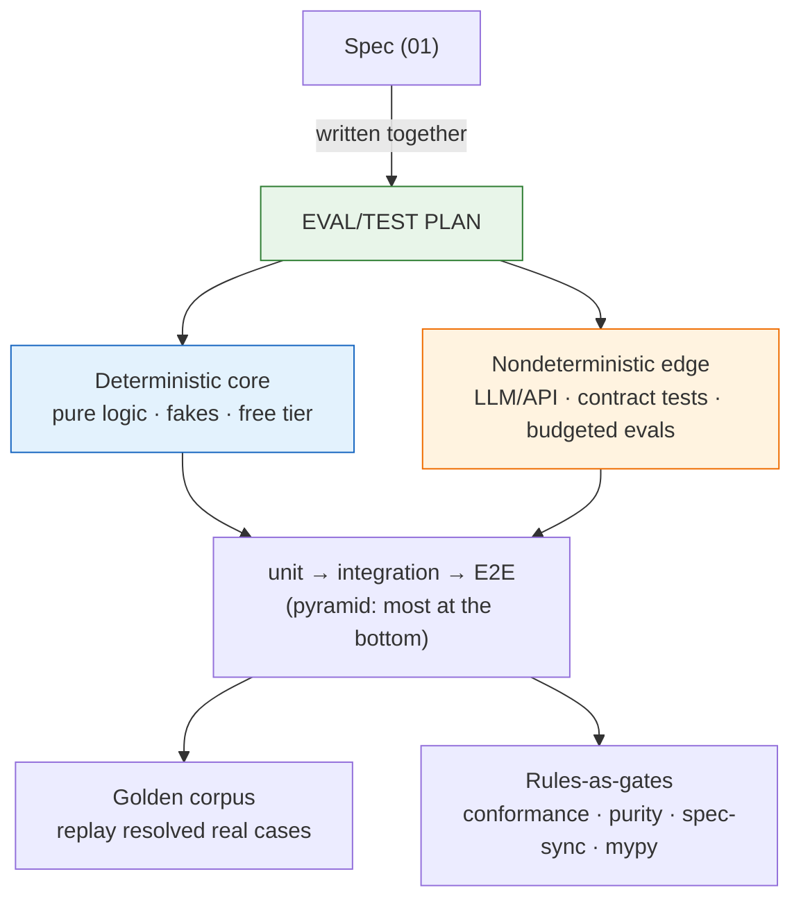

# 02_Eval and Test Plan Patterns — Test Plan Authoring Conventions

**Thesis:** The **eval/test plan** is an authored artifact, not an afterthought: it is written **with the spec, before code** (stage 2 of [[00_Tool Development Playbook]]), so the tests pin the *intent* rather than whatever the first implementation happened to do. Don't invent ad-hoc structure — each decision below is an instance of a **named, established pattern**; reuse the term so the next author finds the canon. The catalog is §1; the load-bearing five §2; the plan-structure checklist §3. The day-to-day *enforcement practice* (gate-first, ratchets) is [[05_Layered Build Standard — DDD, TDD, Small Functions, Typed Gates]] §3.

---

## §1 | The pattern catalog

¶1 One row per decision: the convention and its canonical name + originator. Reuse the **name**, not a synonym.

> [!example]- Catalog (convention → established pattern)
> | Convention | Established pattern (term · originator) |
> |---|---|
> | **Write the plan with the spec, before code** — tests define "done" mechanically; the rule-gate is written first and drives the work | **design-first / spec-first**; tests-as-spec ≈ **Specification by Example** (Adzic) / **executable specification** |
> | **Split the deterministic core from the nondeterministic edge** — pure logic (no LLM / network / clock) tested exhaustively and free; the LLM/API edge tested by contract | **Humble Object / test doubles** (Meszaros, *xUnit Test Patterns*); **contract tests** at the nondeterministic boundary |
> | **Layer unit → integration → end-to-end; most tests at the bottom** — E2E = the full trigger → … → output run in a dry/sandbox mode | **test pyramid** (Cohn); E2E in **dry-run / sandbox** (no external writes) |
> | **Plan the fake inventory up front** — a double for every side-effecting collaborator: LLM, clock, network, disk | **test doubles** (Meszaros); **Dependency Injection** makes them pluggable |
> | **Source a golden corpus from resolved real cases and replay it** — the tool's past decisions become the regression suite | **characterization tests** (Feathers, *Working Effectively with Legacy Code*, 2004); **golden master** (folklore; popularized by Rainsberger) |
> | **With-/without-LLM split** — the without-LLM tier is free and runs on every change; token-costing live evals are a deliberate, budgeted tier | **offline evals as the free tier** before live evals; cost-tiered testing |
> | **Task-specific LLM assertions** — encode the behavior the model usually misses as explicit pass/fail checks, not vibes | **LLM eval assertions / guardrails**; see [[06_External Grounding — LLM Power-User Practice]] |
> | **Calibrate LLM-as-judge with humans** — judge prompts and rubrics are tested against human decisions before they become gates | **evaluator validation**; prevents the validator from silently becoming the bug |
> | **Agent-runnable verification** — each plan section names the exact command, fixture diff, screenshot check, or smoke test an agent can run after editing | **executable checks**; tight feedback loop for AI-assisted development |
> | **One pinning test per fixed bug, in the same change** — fails on the old code, passes on the fix | **regression pinning**; regression-test-driven |
> | **Differential proof for refactors** — run old and new on the same inputs, assert byte-identical output BEFORE deleting the old | **golden-master diff / differential testing** |
> | **Real-store smokes for anything that serializes** — one test against a REAL throwaway store (tmp-dir ClickHouse, SQLite file); mock-only suites pass while production crashes | **integration smoke against a real backing service**; the anti-pattern it kills is mock-only false confidence |
> | **A property layer over the pure core** — totality (parsers never raise), idempotence (f(f(x)) == f(x)), round-trips (serialize→parse == id), content preservation; derandomize in CI | **property-based testing** (QuickCheck, Claessen & Hughes, 2000; Hypothesis); **derandomized CI** so a counterexample is a failure, not a flake |
> | **An injection canary for LLM-facing tools** — a hostile input must stay inside its untrusted fence; deterministic, CI-safe | **canary test** for prompt-injection containment |
> | **Declare the shared gates in the plan** — conformance (function size), purity (layer matrix), spec-sync, mypy, lint run inside the suite | **rules as executable tests** — see [[05_Layered Build Standard — DDD, TDD, Small Functions, Typed Gates]] §5 |
> | **Capture red/green evidence for test-driven changes** — the plan says where the failing output and passing output will be recorded, so tests prove intent rather than merely passing after the fact | **red-green-refactor** / strict TDD evidence (superpowers) |
> | **Verification-before-completion — evidence before claims** — before claiming a task is done, run a fresh full verification command, read its output and exit code, verify the claim, then state it with the evidence | **verification-before-completion** (superpowers) |
> | **Subagent review after each implementation task** — a fresh implementer per bounded task; after each task, a reviewer checks spec compliance and quality before the next task starts | **subagent-driven development** (superpowers) |

## §2 | The five load-bearing ones

¶1 If you take only five ideas to the next eval/test plan, take these — least cost, most leverage.

> [!example]- The five
> 1. **Plan with the spec, before code.** A plan written after the build tests the implementation; a plan written with the spec tests the intent. The spec's invariants and lifecycle transitions are the test list — derive it, don't brainstorm it.
> 2. **Deterministic core vs nondeterministic edge is the master split.** Decide per component which side it is on; everything on the core side gets exhaustive, free, fast tests with fakes; the edge gets contract tests + budgeted live evals. This one split determines cost, speed, and where the confidence actually comes from.
> 3. **Golden corpus from resolved real cases, with/without-LLM.** Real past cases replay as characterization tests; the without-LLM tier runs on every change for free, the with-LLM tier is a deliberate spend.
> 4. **Real-store smokes + pinning tests are non-negotiable.** Anything that serializes gets one real-throwaway-store test; a fake-backed suite can pass while the real store still fails. Every fixed bug ships its pinning test in the same change.
> 5. **Agent-runnable checks + calibrated judges.** An agent should never have to infer whether it is done: give it a command or artifact diff. If an LLM judge is part of the gate, validate that judge against human decisions and keep adversarial examples in the suite.

## §3 | What a written eval/test plan must contain

¶1 The checklist — these are the *sections of the plan document*, in order; most tools want all of it.

> [!example]- Checklist (plan sections)
> - [ ] **Scope map: core vs edge** — every component assigned to the deterministic core or the nondeterministic edge; the boundary contracts named.
> - [ ] **Level plan** — what is tested at unit / integration / E2E; the E2E path spelled out end-to-end (trigger → … → output) and the dry/sandbox mode it runs in.
> - [ ] **Fake inventory** — the double for each side-effecting collaborator (LLM, clock, network, disk) and where it is injected.
> - [ ] **Golden corpus** — where the resolved real cases come from, how they are refreshed, and the with-/without-LLM tiering (free tier runs always; live-eval tier has an explicit budget).
> - [ ] **LLM behavior assertions** — task-specific assertions/guardrails for the failure modes the model tends to miss.
> - [ ] **Evaluator calibration** — if an LLM judge is used, list the human-labeled examples, rubric, disagreement policy, and refresh cadence.
> - [ ] **Serialization smokes** — the list of real-throwaway-store tests (which store, what round-trips).
> - [ ] **Property layer** — which totality / idempotence / round-trip properties are asserted over the pure core; CI derandomization stated.
> - [ ] **Agent-runnable verification** — one canonical command/check sequence that returns a readable pass/fail signal after an agent edit.
> - [ ] **Red/green evidence capture** — every test-driven change records the red output (test fails for the right reason) and green output (test passes after the fix).
> - [ ] **Verification-before-completion gate** — no task may be called complete until a fresh full verification command has been run, read, and reported with exit status/output.
> - [ ] **Subagent review checkpoint** — for delegated implementation, each bounded task gets a spec-compliance and quality review before the next task starts.
> - [ ] **Gates** — the machine gates the suite carries (conformance, purity, spec-sync, mypy, lint) per [[05_Layered Build Standard — DDD, TDD, Small Functions, Typed Gates]]; plus the injection canary if the tool feeds an LLM untrusted text.
> - [ ] **Adversarial / drift cases** — hostile inputs, prompt-injection canaries, stale-context cases, and regression examples that protect against silent model drift.
> - [ ] **Pinning policy** — stated: every fixed bug ships a pinning test in the same change; refactors ship a differential proof.
> - [ ] **Done criteria** — what green means (which tiers must pass) before the tool may climb a rollout rung ([[03_Implementation Plan Patterns — Service Build Conventions]]).
