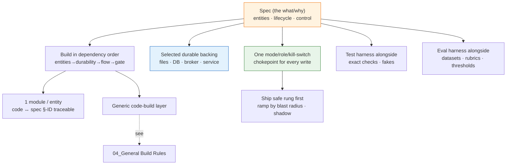

# 03_Implementation Plan Patterns — Service Build Conventions

**Thesis:** When you **implement a deployed service from its spec**, the implementation plan must carry forward the spec's runtime risk profile, concern-scoped durability ownership, and production supportability contract. A stateless process persists through backing services; a local tool may use files at modest write rates or a local database when volume/concurrency demands it. Event sourcing, reconciliation, and durable workflow engines are conditional implementation patterns, not the definition of a service. This is **stage 3** of [00_Tool Development Playbook](<00_Tool Development Playbook.md>); deterministic test proof and probabilistic/qualitative eval proof remain separate per [02_Test and Eval Plan Patterns — Proof Artifact Conventions](<02_Test and Eval Plan Patterns — Proof Artifact Conventions.md>), and generic code-build patterns live in [04_General Build Rules — Tool Code Conventions](<04_General Build Rules — Tool Code Conventions.md>). The catalog is §1; the load-bearing four §2; the apply-it checklist §3.

¶0 **Boundary:** 03 owns the service implementation plan: build order, schema/store binding, rollout rungs, external-effect chokepoints, and milestone sequencing. Generic code/runtime rules live in [04_General Build Rules — Tool Code Conventions](<04_General Build Rules — Tool Code Conventions.md>); executable enforcement lives in [05_Layered Build Standard — DDD, TDD, Small Functions, Typed Gates](<05_Layered Build Standard — DDD, TDD, Small Functions, Typed Gates.md>).

---

## §1 | The pattern catalog

¶1 One row per decision: the convention and its canonical name + originator. Reuse the **name**, not a synonym. These are the *spec→service* conventions; for the generic code-build layer see the last row.

Catalog (convention → established pattern)

| Convention | Established pattern (term · originator) |
|---|---|
| **Build in the spec's dependency order** (entities → selected durability adapter → triggered flow/controller if any → steps → gate) — the spec's define-before-use order *is* the build order | **stepwise refinement** (Wirth, *Program Development by Stepwise Refinement*, CACM 1971) + bottom-up assembly |
| **Explore first, plan second, code third** — start with read-only mapping, then write the implementation plan, then edit only the planned surface | **plan/apply discipline** for AI-assisted engineering; reinforced by [06_External Grounding — LLM Power-User Practice](<06_External Grounding — LLM Power-User Practice.md>) |
| **One code module per spec entity; one symbol per spec §-ID** — keep the source traceable back to the spec | **ubiquitous language** (Evans, *DDD*, 2003) + requirements **traceability** |
| **Bind each persistence adapter to its authoritative schema/contract**—DDL, versioned file schema, broker contract, or backing-service API—and never re-declare the same shape independently | **single source of truth per concern / DRY** (Hunt & Thomas); **schema-first / contract-first** |
| **Implement the durability topology declared by the spec**: local modest-write tools use authoritative files; higher-volume/concurrent local tools use an embedded or local database/server; stateless services use external databases, brokers, object stores, or workflow stores. Do not mirror one authority into a redundant application WAL | Twelve-Factor **backing services** + transactional durability; database-managed **WAL** where the selected database provides it |
| **Implement an append-only event store only when the spec requires audit/history/replay**; projection ordering follows explicit sequence/version/transaction semantics, not universal last-writer-wins | optional **Event Sourcing** (Fowler, 2005) + CQRS projection (Young) |
| **Enforce idempotency at the receiving boundary named by the spec** — atomically deduplicate by key or apply an inherently idempotent operation; retries still use at-least-once delivery | **idempotency key** (Stripe / HTTP); **at-least-once delivery** + receiving-side deduplication/idempotency ⇒ **effectively-once effects within the boundary** |
| **Implement a reconciling control loop only when desired state must converge with independently changing observed state** (find → start → recover; level-triggered) | conditional **reconciliation / control loop**; see [04_General Build Rules — Tool Code Conventions](<04_General Build Rules — Tool Code Conventions.md>) |
| **Use a durable-execution engine only for long-running/resumable flows whose checkpoints, waits, retries, or compensation require it**; bind its native store/history rather than forcing one event row per graph node | conditional **durable execution / workflow orchestration** (Temporal-style) |
| **Realize the engine-vs-authoring split in code** — load runbooks/prompts as data; engine code never embeds domain content | **separation of mechanism and policy** (Brinch Hansen, RC 4000, 1970) + **policy-as-configuration** |
| **Funnel every external effect through one mode/role/kill-switch chokepoint** — `dry`/`shadow` short-circuit *before* the side effect; one place to audit blast radius | **fail-safe defaults** (Saltzer & Schroeder, 1975) + a single **guard / chokepoint** |
| **Check the lethal trifecta before enabling tools** — private data + untrusted input + external communication requires sandboxing, approval gates, logging, and least-privilege tools | **least privilege** + prompt-injection containment; see [06_External Grounding — LLM Power-User Practice](<06_External Grounding — LLM Power-User Practice.md>) |
| **Keep a human-takeover path** — every risky agent step has a manual command, rollback, or operator handoff path | **human-in-the-loop** + graceful degradation |
| **Ship behind the safe rung; ramp by blast radius** (`dry → silent → …`) | **progressive delivery / canary release** (industry practice; no single coiner) |
| **Implement `shadow` as the live pipeline with external writes disabled**, decisions diffed against `main` | **shadow deployment / dark launch** (sibling of canary) |
| **Build separate test and eval harnesses with the code** — exact checks and fakes implement the test plan; datasets, rubrics, thresholds, and budgeted model runs implement the eval plan | **test doubles / Humble Object** (Meszaros) + **characterization / golden-master tests** (Feathers, 2004) + calibrated evaluation |
| **Encode the spec's invariants as runtime assertions + a view** (e.g. zero duplicate idempotency keys) | **design by contract** (Meyer, Eiffel, 1986) + executable invariant |
| **Schedule generic runtime surfaces as milestones, not new rules** — verification, supportability, and generic code-build gates appear in the impl plan by reference, not by re-cataloging | [04_General Build Rules — Tool Code Conventions](<04_General Build Rules — Tool Code Conventions.md>) owns the runtime rules; [05_Layered Build Standard — DDD, TDD, Small Functions, Typed Gates](<05_Layered Build Standard — DDD, TDD, Small Functions, Typed Gates.md>) owns enforcement |
| **Package each implementation as a bounded change folder and open a draft PR early** — use the repository-qualified PR ID as the stable implementation link; after pre-merge verification, reconcile current truth and commit the archived change inside that PR | **change-folder / task-archive** packaging (OpenSpec) + the pull request as the durable code-diff and merge-evidence record |

## §2 | The four load-bearing ones

¶1 If you take only four ideas to the next implementation, take these — least cost, most leverage.

The four

1. **Build in the spec's dependency order, traceably.** Implement entities → selected durability adapter → triggered flow/controller if any → steps → gate, so code remains traceable to stable spec IDs. Start with read-only exploration so the plan describes the real codebase, not a guessed one.
2. **Durability ownership + receiving-side idempotency are the runtime spine.** Implement one authoritative backing system per concern and the recovery contract promised by the spec. Where retries cross a side-effect boundary, use at-least-once delivery plus an atomic receiver-side deduplication/idempotency operation to provide effectively-once effects within that named boundary.
3. **One chokepoint for every external effect, gated by mode/role/kill-switch.** Route all side effects through a single guard where `dry`/`shadow`/`kill_switch` short-circuit *before* the write. This is where the spec's safety ladder becomes real and the only place anyone has to audit blast radius — scattering writes across the code defeats both.
4. **Build the test and eval harnesses alongside, and ship behind the safe rung.** Deterministic fakes and exact regression cases land with the first code; datasets, rubrics, and applicable model-eval thresholds land separately. Deploy at `dry`, then ramp by blast radius. Proof and rollout are load-bearing structure, not end-of-project bolt-ons.

## §3 | Apply it to the next implementation

¶1 A profile-routed checklist that doubles as the section list of a written implementation plan.

Checklist

- [ ] **Read-only exploration first** — map current files, contracts, and risks before changing code; the plan must name the exact edit surface.
- [ ] **Build in the spec's dependency order** (entities → selected durability adapter → triggered flow/controller if any → steps → gate); keep modules/symbols traceable to stable spec IDs.
- [ ] **Propagate runtime risk + durability ownership** — copy the spec's per-concern authority, backend, write volume/concurrency, writer model, reload semantics, failure model, and recovery proof into implementation milestones.
- [ ] **Implement supportability before the pilot/live rung** — schedule structured evidence, correlation and deploy/change identity, safe bounded diagnostics, data-governance controls, runbook/escalation/rollback, and incident traceability at the profile selected by the spec; implement its deterministic tests and diagnostic-usefulness eval before production evaluation.
- [ ] **Bind each persistence adapter to its authoritative contract**—DDL, file schema, broker schema, or service contract—and do not maintain a second shape or redundant WAL.
- [ ] **Conditional event store** — implement transition rows, ordering/version semantics, projections, and replay only when audit/history/replay is a requirement.
- [ ] **Receiving-side idempotency** — enforce the named key, retention window, and atomic check/write at the receiver. Delivery remains at-least-once; assert effectively-once effects only inside that boundary.
- [ ] **Conditional control loop** — implement find/start/recover and repeat-safe watermarks only where desired/observed convergence or external recovery requires them.
- [ ] **Conditional durable execution** — use a workflow engine only for long-running/resumable flows that require durable waits, checkpoints, retries, or compensation; test the engine's native recovery semantics.
- [ ] **Engine-vs-authoring in code** — runbooks/prompts loaded as data; the engine never embeds domain content.
- [ ] **One mode/role/kill-switch chokepoint** for every external effect; `dry`/`shadow` short-circuit *before* the write; kill-switch wired to a hard stop.
- [ ] **Lethal-trifecta check** — if the tool combines private data, untrusted input, and external communication, require sandboxing, approval gates, logging, and least-privilege access before any live rung.
- [ ] **Human takeover / rollback path** — document the manual command, rollback, or handoff when the agent is uncertain or a gate fails.
- [ ] **Ship at the safe rung** (`dry`), then **ramp by blast radius**; never default a new deploy to a writing rung.
- [ ] **Shadow = the live pipeline with writes off**, decisions diffed against `main`.
- [ ] **Test and eval harnesses with the code** — deterministic fakes and pinning tests implement `test-plan.md`; resolved-case replay, rubrics, and budgeted live-model runs implement `eval-plan.md`. Keep their evidence and pass criteria separate per [02_Test and Eval Plan Patterns — Proof Artifact Conventions](<02_Test and Eval Plan Patterns — Proof Artifact Conventions.md>).
- [ ] **Agent-verifiable milestone checks** — after each milestone, name the exact command/check the agent runs before continuing.
- [ ] **Change-folder + PR lifecycle** — open a draft PR as soon as the branch has its first reviewable commit; link its repository-qualified PR ID from the Decision, proposal, implementation plan, tasks, verification, and generated traceability. After pre-merge verification passes, reconcile deltas into current truth and commit the archived change inside the same PR. The PR—not a predicted merge SHA—owns the code diff and records the eventual merge result.
- [ ] **Spec invariants as runtime assertions** (design by contract) — the spec's "must always hold" lines become checks + a view.
- [ ] **Generic runtime rule milestones** — include verification, supportability, code-build gates, and health checks by linking to [04_General Build Rules — Tool Code Conventions](<04_General Build Rules — Tool Code Conventions.md>) / [05_Layered Build Standard — DDD, TDD, Small Functions, Typed Gates](<05_Layered Build Standard — DDD, TDD, Small Functions, Typed Gates.md>); do not re-derive them here.

