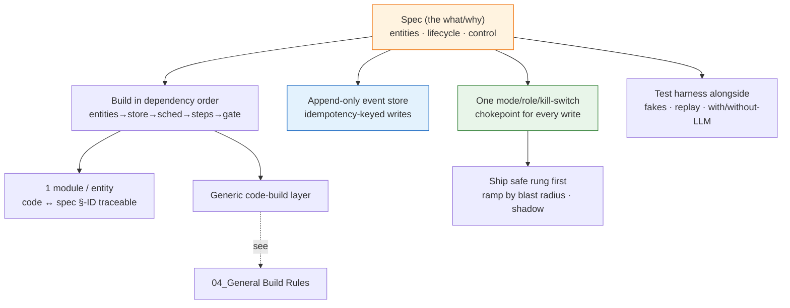

# 03_Implementation Plan Patterns — Service Build Conventions

**Thesis:** When you **implement a deployed service from its spec** — turn the entities, lifecycle, and control of a [[01_Spec Authoring Patterns — Service Spec Conventions]] spec into running, safely-rolled-out code — don't improvise structure; each decision below is an instance of a **named, established pattern**; reuse the term so the next author finds the canon. This is **stage 3** of [[00_Tool Development Playbook]] — these conventions are what your **impl plan** lays out (build order, store binding, rollout ladder, harness); the test harness itself is planned per [[02_Eval and Test Plan Patterns — Test Plan Authoring Conventions]], and the *generic* code-build patterns live in [[04_General Build Rules — Tool Code Conventions]] (this doc does **not** re-catalog those; §1 ends with a pointer to them). The catalog is §1; the load-bearing four §2; the apply-it checklist §3 — which doubles as the section list of a written impl plan.

¶0 **Boundary:** 03 owns the service implementation plan: build order, schema/store binding, rollout rungs, external-effect chokepoints, and milestone sequencing. Generic code/runtime rules live in [[04_General Build Rules — Tool Code Conventions]]; executable enforcement lives in [[05_Layered Build Standard — DDD, TDD, Small Functions, Typed Gates]].

---

## §1 | The pattern catalog

¶1 One row per decision: the convention and its canonical name + originator. Reuse the **name**, not a synonym. These are the *spec→service* conventions; for the generic code-build layer see the last row.

> [!example]- Catalog (convention → established pattern)
> | Convention | Established pattern (term · originator) |
> |---|---|
> | **Build in the spec's dependency order** (entities → store → schedulers → steps → gate) — the spec's define-before-use order *is* the build order | **stepwise refinement** (Wirth, *Program Development by Stepwise Refinement*, CACM 1971) + bottom-up assembly |
> | **Explore first, plan second, code third** — start with read-only mapping, then write the implementation plan, then edit only the planned surface | **plan/apply discipline** for AI-assisted engineering; reinforced by [[06_External Grounding — LLM Power-User Practice]] |
> | **One code module per spec entity; one symbol per spec §-ID** — keep the source traceable back to the spec | **ubiquitous language** (Evans, *DDD*, 2003) + requirements **traceability** |
> | **Bind the store layer to the schema/DDL — never re-declare columns in code** | **single source of truth / DRY** (Hunt & Thomas); **schema-first** |
> | **Implement the spec's log as an append-only event store** — one durable row per transition; current status = replay | **Event Sourcing** (Fowler, 2005) + **Write-Ahead Log** (ARIES) |
> | **Make every write idempotent, keyed by the spec's idempotency key** — upsert / no-op on replay | **idempotency key** (Stripe / HTTP); **exactly-once** = at-least-once + dedup |
> | **Implement schedulers as reconciling control loops** (find → start → recover; level-triggered) | generic — see the reconcile / control-loop row of [[04_General Build Rules — Tool Code Conventions]] |
> | **Run the spec's flow on a durable-execution engine; one graph node = one event row; restart = replay** | **durable execution / workflow orchestration** (Temporal-style); the crash-only-restart half is generic — see [[04_General Build Rules — Tool Code Conventions]] |
> | **Realize the engine-vs-authoring split in code** — load runbooks/prompts as data; engine code never embeds domain content | **separation of mechanism and policy** (Brinch Hansen, RC 4000, 1970) + **policy-as-configuration** |
> | **Funnel every external effect through one mode/role/kill-switch chokepoint** — `dry`/`shadow` short-circuit *before* the side effect; one place to audit blast radius | **fail-safe defaults** (Saltzer & Schroeder, 1975) + a single **guard / chokepoint** |
> | **Check the lethal trifecta before enabling tools** — private data + untrusted input + external communication requires sandboxing, approval gates, logging, and least-privilege tools | **least privilege** + prompt-injection containment; see [[06_External Grounding — LLM Power-User Practice]] |
> | **Keep a human-takeover path** — every risky agent step has a manual command, rollback, or operator handoff path | **human-in-the-loop** + graceful degradation |
> | **Ship behind the safe rung; ramp by blast radius** (`dry → silent → …`) | **progressive delivery / canary release** (industry practice; no single coiner) |
> | **Implement `shadow` as the live pipeline with external writes disabled**, decisions diffed against `main` | **shadow deployment / dark launch** (sibling of canary) |
> | **Build the test harness with the code** — fake the LLM/clock/network; replay resolved cases; with-/without-LLM; the plan itself is authored per [[02_Eval and Test Plan Patterns — Test Plan Authoring Conventions]] | **test doubles / Humble Object** (Meszaros) + **characterization / golden-master tests** (Feathers, 2004) |
> | **Encode the spec's invariants as runtime assertions + a view** (e.g. zero duplicate idempotency keys) | **design by contract** (Meyer, Eiffel, 1986) + executable invariant |
> | **Schedule generic runtime surfaces as milestones, not new rules** — verification, observability, and generic code-build gates appear in the impl plan by reference, not by re-cataloging | [[04_General Build Rules — Tool Code Conventions]] owns the runtime rules; [[05_Layered Build Standard — DDD, TDD, Small Functions, Typed Gates]] owns enforcement |
> | **Package each implementation as a bounded change folder** — one folder per change with delta specs, implementation plan, and task list; archive the folder after the change is verified and merged | **change-folder / task-archive** packaging (OpenSpec) |

## §2 | The four load-bearing ones

¶1 If you take only four ideas to the next implementation, take these — least cost, most leverage.

> [!example]- The four
> 1. **Build in the spec's dependency order, traceably.** Implement entities → store → schedulers → steps → gate, one module per entity, so the code maps 1:1 to the spec and any `§N` is findable in the source. The spec's define-before-use order is your build plan; following it means each layer compiles against only what's already built. (Wirth stepwise refinement; DDD ubiquitous language.) Start with read-only exploration so the plan describes the real codebase, not a guessed one.
> 2. **The append-only event store + idempotency-keyed writes are the spine.** Implement the spec's log as a durable append-only store and key every write by the idempotency key, so retry and catch-up are no-ops and restart is just replay. Every resumable, recoverable property the spec promises falls out of this one decision — build it first and right.
> 3. **One chokepoint for every external effect, gated by mode/role/kill-switch.** Route all side effects through a single guard where `dry`/`shadow`/`kill_switch` short-circuit *before* the write. This is where the spec's safety ladder becomes real and the only place anyone has to audit blast radius — scattering writes across the code defeats both.
> 4. **Build the test harness alongside, and ship behind the safe rung.** Fakes for the LLM/clock/network + resolved-case replay (with/without-LLM) from the first commit, and deploy at `dry` then ramp by blast radius. Testing and rollout are load-bearing structure, not an end-of-project bolt-on.

## §3 | Apply it to the next implementation

¶1 A checklist — most deployed-service implementations built from a spec want all of it; it doubles as the section list of a written impl plan.

> [!example]- Checklist
> - [ ] **Read-only exploration first** — map current files, contracts, and risks before changing code; the plan must name the exact edit surface.
> - [ ] **Build in the spec's dependency order** (entities → store → schedulers → steps → gate); **one module per entity, one symbol per §-ID** (traceable to the spec).
> - [ ] **Bind the store layer to the DDL** — never re-declare columns in code (schema is the source of truth).
> - [ ] **Append-only event store** — one durable row per transition; current status = replay, not a mutable column.
> - [ ] **Idempotent writes keyed by the spec's idempotency key** (no-op on replay); a **zero-duplicate-keys view** asserts the invariant.
> - [ ] **Schedulers as reconciling control loops** (find / start / recover, level-triggered); per-key serialization where concurrency would race.
> - [ ] **Flow on a durable-execution engine** — one node = one event row; **restart = replay** (crash-only, no bespoke recovery branch).
> - [ ] **Engine-vs-authoring in code** — runbooks/prompts loaded as data; the engine never embeds domain content.
> - [ ] **One mode/role/kill-switch chokepoint** for every external effect; `dry`/`shadow` short-circuit *before* the write; kill-switch wired to a hard stop.
> - [ ] **Lethal-trifecta check** — if the tool combines private data, untrusted input, and external communication, require sandboxing, approval gates, logging, and least-privilege access before any live rung.
> - [ ] **Human takeover / rollback path** — document the manual command, rollback, or handoff when the agent is uncertain or a gate fails.
> - [ ] **Ship at the safe rung** (`dry`), then **ramp by blast radius**; never default a new deploy to a writing rung.
> - [ ] **Shadow = the live pipeline with writes off**, decisions diffed against `main`.
> - [ ] **Test harness with the code** — fakes for LLM/clock/network + resolved-case replay, with/without-LLM; **a pinning test per fixed bug** (fails on old code, passes on the fix). Plan it per [[02_Eval and Test Plan Patterns — Test Plan Authoring Conventions]].
> - [ ] **Agent-verifiable milestone checks** — after each milestone, name the exact command/check the agent runs before continuing.
> - [ ] **Change-folder packaging** — each implementation lives in a bounded change folder with its delta spec, implementation plan, and task list; archive after verified merge.
> - [ ] **Spec invariants as runtime assertions** (design by contract) — the spec's "must always hold" lines become checks + a view.
> - [ ] **Generic runtime rule milestones** — include verification, observability, code-build gates, and health checks by linking to [[04_General Build Rules — Tool Code Conventions]] / [[05_Layered Build Standard — DDD, TDD, Small Functions, Typed Gates]]; do not re-derive them here.
