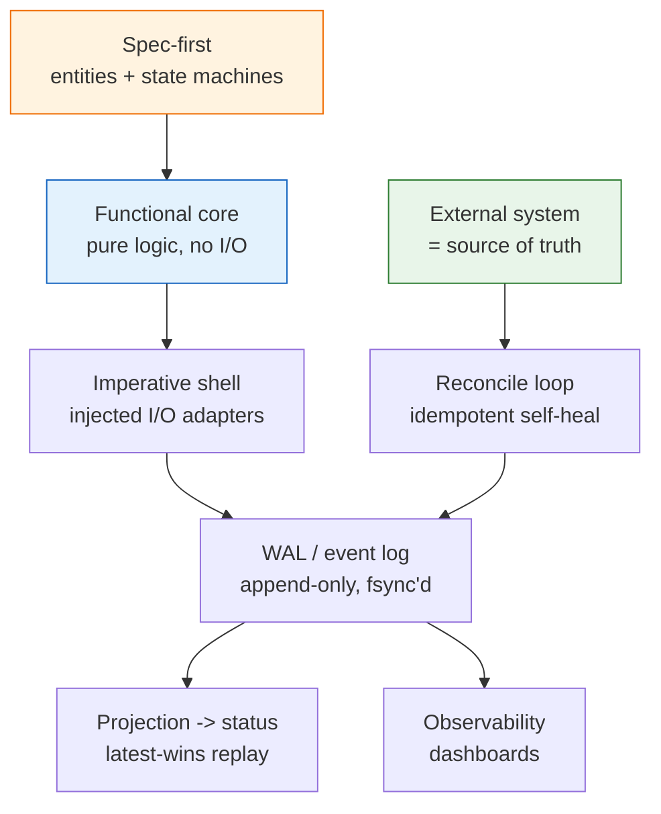

# 04_General Build Rules — Tool Code Conventions

**Thesis:** These are the always-on **general build rules** for ANY internal-tool code — one-shot script or deployed service (stage 4 of [[00_Tool Development Playbook]]; they apply even when the earlier stages are skipped). Don't invent private conventions — each decision below is an instance of a **named, established software pattern**; reuse the term so the next author finds the canon. This is the catalog (*the convention → the right name, and who named it*); the how-to-apply checklist is §3. The core of these rules is machine-enforced by [[05_Layered Build Standard — DDD, TDD, Small Functions, Typed Gates]]; the test side is planned per [[02_Eval and Test Plan Patterns — Test Plan Authoring Conventions]].

¶0 **Boundary:** 04 owns the generic code/runtime rule catalog for any tool. 03 decides when those rules appear in a service implementation plan; 05 turns selected rules into concrete gates, tests, and agent ergonomics.

---

## §1 | The pattern catalog

¶1 One row per decision: the convention and its canonical name + originator. Reuse the **name**, not a synonym.

> [!example]- Catalog (convention → established pattern)
> | Convention | Established pattern (term · originator) |
> |---|---|
> | Write the entity + state-machine spec first; tests enforce it — spec per [[01_Spec Authoring Patterns — Service Spec Conventions]] | **Spec-driven development**; tests-as-spec ≈ **Specification by Example** (Adzic) / **executable specification** |
> | Small single-step workers; the orchestrator may die & restart with **no** special recovery path (restart = replay the log) | **Crash-only software** (Candea & Fox, 2003) + **durable execution / workflow orchestration** (Temporal-style) |
> | Append-only log, `fsync`'d per line; current state = replay, latest line wins | **Write-Ahead Log** (ARIES) + **Event Sourcing** projection (Young/Fowler); **last-writer-wins (LWW)** |
> | **Files are the single source of truth; nothing that matters lives only in memory.** Re-read ALL state from disk every tick — config, the work-set, the event log, AND every *derived* cache (freeze baselines, rate-gates). A cross-tick in-memory dict is a latent bug: an external edit to its file is silently overwritten on the next write, and a crash/restart loses it. Need cross-tick state? Externalize it to a derivable **event log** (re-derive the value) or a small **atomically-written** state file; hold nothing across ticks but open resources (a socket). Durability tiers: `fsync` the state you cannot re-derive (the WAL); a derivable cache can be best-effort (rebuilt by the next reconcile/scrape). | **Stateless processes** (Twelve-Factor App, Wiggins — state in durable **backing services**; the process is disposable) + **Event Sourcing** (derive the cache by replaying the log) + atomic **rename(2)** for state files |
> | Compare desired (config/input) vs observed (the external system), converge; idempotent; rebuild from the source of truth | **Reconciliation / control loop** (Kubernetes controllers; *level-triggered*) + **idempotency** |
> | **Plan, then apply** — a no-side-effect preview (`--dry-run`) that shows EXACTLY what would happen (+ a single-step `--once`), so the operator can check blast radius before an irreversible write | **plan/apply gate** (Terraform `plan`/`apply`; `kubectl --dry-run`); the underlying **dry run** is Unix folklore |
> | **Expose an agent-readable check surface** — one `check` / `test` / `smoke` command returns a clear pass/fail after edits; the verification-command discipline is defined in [[05_Layered Build Standard — DDD, TDD, Small Functions, Typed Gates]] | **executable feedback loop** for AI-assisted development; see [[06_External Grounding — LLM Power-User Practice]] |
> | **Generated code is draft until understood** — no AI patch ships until a human can explain the architecture, edge cases, and failure modes | **review discipline**; the “70% problem” applied to maintainable code |
> | **Synthesize a correlation key by set-difference** when the sink returns none: snapshot the entity-id SET before you submit, submit, then on a later poll claim your new entity as the id NOT in the baseline; serialize per-entity (≤1 un-claimed submit) so the diff stays unambiguous, and tolerate the sink's registration lag | **Correlation Identifier** (Hohpe & Woolf, *Enterprise Integration Patterns*) ≈ **Claim Check**; the snapshot-then-anti-join is folklore |
> | Pure-logic core with zero I/O behind a thin shell that gets its side-effecting collaborators **injected** | **Functional Core, Imperative Shell** (Bernhardt) + **Hexagonal / Ports & Adapters** (Cockburn) + **Dependency Injection** |
> | Swap the backend without touching the logic — one backend today, another tomorrow, chosen by a `mode` setting; business *decisions* live in config | **Ports & Adapters** (Cockburn) + **Strategy** (GoF) + **policy-as-configuration** |
> | Small functions, one job each (a screenful); line-count/complexity enforced by [[05_Layered Build Standard — DDD, TDD, Small Functions, Typed Gates]] | **Single Responsibility Principle** (Martin, SOLID); low **cyclomatic complexity** (McCabe) |
> | Inject fakes for the network/clock/disk; every fixed bug ships a pinning test — plan per [[02_Eval and Test Plan Patterns — Test Plan Authoring Conventions]], enforced per [[05_Layered Build Standard — DDD, TDD, Small Functions, Typed Gates]] | **Test doubles / Humble Object** (Meszaros, *xUnit Test Patterns*); **regression-test-driven** |
> | Concurrency bounded per pool; bounded retry then degrade | **Bulkhead** (Nygard, *Release It!*) + **admission control / concurrency limiting**; bounded **retry budget** + graceful degradation |
> | **Classify the failure by recoverability**: RAISE on the unrecoverable (auth / credential / contract) and an **error is NEVER empty data** — a false-empty masquerades as legitimate "no data" and silently corrupts every downstream consumer; but **keep the last-good** value on a genuinely transient re-read | **Fail Fast** (Shore & Fowler, *IEEE Software*, 2004) + **Fail Loud / "Crash Early"** (Hunt & Thomas, *The Pragmatic Programmer*); fail-soft / keep-last-good = control-systems folklore |
> | **Least-privilege tool boundaries** — private data, untrusted content, and outbound communication do not share one unconstrained path; injection-canary and boundary gates enforced by [[05_Layered Build Standard — DDD, TDD, Small Functions, Typed Gates]] | **principle of least privilege** + prompt-injection containment |
> | **Secrets are runtime credentials, not ordinary config or state.** `.env` is a local injection mechanism only: never commit it, never copy raw values into specs/logs/WAL/status/LLM prompts, and never let domain logic read `os.environ`; commit `.env.example` with variable names/scopes/dummy values only, load/redact at the adapter/app boundary, fail loud on missing or auth-bad credentials, and prefer OS/cloud/password-manager secret stores for durable services | **Secrets management** + **Twelve-Factor config** (env vars as deployment config, credentials kept out of code) + **least privilege / need-to-know** |
> | **Be a polite, rate-limited client** of a service you don't own: deliberate inter-submit pacing + a re-read gate (poll an entity at most once per N seconds), so you never hammer a shared external system | **client-side rate-limiting / backpressure** (token- / leaky-bucket pacing) — the outbound, cross-process complement to the in-process **Bulkhead** cap (above) |
> | Each concurrent unit of work on its own client/session — no shared mutable | **Thread confinement / share-nothing concurrency** |
> | Decide liveness from **observed progress**, never a remote system's wall-clock | distributed-systems **clock-skew** caution; failure detection by observed progress (heartbeat-style) |
> | **Verify the real effect, not the ack** — a remote `200` / exit-0 / "done" is an acknowledgement, not proof the mutation landed; re-read the actual artifact and smoke-test at the endpoint that holds the data. Pairs with **one writer per file** (two concurrent writers = silent last-write-wins; the filesystem — and git — see no conflict) | **End-to-End Argument** (Saltzer, Reed & Clark, *ACM TOCS*, 1984); single-writer file custody via atomic **rename(2)** / advisory lock |
> | **Hot-reload the tuning, not the plan.** Tuning config (caps, pace, sizes, toggles) lives in a declarative file re-read FRESH each tick by a **dedicated stateless reader** — no cache, so the re-read *is* the hot-reload (tune live, no restart); every present key is live (**no dead keys** — wire it or delete it). But the heavy **structural input / work-set** (the plan, the input files) is **NOT** hot-reloaded by default: re-deriving it each tick is expensive and can corrupt in-flight work — change it via a deliberate **rebuild** (the build-step row below). | **Externalized / declarative configuration** + **hot reload** (stateless re-read, no cache); the split = live **configuration** vs the deliberately-rebuilt **work-set / plan** |
> | **One process multiplexes ALL config-defined units** (each a hot-reloaded config section — row above), never one process per unit, because it is the **single owner of the shared global budget** (a cap / quota / rate limit); two processes would split-brain it and over-spend. That budget is the *one* shared-mutable exception to share-nothing (below) — everything else stays confined | **Single Writer Principle** (Thompson, *Mechanical Sympathy*, 2011) for the shared budget + **controller-manager** bundling (Kubernetes: many control loops in ONE process, not one per object) + config-as-data via **Externalized Configuration** (Richardson); the failure it avoids is **split-brain** |
> | A one-time build step split from runtime; idempotent; input (read-only) vs working/derived files separated | **Source vs generated artifacts** / idempotent **builder**; **separation of concerns** |
> | Right format per role: append-only **NDJSON/JSONL** for events, tabular **CSV** for state | **event log vs snapshot** (Event Sourcing's log-vs-state) |
> | Make internal state externally visible — a **live** view + a **cumulative** audit + an **aggregate** roll-up, rebuilt from the log; outputs-only; one consistent unit | **Observability**; operational **materialized views** of the log |
> | **Uniform, self-describing surfaces**: every view shares ONE column schema + ONE unit convention; the header is the first line and rows are newest-first, so a plain `head` reveals schema + freshest data; empty cells show a visible placeholder (`—`), never a bare gap | **Principle of Least Astonishment / Rule of Least Surprise** (commonly traced to the PL/I community; popularized for interfaces by Raymond, *The Art of Unix Programming*, 2003) + Nielsen **"Consistency and standards"** (1994) + **self-describing format** (header-first; cf. RFC 4180 header line) + **reverse-chronological log** |
> | Model the domain entities + each entity's **derived** status as a state machine | **Domain modeling** (DDD entities) + per-entity **finite-state machine**; status = a **projection** |

## §2 | The four load-bearing ones

¶1 If you take only four ideas to the next tool, take these — least cost, most leverage.

> [!example]- The four
> 1. **Functional Core, Imperative Shell + DI.** Put every decision in a pure module (no network, clock, or disk) and inject the I/O. The whole logic becomes unit-testable with fakes, and the bug surface stays in the thin shell. (Hexagonal: each external system is just a swappable adapter behind a port.)
> 2. **WAL + crash-only restart.** An append-only, fsync'd log as the *only* stored state makes "restart" just "replay the log" — no bespoke recovery branch, no in-memory state to lose. The process is disposable.
> 3. **Reconcile against a source of truth (idempotently).** On (re)start, converge local state to what the external system actually shows. The control-loop move: it self-heals any local loss and avoids redoing work — and being idempotent, running it twice is safe.
> 4. **Observe progress; never trust a foreign clock.** Reading a remote system's timestamp as if it were local is a classic bug (timezone / clock skew) — it can make fresh work look stale and get killed. Decide liveness only from progress *you* observe (e.g. a duration advancing on *your* clock). Across systems, clocks are not comparable.

## §3 | Apply it to the next tool

¶1 A checklist — most tools that fire / poll / transform against an external system want all of it, scripts and services alike.

> [!example]- Checklist
> - [ ] **Spec first** — write the entities + their state machine before code; let tests pin each rule (spec: [[01_Spec Authoring Patterns — Service Spec Conventions]]; test plan: [[02_Eval and Test Plan Patterns — Test Plan Authoring Conventions]]).
> - [ ] **Pure core, injected shell** — domain logic in a no-I/O module; pass the side-effecting collaborators in (DI) so tests use fakes.
> - [ ] **Small functions**, single responsibility; verify with a line-count / complexity check (enforced by [[05_Layered Build Standard — DDD, TDD, Small Functions, Typed Gates]]).
> - [ ] **Append-only event log** (NDJSON), `flush`+`fsync` per line; tabular CSV only for state; **input read-only, working/derived files separated**.
> - [ ] **Restart = replay** the log (crash-only); never hold the run only in memory; checkpoint frequently.
> - [ ] **Files are the single source of truth — nothing critical in memory.** Re-read every piece of state (config, input, log, AND derived caches like freeze-baselines / rate-gates) from disk each tick; never let a cross-tick in-memory dict be authoritative (an external edit gets overwritten; a crash loses it). Externalize any such cache to a derivable event log or an atomically-written state file; `fsync` only what you can't re-derive.
> - [ ] **Reconcile to the source of truth** on (re)start — idempotent, never double-acts.
> - [ ] **Caps per pool** (bulkhead) + **bounded retry → degrade**; concurrency via **share-nothing** clients.
> - [ ] **Liveness from observed progress**, not a foreign timestamp.
> - [ ] **Plan, then apply** — a `--dry-run` preview (+ `--once`) that mutates nothing, so blast radius is checkable before an irreversible write.
> - [ ] **One command proves health** — expose a canonical `check` / `test` / `smoke` command an agent can run and understand after every edit, as specified in [[05_Layered Build Standard — DDD, TDD, Small Functions, Typed Gates]].
> - [ ] **Generated code reviewed as draft** — do not ship AI-written code until its architecture, edge cases, and failure modes are understood.
> - [ ] **Classify failures by recoverability** — RAISE on the unrecoverable (auth/contract), keep-last-good on the transient; an error is NEVER an empty result.
> - [ ] **Least-privilege boundaries** — isolate private data, untrusted input, and external communication; add approval/logging before combining them, per the enforcement gates in [[05_Layered Build Standard — DDD, TDD, Small Functions, Typed Gates]].
> - [ ] **Secrets stay boundary-only** — `.env` is local/uncommitted; `.env.example` contains names/scopes/dummy values only; domain code never reads env; logs/WAL/status/LLM prompts redact; missing/bad creds fail loud; durable services use a secret store.
> - [ ] **Correlate by set-difference** when the sink gives no id — snapshot the id-set, submit, claim the new id on a later poll; serialize per-entity; tolerate registration lag.
> - [ ] **Be a polite, rate-limited client** — pace submits + gate re-reads to once per N seconds; don't hammer a shared service.
> - [ ] **Verify the effect, not the status** — confirm the real state by content + smoke test, never an exit-0 / `200`; **one writer per file** (concurrent writers = silent last-write-wins).
> - [ ] **Hot-reload the tuning, not the plan** — tuning config re-read fresh each tick by a stateless reader (no cache, no dead keys); keep the heavy work-set / input files **plan-time** (a deliberate rebuild — re-planning each tick is costly and can corrupt in-flight work).
> - [ ] **One process multiplexes every config-defined unit** (hot-reloaded sections) — it's the **single writer** of any shared global budget, or two processes split-brain it; everything else stays share-nothing.
> - [ ] **Observability dashboards** rendered from the log — a live view + a cumulative audit + an aggregate roll-up — in **one consistent unit**.
> - [ ] **Uniform, self-describing surfaces** — one schema + one unit across views; header-first + newest-first (`head`-discoverable); empty cells get a visible placeholder, not a bare gap.
> - [ ] **Backend behind a port** if a second one is likely; pick it by a `mode` setting (Strategy); keep business *policies* in config.
> - [ ] **A regression test for every fixed bug** (fails on old code, passes on the fix), in the same change — per [[02_Eval and Test Plan Patterns — Test Plan Authoring Conventions]].

---
