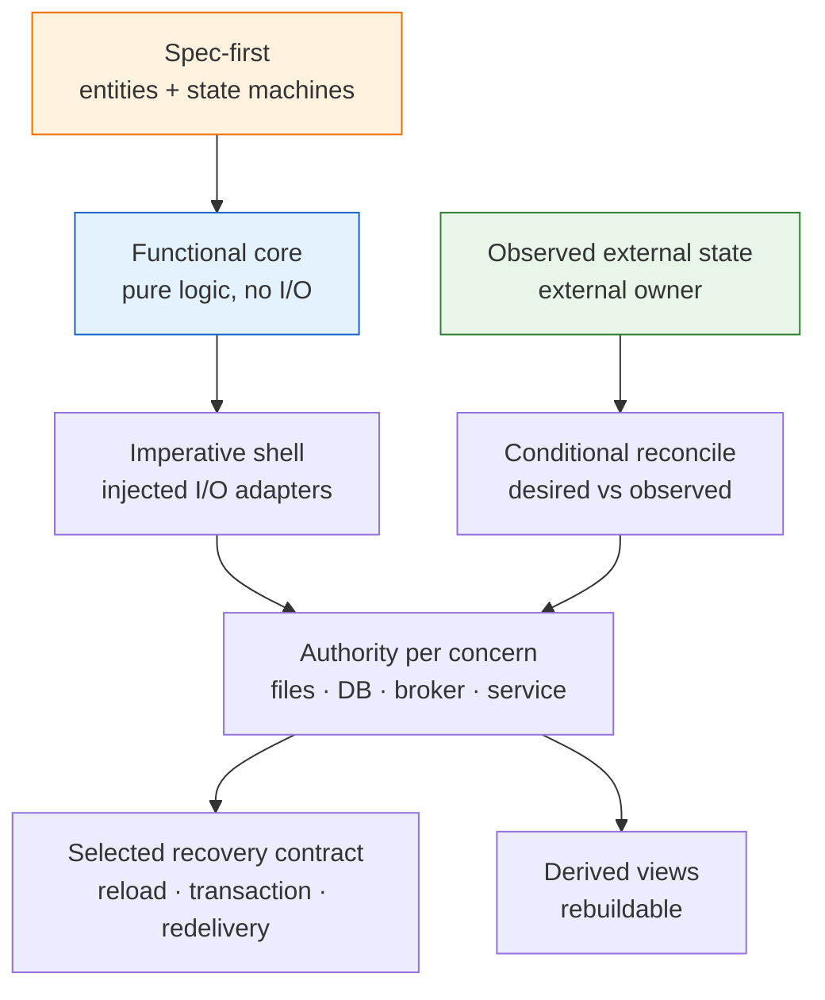

# 04_General Build Rules — Tool Code Conventions

**Thesis:** This is the general build-rule catalog for internal tools (stage 4 of [00_Tool Development Playbook](<00_Tool Development Playbook.md>)), with two independent selections: the **runtime risk profile** decides which recovery, safety, and production supportability semantics are required, while **deployment topology plus write volume/concurrency** decides whether durable authority lives in local files, a local database, or external backing services. Baseline clarity, deterministic verification, failure classification, and relevant secret hygiene apply to every tool. Event logs, replay, reconciliation, durable workflow engines, and observed-progress liveness apply only when their specific semantics are triggered. Production-bound tools always declare a supportability contract, scaled to risk and topology; non-production tools may record a justified not-applicable disposition. The how-to-apply checklist is §3; enforcement lives in [05_Layered Build Standard — DDD, TDD, Small Functions, Typed Gates](<05_Layered Build Standard — DDD, TDD, Small Functions, Typed Gates.md>), and proof is planned per [02_Test and Eval Plan Patterns — Proof Artifact Conventions](<02_Test and Eval Plan Patterns — Proof Artifact Conventions.md>).

¶0 **Boundary:** 04 owns the generic code/runtime rule catalog for any tool. 03 decides when those rules appear in a service implementation plan; 05 turns selected rules into concrete gates, tests, and agent ergonomics.

---

## §1 | The pattern catalog

¶1 One row per decision: the convention and its canonical name + originator. Reuse the **name**, not a synonym.

Catalog (convention → established pattern)

| Convention | Established pattern (term · originator) |
|---|---|
| Write the entity + state-machine spec first; tests enforce it — spec per [01_Spec Authoring Patterns — Service Spec Conventions](<01_Spec Authoring Patterns — Service Spec Conventions.md>) | **Spec-driven development**; tests-as-spec ≈ **Specification by Example** (Adzic) / **executable specification** |
| For stateful/retryable work, make the process disposable and restart through the **declared backing system's recovery contract**—file reload/replay, database recovery, broker redelivery, or workflow-store resume—without inventing a second recovery authority | **Crash-only software** (Candea & Fox, 2003) + **durable execution / workflow orchestration** where selected |
| Use an append-only, `fsync`'d NDJSON log for a modest-write local event history when audit/replay is required; use database transactions and its internal on-disk WAL for database-backed state; use broker ack/redelivery for queued delivery. Do not duplicate one authority across an application WAL and a database merely by habit | **Write-Ahead Log** (ARIES) + optional **Event Sourcing** (Young/Fowler) + transactional durability |
| Define **one authoritative source per concern**, not one global source for the application. Nothing durable may exist only in process memory. Re-read live tuning at its declared refresh boundary; pin the structural work-set/run manifest for a run and change it through rebuild/new-run; read operational state through the selected backend's consistency contract; rebuild derived views/caches from their owner | **single source of truth per concern** + Twelve-Factor **backing services** + atomic **rename(2)** for file snapshots |
| When desired intent must converge with independently changing observed state, compare the two owners and converge idempotently; ordinary transactional CRUD without that split does not require a reconciliation controller | conditional **Reconciliation / control loop** (Kubernetes controllers; *level-triggered*) + **idempotency** |
| **Plan, then apply** — a no-side-effect preview (`--dry-run`) that shows EXACTLY what would happen (+ a single-step `--once`), so the operator can check blast radius before an irreversible write | **plan/apply gate** (Terraform `plan`/`apply`; `kubectl --dry-run`); the underlying **dry run** is Unix folklore |
| **Expose an agent-readable check surface** — one `check` / `test` / `smoke` command returns a clear pass/fail after edits; the verification-command discipline is defined in [05_Layered Build Standard — DDD, TDD, Small Functions, Typed Gates](<05_Layered Build Standard — DDD, TDD, Small Functions, Typed Gates.md>) | **executable feedback loop** for AI-assisted development; see [06_External Grounding — LLM Power-User Practice](<06_External Grounding — LLM Power-User Practice.md>) |
| **Generated code is draft until understood** — no AI patch ships until a human can explain the architecture, edge cases, and failure modes | **review discipline**; the “70% problem” applied to maintainable code |
| **Synthesize a correlation key by set-difference** when the sink returns none: snapshot the entity-id SET before you submit, submit, then on a later poll claim your new entity as the id NOT in the baseline; serialize per-entity (≤1 un-claimed submit) so the diff stays unambiguous, and tolerate the sink's registration lag | **Correlation Identifier** (Hohpe & Woolf, *Enterprise Integration Patterns*) ≈ **Claim Check**; the snapshot-then-anti-join is folklore |
| Pure-logic core with zero I/O behind a thin shell that gets its side-effecting collaborators **injected** | **Functional Core, Imperative Shell** (Bernhardt) + **Hexagonal / Ports & Adapters** (Cockburn) + **Dependency Injection** |
| Swap the backend without touching the logic — one backend today, another tomorrow, chosen by a `mode` setting; business *decisions* live in config | **Ports & Adapters** (Cockburn) + **Strategy** (GoF) + **policy-as-configuration** |
| Small functions, one job each (a screenful); line-count/complexity enforced by [05_Layered Build Standard — DDD, TDD, Small Functions, Typed Gates](<05_Layered Build Standard — DDD, TDD, Small Functions, Typed Gates.md>) | **Single Responsibility Principle** (Martin, SOLID); low **cyclomatic complexity** (McCabe) |
| Inject fakes for the network/clock/disk; every fixed bug ships a pinning test — plan per [02_Test and Eval Plan Patterns — Proof Artifact Conventions](<02_Test and Eval Plan Patterns — Proof Artifact Conventions.md>), enforced per [05_Layered Build Standard — DDD, TDD, Small Functions, Typed Gates](<05_Layered Build Standard — DDD, TDD, Small Functions, Typed Gates.md>) | **Test doubles / Humble Object** (Meszaros, *xUnit Test Patterns*); **regression-test-driven** |
| Concurrency bounded per pool; bounded retry then degrade | **Bulkhead** (Nygard, *Release It!*) + **admission control / concurrency limiting**; bounded **retry budget** + graceful degradation |
| **Classify the failure by recoverability**: RAISE on the unrecoverable (auth / credential / contract) and an **error is NEVER empty data** — a false-empty masquerades as legitimate "no data" and silently corrupts every downstream consumer; but **keep the last-good** value on a genuinely transient re-read | **Fail Fast** (Shore & Fowler, *IEEE Software*, 2004) + **Fail Loud / "Crash Early"** (Hunt & Thomas, *The Pragmatic Programmer*); fail-soft / keep-last-good = control-systems folklore |
| **Least-privilege tool boundaries** — private data, untrusted content, and outbound communication do not share one unconstrained path; injection-canary and boundary gates enforced by [05_Layered Build Standard — DDD, TDD, Small Functions, Typed Gates](<05_Layered Build Standard — DDD, TDD, Small Functions, Typed Gates.md>) | **principle of least privilege** + prompt-injection containment |
| **Secrets are runtime credentials, not ordinary config or state.** `.env` is a local injection mechanism only: never commit it, never copy raw values into specs/logs/WAL/status/LLM prompts, and never let domain logic read `os.environ`; commit `.env.example` with variable names/scopes/dummy values only, load/redact at the adapter/app boundary, fail loud on missing or auth-bad credentials, and prefer OS/cloud/password-manager secret stores for durable services | **Secrets management** + **Twelve-Factor config** (env vars as deployment config, credentials kept out of code) + **least privilege / need-to-know** |
| **Be a polite, rate-limited client** of a service you don't own: deliberate inter-submit pacing + a re-read gate (poll an entity at most once per N seconds), so you never hammer a shared external system | **client-side rate-limiting / backpressure** (token- / leaky-bucket pacing) — the outbound, cross-process complement to the in-process **Bulkhead** cap (above) |
| Each concurrent unit of work on its own client/session — no shared mutable | **Thread confinement / share-nothing concurrency** |
| Decide liveness from **observed progress**, never a remote system's wall-clock | distributed-systems **clock-skew** caution; failure detection by observed progress (heartbeat-style) |
| **Verify the real effect, not the ack** — a remote `200` / exit-0 / "done" is an acknowledgement, not proof the mutation landed; re-read the artifact at the concern's authoritative owner. File-backed authorities require one writer per file (or an explicit lock protocol); database/broker authorities coordinate writers through transactions, leases, locks, or consumer groups | **End-to-End Argument** (Saltzer, Reed & Clark, *ACM TOCS*, 1984) + storage-appropriate concurrency control |
| **Hot-reload the tuning, not the plan.** Tuning config (caps, pace, sizes, toggles) lives in a declarative file re-read FRESH each tick by a **dedicated stateless reader** — no cache, so the re-read *is* the hot-reload (tune live, no restart); every present key is live (**no dead keys** — wire it or delete it). But the heavy **structural input / work-set** (the plan, the input files) is **NOT** hot-reloaded by default: re-deriving it each tick is expensive and can corrupt in-flight work — change it via a deliberate **rebuild** (the build-step row below). | **Externalized / declarative configuration** + **hot reload** (stateless re-read, no cache); the split = live **configuration** vs the deliberately-rebuilt **work-set / plan** |
| When a shared global budget has no transactional coordinator, **one process multiplexes its config-defined units** as the single owner. When a database/broker/lease service owns that budget atomically, multiple processes are allowed under its coordination contract | **Single Writer Principle** (Thompson, *Mechanical Sympathy*, 2011) + **controller-manager** bundling; distributed lease/transaction coordination where selected |
| A one-time build step split from runtime; idempotent; input (read-only) vs working/derived files separated | **Source vs generated artifacts** / idempotent **builder**; **separation of concerns** |
| For file-backed tools, use append-only **NDJSON/JSONL** for event history and **CSV/JSON** for snapshots according to shape; for database/broker-backed tools, use native schemas and export files only as derived views | **event log vs snapshot** + schema-appropriate storage |
| Define a **risk-scaled production supportability contract**: operator-usable structured evidence, end-to-end correlation and deploy/change identity, safe read-only diagnostics, bounded/redacted/retained access-controlled telemetry, runbook and escalation/rollback paths, and links from incidents to governing requirements, PRs, and fixes. Derive diagnostic views from declared authorities; telemetry is evidence, not a competing business-state source of truth | **observability** + **operability** + incident-response **traceability** |
| **Uniform, self-describing surfaces**: every view shares ONE column schema + ONE unit convention; the header is the first line and rows are newest-first, so a plain `head` reveals schema + freshest data; empty cells show a visible placeholder (`—`), never a bare gap | **Principle of Least Astonishment / Rule of Least Surprise** (commonly traced to the PL/I community; popularized for interfaces by Raymond, *The Art of Unix Programming*, 2003) + Nielsen **"Consistency and standards"** (1994) + **self-describing format** (header-first; cf. RFC 4180 header line) + **reverse-chronological log** |
| Model the domain entities + each entity's **derived** status as a state machine | **Domain modeling** (DDD entities) + per-entity **finite-state machine**; status = a **projection** |

## §2 | Applicability profiles, durability topology, and runtime spine

¶1 First select the highest triggered runtime risk profile; then select the durability topology independently. Profile B/C requires an explicit durability and recovery contract, not a universal application WAL.

Profiles

| Profile | Triggers | Required rule set |
|---|---|---|
| **A — transient/local** | Pure transform or one-shot local utility; no durable work, retry/resume, polling loop, shared-state concurrency, or external mutation | Explicit inputs/outputs, small functions, deterministic verification, recoverability-aware failures, pinning tests; secret hygiene if credentials exist. Supportability may be not applicable when the tool is not production-bound; otherwise include structured local diagnostics and run/build identity |
| **B — stateful/retryable** | Durable work, restart/resume, polling, retries, scheduled execution, shared-state concurrency, or external mutation | Profile A + functional core/injected shell, declared authority/backing/recovery per concern, receiving-side idempotency where retries cross an effect boundary, and the applicable subset of reconciliation, observed-progress liveness, plan/apply, effect verification, structured support evidence, cross-effect correlation, deploy/change identity, safe bounded diagnostics, data governance, runbook, and incident links. Add traces when asynchronous or multi-hop behavior needs them |
| **C — agentic/high-risk** | Private data, untrusted content, external communication, autonomous writes, or material blast radius | Profile B + least privilege, approval/chokepoint gates, safe autonomy rungs, kill-switch, injection canary, audit evidence, human takeover, audited diagnostic access, stronger redaction and telemetry bounds, and explicit rollback/escalation evidence |

Durability topology

| Topology | Durable authority and mechanism | Writer/recovery contract |
|---|---|---|
| **Local, modest writes** | Files remain authoritative: NDJSON for required event history; CSV/JSON or another declared format for snapshots/config | One writer per authoritative file; atomic replace for snapshots; `flush`/`fsync` for non-rederivable accepted state; reload or replay only the data required by the recovery contract |
| **Local, high volume or concurrency** | An embedded database or separate local database server owns state; its transactions and on-disk WAL provide durability | Use transactions, constraints, locks/leases, and database recovery; do not mirror the same authority into CSV/NDJSON as a second writable store |
| **Stateless service process** | External databases, brokers, object stores, or workflow stores own durable concerns; process memory is disposable cache only | Recover through queries, transactions, ack/redelivery, or workflow resume; do not add a redundant local file WAL to the service process |
| **External observed resource** | The external platform owns observed resource state; a DSET store may separately own desired intent, orchestration history, or deduplication records | Re-read/verify when reconciliation or end-to-end effect proof requires it; do not conflate observed resource truth with orchestration intent |

State ownership and refresh boundaries

| Concern | Authority | Refresh rule |
|---|---|---|
| Live tuning/config | Declared config file or configuration service | Re-read each tick or use a documented watch/version boundary |
| Structural work-set/run plan | Immutable run manifest or snapshot | Load once per run; changes require a rebuild or new run |
| Operational durable state | Selected files, database, broker, object store, or workflow store | Read/recover through that backend's consistency contract; never rely on process memory as the sole copy |
| Observed external resource state | The external system that owns the resource | Re-read when verification, polling, or reconciliation requires it |
| Derived cache/view | No independent authority | Rebuild from its named owner; best-effort persistence is allowed only when loss is harmless |

¶2 For Profile B and C tools, these four rules form the load-bearing runtime spine.

The four

1. **Functional Core, Imperative Shell + DI.** Put every decision in a pure module (no network, clock, or disk) and inject the I/O. The whole logic becomes unit-testable with fakes, and the bug surface stays in the thin shell. (Hexagonal: each external system is just a swappable adapter behind a port.)
2. **Durable backing + restart contract.** Name the authoritative owner for each concern and prove restart through its native mechanism: file reload/replay, database recovery, broker redelivery, or workflow resume. The process is disposable; a duplicate application WAL is not required.
3. **Effect recovery at the boundary.** Delivery remains at-least-once. The receiver atomically deduplicates or applies an idempotent operation within a named boundary; add reconciliation only where desired and observed state have different owners.
4. **Observe progress when asynchronous remote work requires liveness detection.** Use progress observed on the local monotonic clock rather than comparing foreign wall clocks; omit this machinery for ordinary synchronous/transactional flows.

## §3 | Apply it to the next tool

¶1 Apply the baseline to every tool, then add every rule triggered by its profile. Most tools that fire, poll, resume, or mutate an external system are Profile B or C; a transient local script is not.

Checklist

- [ ] **Spec first** — write the entities + their state machine before code; let tests pin each rule (spec: [01_Spec Authoring Patterns — Service Spec Conventions](<01_Spec Authoring Patterns — Service Spec Conventions.md>); test plan: [02_Test and Eval Plan Patterns — Proof Artifact Conventions](<02_Test and Eval Plan Patterns — Proof Artifact Conventions.md>)).
- [ ] **Pure core, injected shell** — domain logic in a no-I/O module; pass the side-effecting collaborators in (DI) so tests use fakes.
- [ ] **Small functions**, single responsibility; verify with the selected language profile's conformance/complexity gate in [05_Layered Build Standard — DDD, TDD, Small Functions, Typed Gates](<05_Layered Build Standard — DDD, TDD, Small Functions, Typed Gates.md>).
- [ ] **Select runtime risk and durability topology separately** — A/B/C determines semantics; local-file, local-database, or stateless-service topology determines the backing mechanism.
- [ ] **Authority table per concern** — name the owner, format/schema, writer model, refresh boundary, failure model, and recovery proof for configuration, run plan, operational state, observed external state, and derived views.
- [ ] **Local modest-write tools** — keep durable authority in declared files; one writer per file, atomic snapshots, and `flush`/`fsync` for non-rederivable accepted state. Use NDJSON only when event history/replay is required.
- [ ] **Local high-volume/concurrent tools** — use an embedded database or local database server; let its transactions and on-disk WAL own durability rather than maintaining a second writable file store.
- [ ] **Stateless service processes** — keep durable state in external databases, brokers, object stores, or workflow stores; process memory is disposable and a redundant local file WAL is prohibited.
- [ ] **Profile B/C recovery contract** — prove file reload/replay, database recovery, broker redelivery, or workflow resume as selected; checkpoint only where the backend/flow requires it.
- [ ] **Receiving-side idempotency** — at-least-once delivery plus an atomic receiver-side deduplication/idempotency operation; claim effectively-once effects only inside the named key/retention/transaction boundary.
- [ ] **Conditional reconciliation** — add an idempotent controller only where desired and observed state have different owners or an external effect needs convergence proof.
- [ ] **Caps per pool** (bulkhead) + **bounded retry → degrade**; concurrency via **share-nothing** clients.
- [ ] **Profile B/C — liveness from observed progress**, not a foreign timestamp.
- [ ] **Plan, then apply** — a `--dry-run` preview (+ `--once`) that mutates nothing, so blast radius is checkable before an irreversible write.
- [ ] **One command proves health** — expose a canonical `check` / `test` / `smoke` command an agent can run and understand after every edit, as specified in [05_Layered Build Standard — DDD, TDD, Small Functions, Typed Gates](<05_Layered Build Standard — DDD, TDD, Small Functions, Typed Gates.md>).
- [ ] **Generated code reviewed as draft** — do not ship AI-written code until its architecture, edge cases, and failure modes are understood.
- [ ] **Classify failures by recoverability** — RAISE on the unrecoverable (auth/contract), keep-last-good on the transient; an error is NEVER an empty result.
- [ ] **Least-privilege boundaries** — isolate private data, untrusted input, and external communication; add approval/logging before combining them, per the enforcement gates in [05_Layered Build Standard — DDD, TDD, Small Functions, Typed Gates](<05_Layered Build Standard — DDD, TDD, Small Functions, Typed Gates.md>).
- [ ] **Secrets stay boundary-only** — `.env` is local/uncommitted; `.env.example` contains names/scopes/dummy values only; domain code never reads env; logs/WAL/status/LLM prompts redact; missing/bad creds fail loud; durable services use a secret store.
- [ ] **Correlate by set-difference** when the sink gives no id — snapshot the id-set, submit, claim the new id on a later poll; serialize per-entity; tolerate registration lag.
- [ ] **Be a polite, rate-limited client** — pace submits + gate re-reads to once per N seconds; don't hammer a shared service.
- [ ] **Verify the effect, not the status** — confirm the real state at its authoritative owner, never from exit-0 / `200`; enforce one writer per file or the selected database/broker coordination mechanism.
- [ ] **Hot-reload the tuning, not the plan** — tuning config re-read fresh each tick by a stateless reader (no cache, no dead keys); keep the heavy work-set / input files **plan-time** (a deliberate rebuild — re-planning each tick is costly and can corrupt in-flight work).
- [ ] **Shared-budget ownership** — one process multiplexes units only when it is the sole coordinator; multiple processes are allowed when a database/broker/lease service enforces the budget atomically.
- [ ] **Production supportability** — implement the selected profile's structured evidence, correlation and deploy/change identity, safe read-only diagnostics, retention/redaction/access/deletion and volume/cardinality/sampling bounds, runbook/escalation/rollback, and incident-to-requirement/PR/fix links. Telemetry remains derived evidence, never a second business-state authority.
- [ ] **Uniform, self-describing surfaces** — one schema + one unit across views; header-first + newest-first (`head`-discoverable); empty cells get a visible placeholder, not a bare gap.
- [ ] **Backend behind a port** if a second one is likely; pick it by a `mode` setting (Strategy); keep business *policies* in config.
- [ ] **A regression test for every fixed bug** (fails on old code, passes on the fix), in the same change — per [02_Test and Eval Plan Patterns — Proof Artifact Conventions](<02_Test and Eval Plan Patterns — Proof Artifact Conventions.md>).

---
