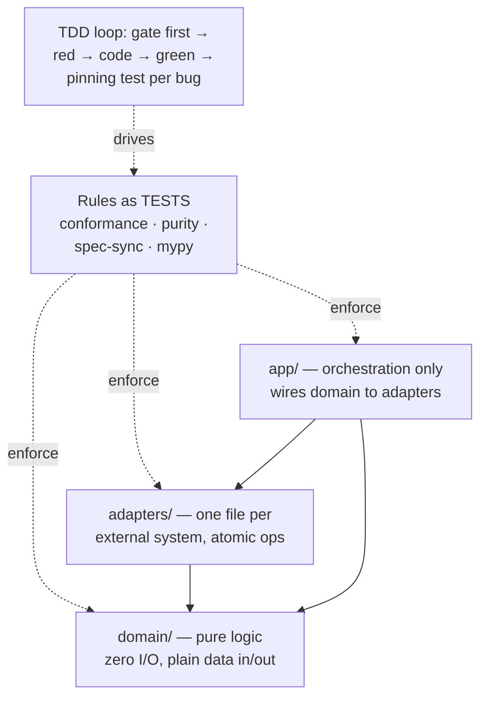

# 05_Layered Build Standard — DDD, TDD, Small Functions, Typed Gates

**Thesis:** Internal tools on this standard are built so that the NEXT editor — usually an LLM agent, sometimes a human in a hurry — can change them without breaking them. Four practices deliver that: a **pure domain core behind thin connectors** (DDD-lite), **test-first with pinning tests** (TDD as practiced, not as ritual), **small functions on narrow lines**, and **typed seams checked by mypy**. The unifying rule: *every convention is an executable test* — a rule that only lives in prose will drift; a rule that fails the suite cannot. Pattern names and their originators live in [[04_General Build Rules — Tool Code Conventions]] (code) and [[02_Eval and Test Plan Patterns — Test Plan Authoring Conventions]] (testing). Examples below are deliberately invented (a toy "SLA reminder bot"), not production code. In the pipeline ([[00_Tool Development Playbook]]) this is **stage 5** — the machine-enforcement layer over [[04_General Build Rules — Tool Code Conventions]]; eval/test-plan authoring is owned by [[02_Eval and Test Plan Patterns — Test Plan Authoring Conventions]] (§3 here is the day-to-day enforcement practice).


¶0 **Boundary:** 05 owns enforcement: the tests, ratchets, type checks, canaries, and agent-facing files that make [[04_General Build Rules — Tool Code Conventions]] executable. It should not re-catalog 04 except where a gate needs exact structure.



---

## §1 | Layering (DDD-lite): pure core, thin connectors

¶1 Every tool splits into three layers with one rule each; the split is enforced by an import-scanning test, not by convention. For the pattern origin of Functional Core/Imperative Shell, Ports & Adapters, and DI, see [[04_General Build Rules — Tool Code Conventions]] §1.

> [!example]- §1 — the layers, the rationale, an example
> **The rule per layer:**
> | Layer | Contains | The one rule |
> |---|---|---|
> | `domain/` | decisions, rendering, parsing, thresholds — *business logic* | **zero I/O**: no network, disk, DB, env, settings. Plain data in, plain data out. |
> | `adapters/` | one module per external system (Jira, ClickHouse, filesystem, an LLM backend) | **atomic operations only**, wire-format ↔ domain mapping; mappers stay pure and unit-testable |
> | `app/` | the workflow: which step runs when, events, retries | **orchestration only** — if a line makes a decision on plain data, it belongs in domain |
>
> **Why:** an LLM agent (or analyst) fixing a business rule should never need creds, a DB, or network to test the fix. Purity makes 90% of the logic testable in microseconds, and testable logic is the only logic agents change safely. It also makes behavior questions grep-answerable: *"when do we escalate?"* has exactly one home.
>
> **Invented example — SLA reminder bot.** Wrong (one file, mixed):
> ```python
> def remind(ticket_id):
>     t = jira.get(ticket_id)              # I/O
>     if hours_since(t.updated) > 24:      # decision
>         jira.comment(ticket_id, "ping")  # I/O
> ```
> Right (three homes):
> ```python
> # domain/reminders.py — pure, trivially testable
> def needs_reminder(updated_hours_ago: float,
>                    sla_hours: float) -> bool:
>     return updated_hours_ago > sla_hours
>
> # adapters/jira_api.py — atomic I/O only
> def staleness_hours(ticket_id: str) -> float: ...
> def post_ping(ticket_id: str) -> None: ...
>
> # app/run.py — orchestration only
> def remind(ticket_id: str) -> None:
>     if needs_reminder(staleness_hours(ticket_id), 24):
>         post_ping(ticket_id)
> ```
> **The enforcement** (the purity gate — real technique, toy names): an AST walk over `domain/*.py` asserting no import of `settings/adapters/app` — a layering violation is a red test in seconds, not a review comment three weeks later.

## §2 | Small functions, narrow lines — and why

¶1 Hard limits — every function body ≤25 lines, every line <70 characters, one statement per line — enforced by a ratcheted conformance test that new files are born under.

> [!example]- §2 — rationale + the ratchet
> **Rationale.** A 25-line function is the unit an LLM edits without collateral damage: it fits one screen and one diff hunk, its behavior is nameable (so the name can be honest), and an exact-match string edit on it is unambiguous. Narrow lines are the anti-cheat (no cramming three clauses into one line to "pass") and keep side-by-side diffs readable. Small functions also force the extraction of helpers whose NAMES document the code — which is why this standard needs almost no inline comments.
> **The ratchet.** The conformance test walks every `*.py` in the package (tests included) and fails on any violation. Files that predate the rule sit in an explicit `PENDING` set that may only SHRINK — the test fails if a PENDING file becomes clean but stays listed, and new files are checked automatically. Adopting the standard on a legacy tool is therefore incremental *and* irreversible.
> **Anti-patterns the gate rejects:** `if x: return y` one-liners, `a; b`, and nested `def`s used to smuggle a 60-line body inside a 25-line shell (nested lines count into the parent).

## §3 | TDD as practiced (not as ritual)

¶1 Five moves, in order of leverage: gate-first, pinning test per bug, differential proof for refactors, real-store smokes for storage code, and a property layer over the pure core.

> [!example]- §3 — the five moves
> 1. **Gate first — red/green evidence.** Starting a standard-adoption or a refactor, write the RULE as a failing test before touching code; capture the red output (test fails for the right reason), then implement until green output (test passes). If you did not watch the test fail, you do not know whether it tests the right thing. The rule-test defines "done" mechanically before the code moves.
> 2. **Pinning test per bug.** Every fixed bug ships, in the same change, a test that fails on the old code and passes on the fix. Example: a report tool read `result["note"]` — a key the producer never emitted, so a whole check silently always-failed; the fix came with a test that constructs the producer's real output and asserts the check can pass at all.
> 3. **Differential proof for refactors.** Moving logic without changing behavior? Run old and new implementations on the same inputs and assert byte-identical output BEFORE deleting the old one.
> 4. **Real-store smokes.** Mock-only test suites pass while production crashes. Anything that serializes (DB rows, checkpoints, event logs) gets one test against a REAL throwaway store (embedded ClickHouse in a tmp dir, SQLite file). This catches the common failure mode where an in-memory fake passes but the real persistence layer rejects serialization, locking, or schema details.
> 5. **Property layer on the pure core.** Once domain functions are pure, hypothesis-style fuzzing is nearly free and finds the inputs no one hand-picks: assert *totality* (parsers never raise on arbitrary text), *idempotence* (redact(redact(x)) == redact(x)), *round-trips* (serialize→parse == identity), *content preservation* (a splitter never drops non-space text). Derandomize in CI so a found counterexample is a reproducible failure, not a flake.

## §4 | Typed gates — mypy strict core, generic seams

¶1 mypy runs inside the test suite: strict on `domain/`, lenient on adapters (they talk to untyped externals); the highest-value typing work is making generic seams carry types to call sites.

> [!example]- §4 — rationale + the seam pattern
> **Why this matters more for LLM editors than humans:** the most common LLM error class is a confidently hallucinated attribute (`verdict.reasons` when the field is `verdict.remaining_questions`). With a typed seam that is a red check in seconds; untyped, it is a runtime crash on a real ticket.
> **The seam pattern** — a function that returns "whatever schema you asked for" must SAY so, with overloads, so the type flows to the call site instead of decaying to a union:
> ```python
> S = TypeVar("S", bound=BaseModel)
>
> @overload
> def ask_json(prompt: str, schema: Type[S]) -> S:
>     ...
> @overload
> def ask_json(prompt: str, schema: None = None) -> dict:
>     ...
> ```
> Now `ask_json(p, schema=Reminder)` is a typed `Reminder` — `reminder.snooze_hours` typo → mypy error, not a 3 a.m. crash.
> **Scope discipline:** strict flags (`disallow_untyped_defs`, `warn_return_any`, `strict_equality`) ONLY where the code is ours and pure; forcing strictness onto adapter code that wraps untyped SDKs produces `# type: ignore` noise that trains editors to ignore the checker.

## §5 | Rules as tests — the full gate set

¶1 A tool on this standard carries five machine gates in its own suite; prose documents the WHY, gates enforce the WHAT.

> [!example]- §5 — the gates and what each catches
> | Gate | Enforces | Catches |
> |---|---|---|
> | conformance | ≤25-line bodies, <70-char lines, one stmt/line, ratcheted PENDING | cramming, monster functions, regression of adopted files |
> | purity (layer matrix) | `domain/` imports no I/O layer; adapters/providers never import `app/`; providers never import adapters | layering erosion — the #1 silent decay in shared codebases |
> | spec-sync | declarative spec ⇄ runtime structure equality | docs-vs-code drift (the spec CANNOT quietly fall behind) |
> | typing | mypy (strict core) in-suite | hallucinated attributes, Optional leaks, dead branches |
> | lint | ruff (`F,E9,B,SIM`) in-suite | unused/undefined names, bug-prone patterns, complexity creep |
> | secret hygiene | `.env*` ignored except examples, secret scanner / pre-commit, redaction tests, no env reads in `domain/` | leaked keys, creds in logs/WAL/status, pure code coupled to private runtime |
>
> Plus, for LLM-calling tools specifically: an **injection canary** (a hostile input must stay inside its untrusted fence — deterministic, CI-safe) and **offline evals** as the free tier before token-costing live evals.

## §6 | Agent ergonomics — the standard serving its editors

¶1 The codebase is the primary interface for agents; six cheap artifacts make every future session start warm without drowning the agent in context.

> [!example]- §6 — the six artifacts
> - **Directory-scoped `CLAUDE.md`** (+ `AGENTS.md` symlink for Codex) inside the package: concise gate discipline, layer-placement table, safety invariants, test toolkit, and the after-a-change checklist. Auto-loaded — the operating knowledge travels WITH the code, not in a doc an agent must know to retrieve.
> - **One canonical verification command** (`make check`, `uv run pytest`, `npm test`, or equivalent): the agent needs a deterministic pass/fail loop it can run before handing work back.
> - **Context budget hygiene**: keep AGENTS/CLAUDE/skills short, scoped, and current; stale, contradictory, or repository-wide advice is a bug.
> - **Workflow-bearing hooks / skills / subagents only**: use them when they enforce a real check, isolate a review, or run a deterministic workflow — not as a static dumping ground for prose.
> - **Verification-before-completion discipline**: before claiming done, identify the command that proves it, run the full fresh command, read the output and exit code, then report the claim with that evidence. Agent success reports are inputs, not proof.
> - **Subagent-driven review**: after each implementation task, a fresh reviewer checks spec compliance and quality before handoff; broad whole-branch review happens at the end. No human check-in between tasks unless blocked, ambiguous, or complete; never ignore a blocked status.
> - **Thesis-style module docstrings** carrying the WHY + spec citations (`09 §4`, decision ids, session ids) — provenance an agent can follow instead of re-deriving intent.
> - **Commit-after-each-edit, code separate from KG** — small atomic commits survive daemon churn and give the next session a readable ledger of what changed and why.

## §7 | Adoption checklist for a new or legacy tool

¶1 In order; each step is one commit.

> [!example]- §7 — checklist
> 1. Drop in the conformance test with `PENDING` = every currently-dirty file; suite green from day one.
> 2. Carve `domain/` — move every plain-data decision behind pure functions; add the purity gate (architecture rule in [[04_General Build Rules — Tool Code Conventions]]).
> 3. One adapter module per external system; mappers pure and unit-tested (adapter rule in [[04_General Build Rules — Tool Code Conventions]]).
> 4. mypy.ini (strict core, lenient shell) + the in-suite mypy test; fix the seams with overloads first.
> 5. Write the pinning-test habit into the tool's CLAUDE.md; add the canary if the tool feeds LLMs untrusted text.
> 6. Add one canonical verification command (per [[04_General Build Rules — Tool Code Conventions]]) and put it in CLAUDE.md / AGENTS.md.
> 7. Prune agent context: remove stale, conflicting, or irrelevant instructions; split large static guidance into focused skills only when the skill runs a real workflow.
> 8. If the tool handles private data, untrusted content, and external communication, add least-privilege boundaries (per [[04_General Build Rules — Tool Code Conventions]]) plus an injection canary before live use.
> 9. If the tool uses credentials, add the secret-hygiene gate: `.env*` ignored except examples, scanner/pre-commit, redaction tests, and no env reads from `domain/`.
> 10. Pin the CI dependency set (a lock file) and add the property layer over the now-pure core.
> 11. Shrink PENDING to empty; from then on the standard maintains itself.

*Provenance: distilled from repeated tool refactors and best-practice adoption work; pattern canon in [[04_General Build Rules — Tool Code Conventions]]; external grounding in [[06_External Grounding — LLM Power-User Practice]]. All §-examples are invented illustrations, not production code.*
