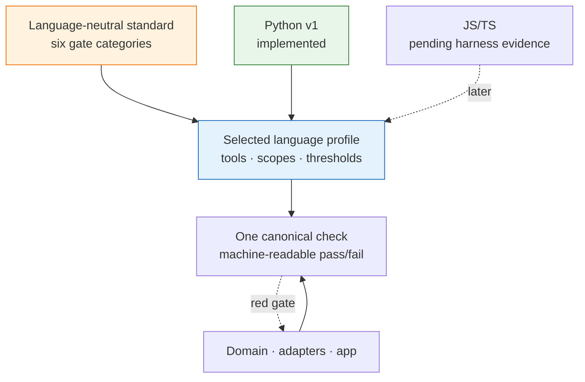

# 05_Layered Build Standard — DDD, TDD, Small Functions, Typed Gates

**Thesis:** DSET defines a **language-neutral enforcement contract** and realizes it through **applied language profiles**. Every durable tool carries the same six gate categories—conformance, purity, spec-sync, typing/contracts, lint/static analysis, and secret hygiene—but each profile selects the language-native tools, file scopes, thresholds, exclusions, and migration ratchet. The first applied profile is Python. A JavaScript/TypeScript profile will be derived later from evidence in `obsidian-your-harness`; no guessed JS/TS thresholds are normative yet. The unifying rule is that every adopted convention must have an executable check: prose explains why, while the selected profile makes violations fail. Pattern names and origins live in [04_General Build Rules — Tool Code Conventions](<04_General Build Rules — Tool Code Conventions.md>), proof planning lives in [02_Test and Eval Plan Patterns — Proof Artifact Conventions](<02_Test and Eval Plan Patterns — Proof Artifact Conventions.md>), and this document is stage 5 of [00_Tool Development Playbook](<00_Tool Development Playbook.md>).

¶0 **Boundary:** Sections 1–5 define language-neutral code-enforcement rules. Section 6 owns applied implementation-language profiles. Sections 7–8 define agent ergonomics and adoption. A project selects its implementation-language profile explicitly; it must not inherit Python tools or thresholds merely because Python is the first implemented profile. Artifact governance is a separate axis owned by the [documentation architecture](../documentation/README.md); `documentation-v1` may be combined with Python, JavaScript/TypeScript, another code profile, or no code profile.



---

## §1 | Language-neutral layering: pure core, thin connectors

¶1 Every tool separates policy from effects. Directory names may vary by ecosystem, but the ownership and dependency direction are invariant and must be enforced with the selected profile's syntax-aware dependency check.

<details>

<summary>Layer contract</summary>

| Logical layer | Contains | Required rule |
|---|---|---|
| **Domain/core** | Decisions, parsing, rendering, state transitions, thresholds, invariants | No direct network, disk, database, environment, UI, framework, or process I/O; plain domain values in and out |
| **Ports/adapters** | External-system clients, persistence, filesystem, UI, model providers, wire-format mapping | Atomic boundary operations; translate external representations to and from domain values; no workflow ownership |
| **Application/orchestration** | Use-case sequencing, transaction boundaries, retries, scheduling, mode gates | Coordinate domain and adapters; do not become a second home for domain decisions |

The project profile maps these logical layers to real paths and checks forbidden dependency edges using a parser, compiler API, module-graph tool, or equivalent language-aware mechanism. Text search alone is insufficient where aliases, generated imports, or conditional imports can hide a violation.

</details>

## §2 | Language-neutral conformance: bounded, readable change units

¶1 DSET requires bounded functions/modules and readable formatting, but it does not impose one universal line count or line length across languages. Each applied profile declares measurable thresholds appropriate to the language and formatter, plus a complexity ceiling where raw line count is a poor proxy.

<details>

<summary>Required profile fields</summary>

- **Scope:** source/test globs and explicit exclusions for generated, vendored, migration, fixture, and build-output files.
- **Thresholds:** function size, module size if used, line width or formatter policy, nesting/cyclomatic/cognitive complexity where supported, and statement-density rules where relevant.
- **Measurement semantics:** whether comments, blank lines, decorators, signatures, nested functions, generated code, and tests count.
- **Ratchet:** existing violations live in a machine-readable baseline that may only shrink; new or newly-clean files must satisfy the profile.
- **Override contract:** a threshold change is versioned and justified with evidence; projects do not silently weaken a gate locally.

</details>

## §3 | Language-neutral TDD and proof practice

¶1 The proof loop is independent of language and test runner.

<details>

<summary>The five moves</summary>

1. **Gate first, with red/green evidence.** Add or expose the failing check before changing implementation; then make it pass.
2. **Pinning test per bug.** Every fixed bug ships with proof that fails on the defective revision and passes on the fix.
3. **Differential proof for behavior-preserving refactors.** Compare old and new behavior on the same inputs before deleting the old path.
4. **Real-store smoke for serialization.** Exercise a disposable instance of the real storage technology; an in-memory fake is not enough.
5. **Property/invariant layer over the pure core.** Check totality, idempotence, round trips, content preservation, and domain invariants with reproducible counterexamples.

</details>

## §4 | Language-neutral typing and contract gates

¶1 Every boundary that carries structured data needs an executable contract. A statically typed language profile uses its compiler/type checker; a dynamically typed profile may combine static annotations with runtime schemas and contract tests. The profile must state what is strict, what is intentionally looser at external adapters, and how suppressions are reviewed.

<details>

<summary>Required typing/contract behavior</summary>

- Domain-owned types flow through generic seams to call sites rather than degrading to an untyped map or universal value.
- External payloads are parsed and validated at adapters before entering the domain.
- Suppressions are narrow, explained, and machine-counted or otherwise prevented from silently growing.
- Public interfaces and serialization formats have compatibility or schema tests in addition to local type checking.

</details>

## §5 | Language-neutral gate categories

¶1 A conforming profile implements all six categories. “Typing” may be realized as compiler checks, static analysis, runtime schema validation, or a documented combination appropriate to the language; the category may not disappear merely because a particular tool lacks a type system.

<details>

<summary>The six gates</summary>

| Gate category | Language-neutral contract | Profile must declare |
|---|---|---|
| **Conformance** | Keep change units bounded and readable; prevent new structural debt | Source scope, thresholds/formatter policy, complexity rules, exclusions, legacy baseline and ratchet behavior |
| **Purity / layer matrix** | Enforce allowed dependency directions and keep effects out of the domain core | Logical-layer path mapping, forbidden edges, syntax/module-graph checker, generated-code treatment |
| **Spec-sync** | Prove declarative specs/manifests and runtime structure agree where equality is promised | Compared artifacts, normalization rules, mismatch output, archive/current-truth checks |
| **Typing / contracts** | Catch invalid data flow and interface drift before production | Compiler/checker/schema tools, strictness by layer, suppression policy, public-contract checks |
| **Lint / static analysis** | Catch undefined/unused symbols, bug-prone constructs, unsafe patterns, and complexity drift | Tool and rule set, warning policy, autofix policy, generated/vendor exclusions |
| **Secret hygiene** | Keep credentials out of source, logs, durable state, fixtures, prompts, and domain logic | Scanner, ignore/example policy, redaction tests, environment-access boundary, false-positive process |

Applicable supplemental gates remain separate from the six universal categories: an LLM-facing tool adds an injection canary and applicable offline/live evals; a high-risk tool adds the safety and approval evidence selected by its runtime risk profile; and a production-bound tool adds a supportability gate for its selected profile, including correlation and deploy/change identity, safe diagnostics, retention/redaction/access and volume bounds, runbook links, and incident traceability. Deterministic contract enforcement belongs in tests and gates; qualitative diagnostic usefulness remains an eval.

</details>

## §6 | Applied language profiles

¶1 An applied profile is versioned configuration, not illustrative prose. It must implement the §5 contract, expose one canonical verification command, and identify the profile version in the project or change package.

### §6.1 | Python v1 — active

¶1 Python v1 preserves the proven Python rules but scopes them explicitly to Python projects. These numbers and tools are not defaults for other languages.

<details>

<summary>Python v1 gate mapping</summary>

| Gate | Python v1 applied rule |
|---|---|
| **Conformance** | Inspect `**/*.py` in source and tests, excluding explicitly listed generated/vendor/migration/build paths. Function bodies are at most **25 physical lines**, lines are under **70 characters**, and compound one-line or semicolon-packed statements are rejected. Decorators/signatures are excluded from the body count; comments, blank lines, and nested definitions inside the body count. Existing violations live in a `PENDING` baseline that may only shrink. |
| **Purity / layer matrix** | A Python AST/import-graph check maps `domain/`, `adapters/`, and `app/`; `domain/` may not import I/O/framework/settings layers, adapters/providers may not import `app/`, and providers may not bypass their declared port. |
| **Spec-sync** | A deterministic pytest check parses the declarative spec/manifest and compares normalized expected structure with the runtime registry; mismatch output names the missing, extra, or changed entity. |
| **Typing / contracts** | `mypy` is strict for the owned domain/core and intentionally bounded at untyped external adapters. Structured external payloads are validated at the adapter boundary. Broad `Any` and unscoped `type: ignore` growth fail the gate. |
| **Lint / static analysis** | `ruff` runs at least `F`, `E9`, `B`, and `SIM`; the project may add rules but may not remove the profile minimum without a versioned exception and evidence. |
| **Secret hygiene** | A repository secret scanner/pre-commit check, `.env*` ignored except dummy examples, redaction tests, and an AST check preventing environment reads from `domain/`. |

The canonical command may be `make check`, `uv run pytest`, or an equivalent project wrapper, but it must run or aggregate all six gates and return a reliable non-zero exit on failure.

</details>

<details>

<summary>Python typed-seam example</summary>

```python
S = TypeVar("S", bound=BaseModel)

@overload
def ask_json(prompt: str, schema: Type[S]) -> S:
    ...

@overload
def ask_json(prompt: str, schema: None = None) -> dict:
    ...
```
With this seam, `ask_json(prompt, schema=Reminder)` retains `Reminder` at the call site, so an invented attribute fails type checking instead of failing in production.

</details>

### §6.2 | JavaScript/TypeScript — pending evidence

¶1 No JavaScript/TypeScript tool choice or threshold is normative yet. The profile will be derived from the real architecture, package boundaries, scripts, compiler settings, lint rules, tests, and failure history of `obsidian-your-harness`. The resulting profile must fill the same six-row mapping as Python v1 and record which observed failures each gate prevents. Candidate tools may be evaluated, but their presence here would not make them a standard before that evidence pass.

## §7 | Agent ergonomics

¶1 The codebase is the primary interface for agents; these eight artifacts and practices are language-neutral.

<details>

<summary>The eight artifacts</summary>

- **Directory-scoped agent contract:** concise `AGENTS.md`, `CLAUDE.md`, or ecosystem-equivalent guidance containing the selected profile/version, layer map, safety invariants, and after-change checklist.
- **One canonical verification command:** a deterministic pass/fail loop that runs all selected gates.
- **Context budget hygiene:** short, scoped, current instructions; stale or contradictory guidance is a defect.
- **Workflow-bearing hooks, skills, or subagents only:** use them for executable workflows or isolated review, not as prose warehouses.
- **Verification before completion:** run the fresh full command, inspect output and exit status, then report the evidence.
- **Independent review at risk-appropriate boundaries:** check spec compliance and quality without making subagents mandatory for every trivial edit.
- **Traceable module rationale:** concise module/package documentation points to governing requirement and decision IDs without duplicating the spec.
- **Small atomic changes:** keep implementation, proof, and documentation changes traceable even when commit timing is controlled by the project workflow.

</details>

## §8 | Adoption checklist

¶1 Adopt the language-neutral standard first, then instantiate the selected applied profile. Each migration step must leave the canonical verification command green or record the bounded legacy baseline responsible for an expected gate.

<details>

<summary>Checklist</summary>

1. Declare the selected language profile and version; if none exists, author and validate one before claiming DSET conformance.
2. Map real project paths to domain/core, ports/adapters, and application/orchestration; document justified deviations.
3. Add one canonical command aggregating the six gate categories.
4. Configure conformance scope, exclusions, thresholds, measurement semantics, and the non-growing legacy ratchet.
5. Add the syntax-aware purity/layer check.
6. Add typing/contracts, lint/static analysis, spec-sync, and secret-hygiene checks using the selected profile.
7. Add the pinning-test rule, real-store smoke where serialization exists, property/invariant checks over the pure core, an injection canary where untrusted text reaches an LLM, and the selected supplemental supportability gate for production-bound tools.
8. Record red/green evidence for adoption and confirm that each gate fails for a representative violation.
9. Prune stale agent guidance and publish the selected profile, layer map, and canonical command in the directory-scoped agent contract.
10. Shrink the legacy baseline to empty; profile changes thereafter require versioned evidence rather than silent local weakening.

</details>

*Provenance: the language-neutral categories are distilled from repeated tool refactors and best-practice adoption work; Python v1 carries forward the existing Python enforcement profile; pattern canon lives in [04_General Build Rules — Tool Code Conventions](<04_General Build Rules — Tool Code Conventions.md>), and external grounding lives in [06_External Grounding — LLM Power-User Practice](<06_External Grounding — LLM Power-User Practice.md>).*
